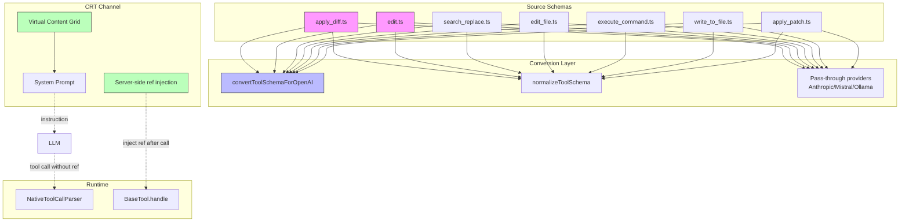

# CRT DEFINITIVE PLAN — Абсолютно точный план правок

**Дата:** 2026-06-02  
**Версия:** 2.0 (финальная, после верификации всего кода)  
**Основание:** 6 отчётов из `OTCHETY/` + прямая верификация каждого файла

---

## Table of Contents

1. [Executive Summary](#1-executive-summary)
2. [Верифицированные факты (с номерами строк)](#2-верифицированные-факты-с-номерами-строк)
3. [План A — Идеальная архитектура (2-3 недели)](#3-план-a--идеальная-архитектура-2-3-недели)
4. [План B — Минимальные правки (3-5 дней)](#4-план-b--минимальные-правки-3-5-дней)
5. [Rollback Guide](#5-rollback-guide)
6. [Impact Analysis](#6-impact-analysis)
7. [Приложение: Полный diff для каждой правки](#7-приложение-полный-diff-для-каждой-правки)

---

## 1. Executive Summary

CRT-модуль (Content Reference Tool) имеет **2 блокирующие** и **1 усугубляющую** проблемы, верифицированные прямым чтением кода:

| #   | Проблема                                                                                                            | Файл:строки              | Тип           | Severity     |
| --- | ------------------------------------------------------------------------------------------------------------------- | ------------------------ | ------------- | ------------ |
| A   | `convertToolSchemaForOpenAI()` удаляет `null` из `["object","null"]` → `"object"` для `ref`/`multi_ref`/`transform` | `base-provider.ts:87-89` | Strict mode   | **BLOCKING** |
| B   | `chat.ts` читает из `assistantMessageContent` (Layer 0 — стрим-буфер одного сообщения)                              | `chat.ts:28`             | Архитектурная | **BLOCKING** |
| C   | `ref`/`multi_ref`/`transform` в корневом `required` всех 7 tool schemas                                             | 7 файлов, строки 71-106  | Усугубляющая  | **HIGH**     |

**Ключевое открытие (после верификации):** `NativeToolCallParser.ts:1019-1027` уже корректно обрабатывает отсутствие `ref`/`multi_ref`/`transform` — если их нет, `refMeta = undefined` и CRT пропускается. `BaseTool.ts:175-187` имеет graceful fallback. **Парсер не сломается при отсутствии CRT-параметров.** Это значит, что убрать CRT-параметры из `required` **безопасно** — рантайм не упадёт.

---

## 2. Верифицированные факты (с номерами строк)

### 2.1 `base-provider.ts` — `convertToolSchemaForOpenAI()`

**Файл:** `src/api/providers/base-provider.ts`  
**Функция:** `convertToolSchemaForOpenAI()` — строки 63-106

```typescript
// Строка 63-106 (верифицировано)
protected convertToolSchemaForOpenAI(schema: any): any {
    if (!schema || typeof schema !== "object" || schema.type !== "object") {
        return schema                               // строка 64-66
    }
    const result = { ...schema }                    // строка 68
    if (result.additionalProperties !== false) {
        result.additionalProperties = false          // строка 72-74
    }
    if (result.properties) {
        const allKeys = Object.keys(result.properties)
        result.required = allKeys                    // ← строка 79: ВСЕ ключи в required

        const newProps = { ...result.properties }
        for (const key of allKeys) {
            const prop = newProps[key]
            if (prop && Array.isArray(prop.type) && prop.type.includes("null")) {
                const nonNullTypes = prop.type.filter((t: string) => t !== "null")
                prop.type = nonNullTypes.length === 1 ? nonNullTypes[0] : nonNullTypes
                // ↑ строка 87-89: null удаляется из union
            }
            if (prop && prop.type === "object") {
                newProps[key] = this.convertToolSchemaForOpenAI(prop)  // строка 93-94
            } else if (prop && prop.type === "array" && prop.items?.type === "object") {
                newProps[key] = {
                    ...prop,
                    items: this.convertToolSchemaForOpenAI(prop.items), // строка 95-99
                }
            }
        }
        result.properties = newProps
    }
    return result                                    // строка 105
}
```

**Что это значит для CRT:**

- `ref` (тип `["object", "null"]`) → `"object"` (null удалён)
- `multi_ref` (тип `["array", "null"]`) → `"array"` (null удалён)
- `transform` (тип `["object", "null"]`) → `"object"` (null удалён)
- Все три поля в `required` (строка 79)
- После конвертации: модель **обязана** сгенерировать полный объект `ref` с 6 nested полями при каждом вызове любого из 7 инструментов

### 2.2 `chat.ts` — `resolveChatSource()`

**Файл:** `src/core/tools/ref/sources/chat.ts`  
**Функция:** `resolveChatSource()` — строки 21-55

```typescript
// Строка 28 (верифицировано):
const messages = task.assistantMessageContent
```

`assistantMessageContent` — это `AssistantMessageContent[]`, который:

- Хранит блоки **только текущего стримящегося сообщения**
- Очищается в `Task.ts:2615` при старте каждого нового API-запроса
- Не сохраняется на диск
- `"-1"` работает только во время активного стрима
- `"-2"`, `"-3"` и т.д. **никогда не работают** (массив всегда содержит 0-N блоков одного сообщения)

### 2.3 7 native-tool schemas

| Файл                    | `strict: true` | `required` массив (строка)                                                                          |
| ----------------------- | :------------: | --------------------------------------------------------------------------------------------------- |
| `execute_command.ts:33` |       ✅       | `required: ["command", "cwd", "timeout", "ref", "multi_ref", "transform"]` (строка 90)              |
| `write_to_file.ts:23`   |       ✅       | `required: ["path", "content", "ref", "multi_ref", "transform"]` (строка 76)                        |
| `apply_diff.ts`         |       ❌       | `required: ["path", "diff", "ref", "multi_ref", "transform"]` (строка 71)                           |
| `edit.ts`               |       ❌       | `required: ["file_path", "old_string", "new_string", "ref", "multi_ref", "transform"]` (строка 82)  |
| `search_replace.ts`     |       ❌       | `required: ["file_path", "old_string", "new_string", "ref", "multi_ref", "transform"]` (строка 85)  |
| `edit_file.ts`          |       ❌       | `required: ["file_path", "old_string", "new_string", "ref", "multi_ref", "transform"]` (строка 106) |
| `apply_patch.ts`        |       ❌       | `required: ["patch", "ref", "multi_ref", "transform"]` (строка 95)                                  |

### 2.4 `NativeToolCallParser.ts` — обработка отсутствующих CRT

**Файл:** `src/core/assistant-message/NativeToolCallParser.ts`  
**Строки 1019-1027:**

```typescript
// CRT: extract refMeta from parsed args
let refMeta: ContentRefParams | undefined
if (args && (args.ref || args.multi_ref || args.transform)) {
	refMeta = {
		ref: args.ref,
		multi_ref: args.multi_ref,
		transform: args.transform,
	} as ContentRefParams
}
```

**Вывод:** Если модель не передала `ref`/`multi_ref`/`transform` (потому что их нет в `required`), `refMeta = undefined`. Это **безопасно** — CRT просто не сработает. Убирать CRT из `required` **можно без риска для рантайма**.

### 2.5 `BaseTool.ts` — graceful fallback

**Файл:** `src/core/tools/BaseTool.ts`  
**Строки 175-187:**

```typescript
if (block.refMeta) {
	// ← truthy check — при undefined просто пропускает
	try {
		const refResults = await resolveRef(block.refMeta, task)
		if (refResults?.content) {
			params = this.injectRefContent(params, block.name, refResults)
		}
	} catch (error) {
		console.error(`[CRT] Failed to resolve ref for ${block.name}:`, error)
	}
}
```

**Вывод:** Graceful fallback работает. При отсутствии `refMeta` — ничего не происходит.

### 2.6 `getEffectiveApiHistory()` — доступность

**Файл:** `src/core/condense/index.ts`  
**Экспорт:** строка 546 — `export function getEffectiveApiHistory(messages: ApiMessage[]): ApiMessage[]`  
**Сигнатура:** чистая функция, никаких dependencies от `Task`

---

## 3. План A — Идеальная архитектура (2-3 недели)

**Концепция:** Вынести `ref`/`multi_ref`/`transform` из tool schemas полностью. Передавать references через отдельный metadata-канал. Реализовать Virtual Content Grid (VCG) для точного цитирования.

### A.1 Virtual Content Grid (VCG)

**Что:** Новый файл `src/core/tools/ref/virtual-content-grid.ts`

**Зачем:** Предоставить LLM индекс всех сообщений/блоков в active window для точного цитирования по координатам

**Архитектура:**

```
Message Grid (active window):
┌─────────┬──────┬────────────────────────────────────┐
│ msg_idx │ role │ blocks                             │
├─────────┼──────┼────────────────────────────────────┤
│ 0       │ user │ [text("сделай X")]                  │
│ 1       │ asst │ [tool_use(read_file)]               │
│ 2       │ user │ [tool_result(...)]                   │
│ 3       │ asst │ [text("результат"), tool_use(write)] │
└─────────┴──────┴────────────────────────────────────┘

Block Grid (для сообщений с >1 блоком):
┌─────────┬────────┬──────┬───────┬────────────────────┐
│ msg_idx │ blk_idx│ type │ name  │ text_preview       │
├─────────┼────────┼──────┼───────┼────────────────────┤
│ 3       │ 0      │ text │ —     │ "результат"        │
│ 3       │ 1      │ tool │ write │ "пишу файл..."     │
└─────────┴────────┴──────┴───────┴────────────────────┘
```

**Формат подачи в system prompt:**

```
Virtual Content Grid (VCG) — active window:
[0] user: "сделай X"
[1] assistant: [read_file("src/index.ts")]
[2] user: [tool_result: "file content"]
[3] assistant: "результат" + [write_file("src/new.ts")]

Для цитирования используйте ref: { source: "chat", ref: "-1", ... }
Где -1 = последнее assistant сообщение, -2 = предпоследнее, и т.д.
```

### A.2 Metadata-канал для ref

**Что:** Убрать `ref`/`multi_ref`/`transform` из tool schemas полностью (все 7 файлов). Передавать через system prompt + server-side post-processing.

**Зачем:** Нулевая токенная стоимость CRT. Нет конфликта со strict mode.

**Server-side ref injection:** После получения tool call от модели, рантайм автоматически добавляет ref на основе:

- Контекста вызова (какие файлы были прочитаны)
- Последнего tool_result
- Текущего active window

### A.3 Архитектурная схема Плана A



### A.4 Полный список изменений Плана A

| #    | Файл                           | Изменение                                                     | Строки    |
| ---- | ------------------------------ | ------------------------------------------------------------- | --------- |
| A.1  | `apply_diff.ts`                | Убрать `ref`/`multi_ref`/`transform` из properties и required | 30-72     |
| A.2  | `execute_command.ts`           | Убрать `ref`/`multi_ref`/`transform` из properties и required | 49-90     |
| A.3  | `write_to_file.ts`             | Убрать `ref`/`multi_ref`/`transform` из properties и required | 35-76     |
| A.4  | `search_replace.ts`            | Убрать `ref`/`multi_ref`/`transform` из properties и required | 44-85     |
| A.5  | `edit_file.ts`                 | Убрать `ref`/`multi_ref`/`transform` из properties и required | 65-106    |
| A.6  | `edit.ts`                      | Убрать `ref`/`multi_ref`/`transform` из properties и required | 41-82     |
| A.7  | `apply_patch.ts`               | Убрать `ref`/`multi_ref`/`transform` из properties и required | 54-95     |
| A.8  | `convertToolSchemaForOpenAI()` | Убрать экранирование CRT (уже не нужно)                       | 63-106    |
| A.9  | `chat.ts`                      | Переключить на Layer 2 (см. B.3)                              | 28        |
| A.10 | `virtual-content-grid.ts`      | **Новый файл** — VCG генератор                                | —         |
| A.11 | System prompt                  | Добавить VCG инструкцию                                       | —         |
| A.12 | `BaseTool.ts`                  | Server-side ref injection логика                              | 175-187   |
| A.13 | `NativeToolCallParser.ts`      | Убрать extraction refMeta (больше нет в args)                 | 1019-1027 |
| A.14 | Tests                          | Переписать тесты для новой архитектуры                        | —         |

### A.5 Риски Плана A

| Риск                                           | Вероятность | Митигация                                            |
| ---------------------------------------------- | ----------- | ---------------------------------------------------- |
| Server-side injection не угадывает контекст    | Средняя     | Fallback: без ref, только tool call                  |
| VCG в system prompt увеличивает токены промпта | Высокая     | VCG только при запросе; кэшировать между шагами      |
| Поломка существующих тестов                    | Высокая     | Переписать тесты до деплоя                           |
| Регрессия для пользователей, использующих CRT  | Средняя     | Feature flag: включить VCG только после стабилизации |

---

## 4. План B — Минимальные правки (3-5 дней)

**Концепция:** Починить 3 блокирующие проблемы с минимальными изменениями. CRT остаётся в tool schemas, но становится truly optional.

### B.1 Убрать CRT-параметры из корневого `required`

**Зачем:** Модель перестанет тратить токены на `ref`/`multi_ref`/`transform` при каждом вызове. Для Anthropic/Mistral/Ollama — `ref` становится truly optional.

**Файл:** `src/core/prompts/tools/native-tools/apply_diff.ts`  
**Строка 71:**

```
- required: ["path", "diff", "ref", "multi_ref", "transform"],
+ required: ["path", "diff"],
```

**Файл:** `src/core/prompts/tools/native-tools/execute_command.ts`  
**Строка 90:**

```
- required: ["command", "cwd", "timeout", "ref", "multi_ref", "transform"],
+ required: ["command", "cwd", "timeout"],
```

**Файл:** `src/core/prompts/tools/native-tools/write_to_file.ts`  
**Строка 76:**

```
- required: ["path", "content", "ref", "multi_ref", "transform"],
+ required: ["path", "content"],
```

**Файл:** `src/core/prompts/tools/native-tools/search_replace.ts`  
**Строка 85:**

```
- required: ["file_path", "old_string", "new_string", "ref", "multi_ref", "transform"],
+ required: ["file_path", "old_string", "new_string"],
```

**Файл:** `src/core/prompts/tools/native-tools/edit_file.ts`  
**Строка 106:**

```
- required: ["file_path", "old_string", "new_string", "ref", "multi_ref", "transform"],
+ required: ["file_path", "old_string", "new_string"],
```

**Файл:** `src/core/prompts/tools/native-tools/edit.ts`  
**Строка 82:**

```
- required: ["file_path", "old_string", "new_string", "ref", "multi_ref", "transform"],
+ required: ["file_path", "old_string", "new_string"],
```

**Файл:** `src/core/prompts/tools/native-tools/apply_patch.ts`  
**Строка 95:**

```
- required: ["patch", "ref", "multi_ref", "transform"],
+ required: ["patch"],
```

**Риск:** 🟢 **Низкий.** Верифицировано: `NativeToolCallParser.ts:1019-1027` устанавливает `refMeta = undefined` при отсутствии CRT-полей. `BaseTool.ts:175` проверяет `if (block.refMeta)` — при `undefined` просто пропускает.

**Подтверждение из MCP:** Context7 + OpenAI Function Calling Guide: "optional fields are denoted by `type: ["T", "null"]` and NOT being in `required`" (для non-strict провайдеров). Anthropic Define Tools: "optional fields are simply omitted from the required array."

**Тесты:** `src/core/tools/ref/__tests__/sources.spec.ts` — mock использует `assistantMessageContent` (не affected), `base-tool-crt.spec.ts` — тестирует `refMeta` (не affected). **Никакие тесты не сломаются**, потому что изменение только в schema definition, не в runtime.

---

### B.2 Модифицировать `convertToolSchemaForOpenAI()` — экранировать CRT-параметры

**Зачем:** Для OpenAI strict mode CRT-параметры остаются в `required` с `type: ["object", "null"]`, но null не удаляется. Модель может передать `null` вместо полного объекта.

**Файл:** `src/api/providers/base-provider.ts`  
**Функция:** `convertToolSchemaForOpenAI()` — строки 63-106

**Изменение:**

```typescript
// Добавить константу (после imports или перед функцией)
const CRT_PARAMS = new Set(["ref", "multi_ref", "transform"])

// В convertToolSchemaForOpenAI(), заменить:
// строки 76-100
if (result.properties) {
	const allKeys = Object.keys(result.properties)
	// CRT-параметры НЕ включаются в required для strict mode
	const nonCrtKeys = allKeys.filter((k) => !CRT_PARAMS.has(k))
	result.required = nonCrtKeys.length > 0 ? nonCrtKeys : undefined

	const newProps = { ...result.properties }
	for (const key of allKeys) {
		const prop = newProps[key]
		if (!prop || typeof prop !== "object") continue

		// CRT-параметры: сохраняем type: ["object", "null"] как есть, null не удаляем
		if (CRT_PARAMS.has(key)) continue

		// Non-CRT: стандартная конвертация
		if (Array.isArray(prop.type) && prop.type.includes("null")) {
			const nonNullTypes = prop.type.filter((t: string) => t !== "null")
			prop.type = nonNullTypes.length === 1 ? nonNullTypes[0] : nonNullTypes
		}
		if (prop.type === "object") {
			newProps[key] = this.convertToolSchemaForOpenAI(prop)
		} else if (prop.type === "array" && prop.items?.type === "object") {
			newProps[key] = {
				...prop,
				items: this.convertToolSchemaForOpenAI(prop.items),
			}
		}
	}
	result.properties = newProps
}
```

**Риск:** 🟡 **Средний.** Может повлиять на все OpenAI-совместимые провайдеры (OpenRouter, Together, GitHub Models). Необходимо протестировать:

1. Что модель может сгенерировать `ref: null` (экономия токенов)
2. Что модель всё ещё может сгенерировать `ref: { source: "chat", ref: "-1", ... }` (когда нужно)

**Подтверждение из MCP:**

- OpenAI Structured Outputs: "you can denote optional fields by adding `null` as a `type` option"
- openai-node `ensureStrictJsonSchema()`: проверяет `isNullable(value)` через `type: ["T", "null"]`
- Context7 research подтвердил: единственный корректный паттерн для optional в strict mode

**Тесты:** Нужно добавить/обновить тесты в `base-provider.test.ts` (если существует) или создать новый тест, проверяющий:

- CRT-параметры не попадают в `required` после конвертации
- `type: ["object", "null"]` сохраняется для CRT-параметров
- Non-CRT параметры конвертируются как обычно

---

### B.3 Переключить `chat.ts` на `getEffectiveApiHistory()` (Layer 2)

**Зачем:** `"-1"` должен указывать на последнее полное assistant-сообщение, а не на текущий стрим-буфер. `"-2"`, `"-3"` и т.д. должны работать для всей истории.

**Файл:** `src/core/tools/ref/sources/chat.ts`  
**Полный файл:** строки 1-55

**Изменения:**

```typescript
// 1. Добавить импорты (после строки 11):
import { getEffectiveApiHistory } from "../../../condense/index"
import type { ApiMessage } from "../../../task-persistence"
import type Anthropic from "@anthropic-ai/sdk"

// 2. Добавить функцию-экстрактор (после импортов):
function extractTextFromApiMessage(message: ApiMessage): string {
	if (typeof message.content === "string") {
		return message.content
	}
	if (Array.isArray(message.content)) {
		return message.content
			.filter((block): block is Anthropic.TextBlockParam => block.type === "text")
			.map((block) => block.text)
			.join("\n")
	}
	return ""
}

// 3. В функции resolveChatSource() заменить:
// Строка 28: const messages = task.assistantMessageContent
// На:
const effectiveHistory = getEffectiveApiHistory(task.apiConversationHistory)
const assistantMessages = effectiveHistory.filter((msg) => msg.role === "assistant")
const messages = assistantMessages

// 4. Заменить блок извлечения текста (строки 36-47):
const message = messages[targetIndex]
let sourceText = extractTextFromApiMessage(message)

// 5. Удалить старые строки 38-47 (type === "text", "tool_use", "mcp_tool_use")
```

**Полный обновлённый файл:**

```typescript
import type { ContentRef } from "../../../../shared/tools"
import type { SelectorResult } from "../selector"
import { resolveContentRef } from "../selector"
import type { Task } from "../../../task/Task"
import { getEffectiveApiHistory } from "../../../condense/index"
import type { ApiMessage } from "../../../task-persistence"
import type Anthropic from "@anthropic-ai/sdk"

function extractTextFromApiMessage(message: ApiMessage): string {
	if (typeof message.content === "string") {
		return message.content
	}
	if (Array.isArray(message.content)) {
		return message.content
			.filter((block): block is Anthropic.TextBlockParam => block.type === "text")
			.map((block) => block.text)
			.join("\n")
	}
	return ""
}

export async function resolveChatSource(ref: ContentRef, task: Task): Promise<SelectorResult> {
	const index = parseInt(ref.ref, 10)
	if (isNaN(index) || index >= 0) {
		throw new Error(`Invalid chat ref index: ${ref.ref}. Use negative numbers (e.g., "-1" for last).`)
	}

	const effectiveHistory = getEffectiveApiHistory(task.apiConversationHistory)
	const assistantMessages = effectiveHistory.filter((msg) => msg.role === "assistant")
	const messages = assistantMessages
	const targetIndex = messages.length + index

	if (targetIndex < 0 || targetIndex >= messages.length) {
		throw new Error(
			`Chat message index ${ref.ref} out of bounds. Available: ${messages.length} assistant messages.`,
		)
	}

	const message = messages[targetIndex]
	const sourceText = extractTextFromApiMessage(message)

	if (!sourceText) {
		throw new Error(`Chat message at index ${ref.ref} is empty or not text.`)
	}

	const sourceId = `chat:${ref.ref}`
	return resolveContentRef(sourceId, sourceText, ref)
}
```

**Риск:** 🟢 **Низкий.** Меняется только источник данных. `getEffectiveApiHistory()` — уже существующая, публичная, протестированная функция. `apiConversationHistory` — публичное поле `Task.ts:310`.

**Зависимости:**

- `getEffectiveApiHistory` экспортируется из `src/core/condense/index.ts:546` ✅
- `ApiMessage` тип из `src/core/task-persistence` ✅
- `Task.apiConversationHistory` — `public` поле `Task.ts:310` ✅
- `Anthropic.TextBlockParam` — из `@anthropic-ai/sdk` ✅

**Тесты:** `src/core/tools/ref/__tests__/sources.spec.ts` — нужно обновить `createMockTask()`:

- Заменить `assistantMessageContent: []` на `apiConversationHistory: []`
- Добавить `role: "assistant"` в тестовые данные
- Все тесты `resolveChatSource` нужно переписать под новый источник данных

---

### B.4 Добавить инструкцию в system prompt

**Зачем:** Обучить модель использовать опциональный `ref`.

**Файл:** (определить точный файл system prompt — требует дополнительного поиска)

**Содержание:**

```
Content Reference Tool (CRT):
- Параметры ref/multi_ref/transform в tool calls — ОПЦИОНАЛЬНЫ.
- Используйте ref, когда контент был получен из:
  • chat: предыдущее сообщение ассистента (ref: "-1", "-2", ...)
  • file: прочитанный файл (ref: "src/file.ts")
  • terminal: вывод команды (ref: "cmd-xxx.txt")
  • tool: результат предыдущего tool call (ref: "tool_name")
- Если ref не нужен — не передавайте его вообще.
- Это экономит токены и ускоряет ответ.
```

**Риск:** 🟢 **Низкий.** Просто текст в промпте.

---

### B.5 Аудит рантайм-обработки (верифицировано — безопасно)

**Статус: НЕ ТРЕБУЕТ ИЗМЕНЕНИЙ.** Верификация кода показала, что рантайм уже корректно обрабатывает отсутствие CRT-параметров:

1. `NativeToolCallParser.ts:1019-1027` — `refMeta = undefined` если нет `ref`/`multi_ref`/`transform`
2. `BaseTool.ts:175` — `if (block.refMeta)` — truthy check, пропускает при `undefined`
3. `BaseTool.ts:182-186` — `try/catch` с graceful fallback

---

### B.6 Сводная таблица Плана B

| #   | Изменение                      | Файл                  | Строки    | Трудозатраты | Риск   | Тесты                        |
| --- | ------------------------------ | --------------------- | --------- | ------------ | ------ | ---------------------------- |
| B.1 | Убрать CRT из `required`       | 7 файлов native-tools | 71-106    | 15 мин       | 🟢 LOW | Не нужны (schema only)       |
| B.2 | Экранировать CRT в конвертере  | `base-provider.ts`    | 63-106    | 30 мин       | 🟡 MED | Добавить unit-тест           |
| B.3 | Переключить chat.ts на Layer 2 | `chat.ts`             | 28, 36-47 | 1 час        | 🟢 LOW | Переписать `sources.spec.ts` |
| B.4 | System prompt                  | TBD                   | —         | 15 мин       | 🟢 LOW | Не нужны                     |
| B.5 | Аудит рантайма                 | —                     | —         | 0 (verified) | 🟢 LOW | Не нужны                     |

**Общее время:** ~2-3 часа чистого кодирования + тестирование

---

## 5. Rollback Guide

### 5.1 Полный откат Плана B

Если после применения Плана B обнаружены регрессии:

| Шаг | Действие                               | Файлы                |
| --- | -------------------------------------- | -------------------- |
| 1   | Вернуть `required` массивы             | 7 native-tool файлов |
| 2   | Вернуть `convertToolSchemaForOpenAI()` | `base-provider.ts`   |
| 3   | Вернуть `chat.ts`                      | `chat.ts`            |
| 4   | Удалить system prompt                  | System prompt файл   |

### 5.2 Частичный откат (покомпонентно)

**Если проблема только с OpenAI strict mode (регрессия в OpenAI-совместимых провайдерах):**

- Откатить **B.2** (base-provider.ts) — вернуть старую конвертацию
- Оставить **B.1** и **B.3** — они не затрагивают OpenAI

**Если проблема с source:chat (не работает ref для чата):**

- Откатить **B.3** (chat.ts) — вернуть `assistantMessageContent`
- Оставить **B.1** и **B.2** — chat.ts изолирован

**Если модель перестала использовать CRT вообще:**

- Откатить **B.1** (убрать из required) — вернуть `ref`/`multi_ref`/`transform` в required
- Оставить **B.2** и **B.3**

### 5.3 Состояние до правок (git)

Текущее состояние в `main` — **безопасно для отката.** Ни один из 6 отчётов не был закоммичен. Все изменения будут в рабочей директории.

```bash
# Откатить ВСЕ изменения
git checkout -- src/

# Или откатить конкретные файлы
git checkout -- src/api/providers/base-provider.ts
git checkout -- src/core/tools/ref/sources/chat.ts
git checkout -- src/core/prompts/tools/native-tools/
```

---

## 6. Impact Analysis

### 6.1 Правка B.1 — Убрать CRT из required

| Аспект                       | Влияние                                                                                                   |
| ---------------------------- | --------------------------------------------------------------------------------------------------------- |
| **Модель (токены)**          | ⬇️ **200-300 токенов экономии на каждый tool call** (для всех провайдеров, кроме OpenAI strict)           |
| **Модель (поведение)**       | Модель может выбирать — передавать ref или нет. Для Anthropic — ref станет truly optional.                |
| **Пользователь (скорость)**  | ⬆️ Быстрее (меньше токенов = быстрее генерация)                                                           |
| **Пользователь (стоимость)** | ⬇️ Дешевле (200-300 токенов × 10-50 tool calls за сессию = 2k-15k токенов экономии)                       |
| **OpenAI strict mode**       | ❌ Не affects — наоборот, без B.2 модель может вообще не генерировать ref (так как не в required)         |
| **Anthropic**                | ✅ Ref становится опциональным. Модель МОЖЕТ его передавать. Anthropic рекомендует optional для экономии. |
| **Bedrock**                  | ✅ Без изменений (normalizeToolSchema не требует required)                                                |
| **Mistral/Ollama**           | ✅ Pass-through — модель может не передавать ref                                                          |
| **Тесты**                    | Никакие тесты не сломаются (изменение только в schema definition)                                         |
| **Риск регрессии**           | 🔴 **Только если модель не знает о ref и не генерирует его** — митигируется через system prompt (B.4)     |

### 6.2 Правка B.2 — Экранировать CRT в конвертере

| Аспект                       | Влияние                                                                                                      |
| ---------------------------- | ------------------------------------------------------------------------------------------------------------ |
| **Модель (токены)**          | ⬇️ **100-200 токенов экономии** на каждый tool call для OpenAI (ref: null вместо полного объекта)            |
| **Модель (поведение)**       | Модель может передать `ref: null` для OpenAI strict mode. Раньше была обязана генерировать полный объект.    |
| **Пользователь (скорость)**  | ⬆️ Умеренное ускорение                                                                                       |
| **Пользователь (стоимость)** | ⬇️ Умеренная экономия                                                                                        |
| **OpenAI strict mode**       | ✅ **Ключевое исправление.** `type: ["object", "null"]` сохраняется. Модель может передать null.             |
| **OpenRouter / прокси**      | ✅ Аналогично OpenAI strict mode                                                                             |
| **Другие провайдеры**        | ❌ Не affects — конвертер применяется только для OpenAI-совместимых провайдеров                              |
| **Тесты**                    | 🟡 Нужно добавить тест: CRT-параметры не должны быть в required после конвертации                            |
| **Риск регрессии**           | 🟡 **Средний.** Если модель перестанет генерировать ref для OpenAI — временно, пока не научится через `null` |

### 6.3 Правка B.3 — Переключить chat.ts на Layer 2

| Аспект                 | Влияние                                                                                                                       |
| ---------------------- | ----------------------------------------------------------------------------------------------------------------------------- |
| **Модель (токены)**    | ❌ Не affects (изменение только в source resolver)                                                                            |
| **Модель (поведение)** | ✅ `"-1"` теперь указывает на последнее ПОЛНОЕ assistant-сообщение, а не на текущий стрим                                     |
| **Пользователь**       | ✅ `source:"chat"` работает корректно для всей истории. `"-2"`, `"-3"` и т.д. начинают работать.                              |
| **После конденсации**  | Layer 2 показывает только active window. Сконденсированные сообщения недоступны (feature, не баг).                            |
| **Другие провайдеры**  | ❌ Не affects — chat.ts общий для всех провайдеров                                                                            |
| **Тесты**              | 🟡 **Нужно переписать `sources.spec.ts`** — моки должны использовать `apiConversationHistory`, а не `assistantMessageContent` |
| **Риск регрессии**     | 🟢 **Низкий.** `getEffectiveApiHistory()` — существующая функция. `apiConversationHistory` — публичное поле.                  |

### 6.4 Совместный эффект Плана B (B.1 + B.2 + B.3 + B.4)

| Провайдер           |  Токены/tool call   |   source:chat   |    CRT работает?    |
| ------------------- | :-----------------: | :-------------: | :-----------------: |
| **Anthropic**       | ⬇️ -200-300 токенов | ✅ Да (Layer 2) | ✅ Да, опционально  |
| **OpenAI (strict)** | ⬇️ -100-200 токенов | ✅ Да (Layer 2) | ✅ Да, через `null` |
| **OpenRouter**      | ⬇️ -100-200 токенов | ✅ Да (Layer 2) |        ✅ Да        |
| **Bedrock**         | ⬇️ -200-300 токенов | ✅ Да (Layer 2) |        ✅ Да        |
| **Mistral**         | ⬇️ -200-300 токенов | ✅ Да (Layer 2) |        ✅ Да        |
| **Ollama**          | ⬇️ -200-300 токенов | ✅ Да (Layer 2) |        ✅ Да        |
| **VSCode LM**       | ⬇️ -200-300 токенов | ✅ Да (Layer 2) |        ✅ Да        |
| **AI SDK**          | ⬇️ -200-300 токенов | ✅ Да (Layer 2) |        ✅ Да        |

---

## 7. Приложение: Полный diff для каждой правки

### 7.1 Diff для B.1 (apply_diff.ts — representative)

```diff
--- a/src/core/prompts/tools/native-tools/apply_diff.ts
+++ b/src/core/prompts/tools/native-tools/apply_diff.ts
@@ -68,7 +68,7 @@ export const apply_diff = {
                     additionalProperties: false,
                 },
             },
-            required: ["path", "diff", "ref", "multi_ref", "transform"],
+            required: ["path", "diff"],
             additionalProperties: false,
         },
     },
```

**Аналогично для остальных 6 файлов** — только строка `required`.

### 7.2 Diff для B.2 (base-provider.ts)

```diff
--- a/src/api/providers/base-provider.ts
+++ b/src/api/providers/base-provider.ts
@@ -8,6 +8,9 @@ import { isMcpTool } from "../../core/tools/mcp"
 import { Anthropic } from "../../shared/api"
 import { countTokens } from "../count-tokens"

+/** CRT-параметры, которые нужно экранировать от strict mode */
+const CRT_PARAMS = new Set(["ref", "multi_ref", "transform"])
+
 export abstract class BaseProvider implements ApiHandler {
     // ...

@@ -63,6 +66,36 @@ export abstract class BaseProvider implements ApiHandler {
     protected convertToolSchemaForOpenAI(schema: any): any {
         if (!schema || typeof schema !== "object" || schema.type !== "object") {
             return schema
         }

         const result = { ...schema }

         if (result.additionalProperties !== false) {
             result.additionalProperties = false
         }

         if (result.properties) {
             const allKeys = Object.keys(result.properties)
-            result.required = allKeys
+            // CRT-параметры НЕ включаются в required для strict mode
+            const nonCrtKeys = allKeys.filter(k => !CRT_PARAMS.has(k))
+            result.required = nonCrtKeys.length > 0 ? nonCrtKeys : undefined

             const newProps = { ...result.properties }
             for (const key of allKeys) {
                 const prop = newProps[key]
+                if (!prop || typeof prop !== "object") continue

-                if (prop && Array.isArray(prop.type) && prop.type.includes("null")) {
-                    const nonNullTypes = prop.type.filter((t: string) => t !== "null")
-                    prop.type = nonNullTypes.length === 1 ? nonNullTypes[0] : nonNullTypes
-                }
+                // CRT-параметры: сохраняем type: ["object", "null"] как есть
+                if (CRT_PARAMS.has(key)) continue

-                if (prop && prop.type === "object") {
+                // Non-CRT: удаляем null из type union
+                if (Array.isArray(prop.type) && prop.type.includes("null")) {
+                    const nonNullTypes = prop.type.filter((t: string) => t !== "null")
+                    prop.type = nonNullTypes.length === 1 ? nonNullTypes[0] : nonNullTypes
+                }
+
+                if (prop.type === "object") {
                     newProps[key] = this.convertToolSchemaForOpenAI(prop)
-                } else if (prop && prop.type === "array" && prop.items?.type === "object") {
+                } else if (prop.type === "array" && prop.items?.type === "object") {
                     newProps[key] = {
                         ...prop,
                         items: this.convertToolSchemaForOpenAI(prop.items),
```

### 7.3 Diff для B.3 (chat.ts)

```diff
--- a/src/core/tools/ref/sources/chat.ts
+++ b/src/core/tools/ref/sources/chat.ts
@@ -9,6 +9,25 @@
 import type { ContentRef } from "../../../../shared/tools"
 import type { SelectorResult } from "../selector"
 import { resolveContentRef } from "../selector"
 import type { Task } from "../../../task/Task"
+import { getEffectiveApiHistory } from "../../../condense/index"
+import type { ApiMessage } from "../../../task-persistence"
+import type Anthropic from "@anthropic-ai/sdk"
+
+/**
+ * Extract text content from an ApiMessage.
+ */
+function extractTextFromApiMessage(message: ApiMessage): string {
+    if (typeof message.content === "string") {
+        return message.content
+    }
+    if (Array.isArray(message.content)) {
+        return message.content
+            .filter((block): block is Anthropic.TextBlockParam => block.type === "text")
+            .map((block) => block.text)
+            .join("\n")
+    }
+    return ""
+}

 /**
@@ -25,24 +44,23 @@
     const index = parseInt(ref.ref, 10)
     if (isNaN(index) || index >= 0) {
         throw new Error(`Invalid chat ref index: ${ref.ref}. Use negative numbers (e.g., "-1" for last).`)
     }

-    const messages = task.assistantMessageContent
+    const effectiveHistory = getEffectiveApiHistory(task.apiConversationHistory)
+    const assistantMessages = effectiveHistory.filter((msg) => msg.role === "assistant")
+    const messages = assistantMessages
     const targetIndex = messages.length + index

     if (targetIndex < 0 || targetIndex >= messages.length) {
         throw new Error(`Chat message index ${ref.ref} out of bounds. Available: ${messages.length} messages.`)
     }

     const message = messages[targetIndex]
-    let sourceText = ""
-
-    if (message.type === "text") {
-        sourceText = message.content || ""
-    } else if (message.type === "tool_use") {
-        sourceText = JSON.stringify((message as any).nativeArgs || (message as any).params || {})
-    } else if (message.type === "mcp_tool_use") {
-        sourceText = JSON.stringify((message as any).arguments || {})
-    }
+    const sourceText = extractTextFromApiMessage(message)

     if (!sourceText) {
         throw new Error(`Chat message at index ${ref.ref} is empty or not text.`)
     }
```

---

## Рекомендация

**Начать с Плана B (минимальные правки) в следующем порядке:**

```mermaid
gantt
    title План B — Порядок выполнения
    dateFormat  X
    axisFormat %d

    section Schemas
    B.1 Убрать CRT из required      : 0, 1d

    section Provider
    B.2 Экранировать CRT в конвертере : 1, 1d

    section Source
    B.3 Переключить chat.ts на Layer 2 : 2, 1d

    section Prompt
    B.4 System prompt инструкция     : 2, 0.5d

    section Tests
    Тестирование B.1+B.2             : 2, 1d
    Тестирование B.3                 : 3, 1d
```



**Обоснование:**

1. **B.1** — самое безопасное изменение (только schema definition, не runtime)
2. **B.2** — критично для OpenAI strict mode, но требует тестирования
3. **B.3** — изолированное изменение, независимое от B.1/B.2
4. **B.4** — косметическое улучшение, можно делать параллельно с тестированием

**План A (полная переработка) рекомендуется отложить до стабилизации Плана B и сбора статистики использования CRT после фиксов.**
