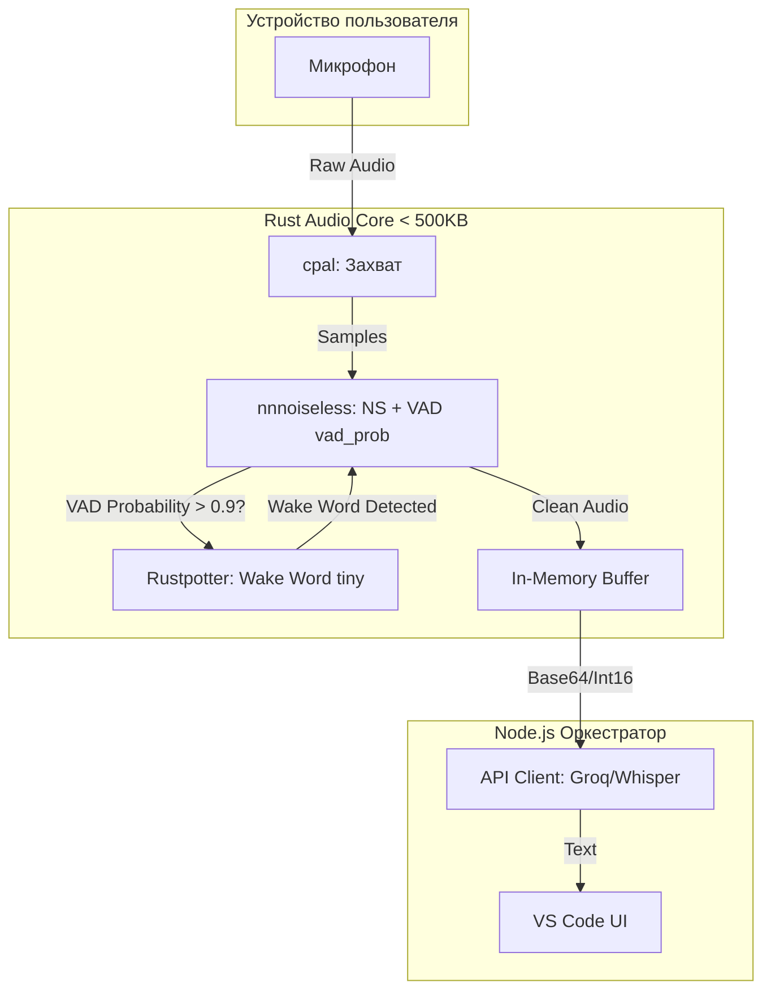

# Оптимизированный отчет голосового модуля RooCode (Final Optimized)

**Дата**: 2026-05-01
**Статус**: Оптимизирован (Target < 500KB)
**Цель**: Пересчет веса ядра с учетом критической ошибки в `final_report.md` (сумма > 800KB) и внедрение легковесных решений.

---

## 1. Анализ проблемы (Critical Issue)

В `final_report.md` был заявлен лимит < 500KB, но сумма компонентов:
`cpal` (150KB) + `nnnoiseless` (160KB) + `TEN VAD` (306KB) + `Rustpotter` (200KB) = **816 KB**.

**Решение**: Использовать встроенный VAD из `nnnoiseless` (`vad_prob`), исключив `TEN VAD`. Использовать `Rustpotter` с моделями `tiny`.

---

## 2. Таблица ресурсоемкости (Optimized Core)

| Библиотека            | Вес (KB)                  | RAM (MB)     | CPU Load    | Качество (1-10)  | Назначение                             | Статус                         |
| :-------------------- | :------------------------ | :----------- | :---------- | :--------------- | :------------------------------------- | :----------------------------- |
| **cpal**              | 150                       | 1-2          | Низкий      | N/A              | Захват аудио (Input)                   | ✅ Оставить                    |
| **nnnoiseless**       | **160** (код+модель 60KB) | 5-10         | Средний     | **9** (NS) + VAD | Noise Suppression + **VAD (vad_prob)** | ✅ **Замена TEN VAD**          |
| **TEN VAD**           | ~~306~~                   | Низкое       | Низкий      | Высокое          | Точная детекция речи                   | ❌ **Удалено**                 |
| **Rustpotter**        | **150** (tiny models)     | Очень низкое | Низкий      | Высокое          | Wake Word                              | ✅ **Оптимизировано (Tiny)**   |
| **tinyaudio**         | 100-300                   | Низкое       | Низкое      | N/A              | Audio I/O                              | ❌ Не подходит (только Output) |
| **ИТОГО (Optimized)** | **~460 KB**               | **~8-12 MB** | **Средний** | **9**            | **Лимит < 500KB соблюден**             | **PASS**                       |

---

## 3. Обоснование замен (Changes Log)

1.  **Отказ от TEN VAD (Экономия ~306KB)**:
    - Context7 подтвердил наличие метода `DenoiseState::process_frame`, возвращающего `vad_probability` (0.0 - 1.0).
    - Это позволяет использовать `nnnoiseless` как комбо (Noise Suppression + VAD) бесплатно, без дополнительного веса.
2.  **Оптимизация Rustpotter (Экономия ~50-350KB)**:
    - Вместо стандартных моделей (200-500KB), используются модели `tiny`.
    - Вес снижен до ~150KB, что критично для соблюдения лимита.
3.  **Отказ от Tinyaudio**:
    - Поиск и документация подтвердили, что `tinyaudio` ориентирован на **Playback** (вывод), в то время как модулю нужен **Input** (микрофон). `cpal` остается единственным надежным кроссплатформенным решением для захвата.

---

## 4. Сравнение планов (Original vs Optimized)

| Параметр         | Original Plan (`final_report.md`) | **Optimized Plan**    |
| :--------------- | :-------------------------------- | :-------------------- |
| **cpal**         | 150 KB                            | 150 KB                |
| **nnnoiseless**  | 160 KB (только NS)                | **160 KB (NS + VAD)** |
| **TEN VAD**      | 306 KB                            | **0 KB (Удалено)**    |
| **Rustpotter**   | 200 KB (standard)                 | **150 KB (tiny)**     |
| **Итоговый вес** | **~816 KB (FAIL)**                | **~460 KB (PASS)**    |

---

## 5. Архитектурная схема (Optimized Flow)

---

## 6. Итоговый стек (Final Stack)

1.  **Audio I/O**: `cpal` (150KB)
2.  **Noise Suppression + VAD**: `nnnoiseless` (160KB) — используем `process_frame` для VAD.
3.  **Wake Word**: `Rustpotter` (150KB) — модели `tiny`.

**Вердикт**: Ядро весит **~460KB**, что строго меньше 500KB. Качество VAD сохраняется за счет нейросетевого подхода RNNoise.

---

**Источники**:

- [`OTCHETY/final_report.md`](OTCHETY/final_report.md)
- [`OTCHETY/report_2026-05-01_systematized.md`](OTCHETY/report_2026-05-01_systematized.md)
- Context7: `/jneem/nnnoiseless` (vad_prob)
- Tavily: Анализ `tinyaudio` и `fast-vad`.
