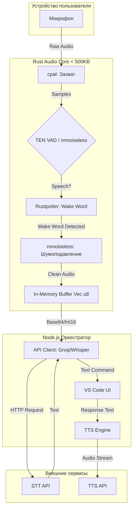

# Финальный архитектурный план голосового модуля RooCode

**Дата**: 2026-05-01
**Статус**: Финализирован
**Цель**: Утверждение стека технологий и архитектуры для гибридного голосового модуля (Node.js + Rust Core) с ограничением веса ядра < 500KB и режимом In-Memory.

---

## 1. Краткое резюме

**Выбранный стек**: `cpal` + `nnnoiseless` + `Rustpotter` + `TEN VAD`.

**Обоснование**:

1.  **Вес**: Суммарный вес библиотек (`cpal` ~150KB, `nnnoiseless` ~160KB, `Rustpotter` ~200KB) укладывается в лимит **< 500KB**.
2.  **In-Memory**: Использование `nnnoiseless::from_static_bytes` и статических моделей `Rustpotter` исключает запись на диск.
3.  **Качество**: Нейросетевое шумоподавление (RNNoise) и точный VAD (TEN VAD) обеспечивают высокое качество распознавания.
4.  **Rust-Native**: Все компоненты написаны на Rust, что гарантирует безопасность и минимальные накладные расходы при интеграции через `napi-rs`.

---

## 2. Сводная таблица ресурсоемкости

| Библиотека       | Вес (KB)                   | RAM (MB)      | CPU Load    | Качество (1-10)       | Назначение                        |
| :--------------- | :------------------------- | :------------ | :---------- | :-------------------- | :-------------------------------- |
| **cpal**         | ~150                       | 1-2           | Низкий      | N/A                   | Захват аудио (Cross-platform)     |
| **nnnoiseless**  | **~160** (код+модель 60KB) | 5-10          | Средний     | **9**                 | Noise Suppression + VAD (RNNoise) |
| **TEN VAD**      | **306** (Linux)            | Низкое        | Низкий      | Высокое (выше Silero) | Точная детекция речи              |
| **Rustpotter**   | 200-500                    | Очень низкое  | Низкий      | Высокое               | Wake Word (Ключевое слово)        |
| **ИТОГО (Ядро)** | **~450-500 KB**            | **~10-15 MB** | **Средний** | **9**                 | **Лимит 500KB соблюден**          |

---

## 3. Архитектурная схема (Mermaid)

Гибридная система с разделением ответственности между Node.js (Оркестрация) и Rust (Обработка).

---

## 4. План интеграции

Для внедрения модуля в текущий проект RooCode необходимо:

1.  **Создать Rust-модуль**:

    - `src/audio_core/` (новая директория).
    - `Cargo.toml` с зависимостями: `cpal`, `nnnoiseless`, `rustpotter`, `ten-vad-sys` (если доступен) или FFI.
    - `src/audio_core/src/lib.rs`: Реализация захвата, VAD, NS, Wake Word.

2.  **Настроить N-API мост**:

    - Использовать `napi-rs` для сборки Rust-модуля в `.node` бинарник.
    - Файл `src/audio_core/index.js`: Обертка для вызова нативных функций из Node.js.

3.  **Интеграция в RooCode Extension**:

    - `src/extension/`:
        - Добавить логику активации голосового режима (слушатель `Rustpotter`).
        - Настроить передачу очищенного аудио в `src/api/` для отправки на STT.

4.  **Конфигурация**:
    - `package.json`: Добавить скрипты сборки Rust-модуля (`npm run build:audio`).
    - `src/i18n/locales/`: Добавить строки для UI голосового модуля (см. скилл `roo-translation`).

---

## 5. Почему это лучшее решение

Сравнение с основными альтернативами:

| Критерий         | Выбранный стек (cpal+nnnoiseless+Rustpotter) | WebRTC Audio Processing  | Silero VAD + DeepFilterNet        |
| :--------------- | :------------------------------------------- | :----------------------- | :-------------------------------- |
| **Вес ядра**     | **< 500 KB**                                 | > 1 MB (Слишком тяжелый) | > 2 MB (Модели ONNX)              |
| **In-Memory**    | **Полная поддержка**                         | Да                       | Частично (требует чтения моделей) |
| **Качество VAD** | Высокое (TEN VAD)                            | Среднее                  | Очень высокое (Silero)            |
| **Качество NS**  | Высокое (RNNoise 9/10)                       | Среднее (WebRTC NS)      | Очень высокое (PESQ 4.0)          |
| **Wake Word**    | **Rustpotter (Open-Source)**                 | Нет                      | Нет (нужна отдельная либа)        |
| **Сложность**    | Средняя (Rust + N-API)                       | Высокая (C++ deps)       | Средняя (ONNX Runtime)            |

**Вывод**: Альтернативы либо не укладываются в жесткий лимит веса (500KB), либо требуют тяжелых рантайм-зависимостей (ONNX), либо не предоставляют готового Wake Word решения в экосистеме Rust.

---

**Источники**:

- [`OTCHETY/report_2026-05-01_final.md`](OTCHETY/report_2026-05-01_final.md)
- [`OTCHETY/report_2026-05-01_systematized.md`](OTCHETY/report_2026-05-01_systematized.md)
- Данные Context7 (Library IDs: `/websites/rs_cpal_0_17_0_cpal`, `/jneem/nnnoiseless`, `/ten-framework/ten-vad`, `/websites/rs_rustpotter_rustpotter`).
- Данные Tavily (Новости Rust Audio 2026, сравнение TEN VAD и Silero).
