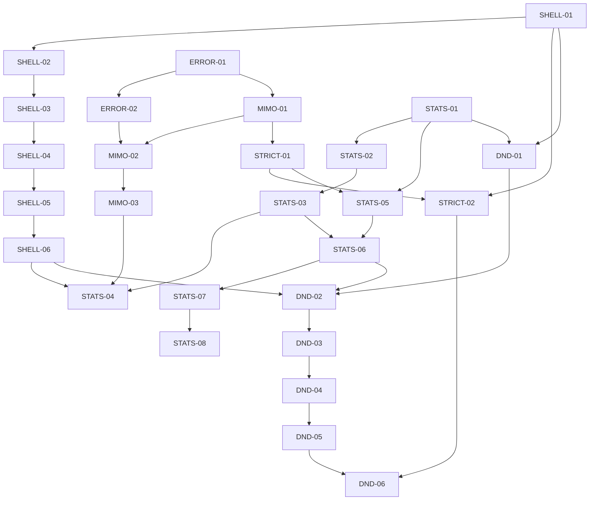

# PR Split Strategy: Six Stacked Feature Branches

## Overview

This report analyzes the stack:

```text
main
  -> feature/unified-shell-resolution
  -> feat/error-interception-middleware
  -> fix/mimo-parallel-tool-call-policy
  -> feat/openai-compatible-strict-reasoning
  -> feature/local-usage-stats
  -> feature/task-dnd-ux
```

The requested constraints cannot all be satisfied literally from the current branch tips:

1. The feature ranges contain **302 reviewable files** and roughly **53K changed lines**.
2. **33 individual files exceed 500 changed lines**. A file-exclusive PR cannot make one of those files smaller without changing the source design or allowing another PR to edit it.
3. The six features overlap on **38 paths**. Examples include `src/core/task/Task.ts`, `src/core/webview/ClineProvider.ts`, `src/core/webview/webviewMessageHandler.ts`, `src/api/providers/openai.ts`, `packages/types/src/index.ts`, and all 18 `chat.json` locale files.
4. The current stack is not cleanly based on the current local `main`. `feature/unified-shell-resolution` has 16 commits on `main` that are not ancestors of the branch. Later branches inherit upstream and cleanup commits in addition to their feature changes.
5. `fix/mimo-parallel-tool-call-policy` contains report-file and error-interception removal/re-add churn. Those commits must not be replayed into feature PRs.

Therefore, the technically safe unit is not “one PR per 100-300 changed lines.” The safe unit is **one PR per cohesive file ownership boundary**, with known large-file exceptions. The recommended plan has **27 PRs**, each with a disjoint file owner. Some PRs exceed 500 lines because one indivisible implementation or test file already exceeds that limit.

### Analysis method

- Cumulative inventory requested by the user: `git diff --name-only main...<branch>` and `git diff --numstat main...<branch>`.
- Introducing-feature attribution:
    - Shell: `main...feature/unified-shell-resolution`.
    - Error interception: feature commit range `26ec8ae88^..3013a09f7`, excluding unrelated upstream and cleanup files.
    - MiMo policy: feature commit range `ff9d40453^..25fc2edff`, excluding report files, baseline restoration, and error-interception churn.
    - Strict reasoning: feature commit `d983aefec`, with inherited shell locale additions excluded.
    - Local stats: `feat/openai-compatible-strict-reasoning..feature/local-usage-stats`.
    - Task DnD: `feature/local-usage-stats..feature/task-dnd-ux`.
- Line estimates are additions plus deletions from `git diff --numstat`. They are planning estimates, not promised final patch sizes, because overlap arbitration removes or relocates some hunks.

## Design options

Exactly three options were evaluated.

| Option                                   | Design                                                                                                                                                                                         |        Effort |    Risk | Outcome                                                                                                                               |
| ---------------------------------------- | ---------------------------------------------------------------------------------------------------------------------------------------------------------------------------------------------- | ------------: | ------: | ------------------------------------------------------------------------------------------------------------------------------------- |
| **A, Standard / Right Way, recommended** | Reconstruct 27 PRs from clean `main`, assign every path to one owner PR, move shared-file integration to explicit convergence PRs, and keep tests with their production owner where practical. |          High |  Lowest | File-disjoint review stack, auditable contracts, no cleanup-churn replay. Large-file exceptions remain visible.                       |
| **B, Practical / Pragmatic**             | Produce about 14 vertical-slice PRs by feature and subsystem. Keep each branch’s tests with implementation and accept 1K-5K line reviews.                                                      |        Medium |  Medium | Faster extraction and fewer integration branches, but less reviewable and still needs shared-file arbitration.                        |
| **C, Staging / Incremental**             | Submit six contract/scaffolding PRs first, then replay the existing branches as six large follow-ups behind feature flags.                                                                     | Low initially | Highest | Quickly proves buildability, but postpones the real split, does not meet the requested 20+ PR target, and leaves large risky reviews. |

**Decision:** use Option A. It addresses the root problem, overlapping ownership in a historical stacked branch chain, rather than treating commit boundaries as architectural boundaries.

# 1. Technical Specification

## 1.1 Goals and constraints

- Every recommended PR owns a unique set of files.
- A file may be listed in only one PR in this plan.
- PR dependencies are branch-base dependencies. A dependent PR must be based on the named predecessor until that predecessor lands.
- A PR may introduce dormant types or helpers before runtime wiring, but it must type-check and its focused tests must pass.
- Shared entrypoints are assigned to convergence PRs, not modified independently by every feature.
- Historical `docs/` reports, `.changeset` files, `src/eslint-suppressions.json` baseline churn, temporary scripts, and unrelated upstream commits are excluded from recovered feature PRs.
- New dependencies are introduced once, in the owner PR. For DnD this means `webview-ui/package.json` plus `pnpm-lock.yaml` are owned by DND-01.
- A split PR must not generate a changeset, in accordance with `AGENTS.md`.

## 1.2 Cross-domain data flows

### A. Unified shell resolution

```text
Settings UI
  -> WebviewMessage(shell setting/profile request)
  -> webviewMessageHandler
  -> ClineProvider / CommandEnvironmentService
  -> TerminalProfileResolver -> ShellResolver
  -> ResolvedCommandEnvironment snapshot
  -> system prompt + execute_command schema + ExecuteCommandTool
  -> TerminalRegistry / TerminalLifecycle / CommandScheduler
  -> ExecaTerminal or VS Code terminal
  -> structured result / ShellResolutionError
```

Core contracts are `ResolvedShell`, `ShellInvocationPlan`, `ResolvedCommandEnvironment`, and `ShellResolutionResult`. Explicit invalid overrides are rejectable. Automatic candidates fall through to a safe same-family fallback. Command contents must not appear in resolution errors.

### B. Error interception and MiMo parallel-tool policy

```text
Provider stream
  -> NativeToolCallParser
  -> ToolCallRetentionPolicy (provider/model capability)
  -> presentAssistantMessage
  -> ToolErrorInterceptor
  -> ErrorClassifier + StructuralValidator
  -> MessageTransformer
  -> tool_result for the model + structured error_details for the user
  -> TaskErrorState circuit/reset
  -> policy/error telemetry
```

The policy layer decides retain, quarantine, or reject before task execution. The error layer must fail open for unknown errors, preserve raw execution logging internally, omit secrets and raw diff payloads from user guidance, and correlate repeated failure categories per task.

### C. Local usage stats

```text
Provider usage chunk(s)
  -> Task terminal API-attempt boundary
  -> UsageRecorder
  -> UsageStatsService
  -> UsageEventStore (append-only NDJSON + manifest/cache)
  -> UsageAggregator / cost recalculation
  -> usageStatsMessageHandler
  -> WebviewMessage(requestId + StatsQuery)
  -> DashboardView / UsageHeatmap / SessionDetail
  <- response(requestId + snapshot/result/error)
```

`UsageEventV1` explicitly excludes prompts, responses, API keys, and workspace paths. Record once per final API attempt, not per stream chunk. Export/query messages use request IDs so stale responses can be ignored. Clear uses a host-issued, short-lived, single-use nonce. Store, aggregation, and handlers must preserve typed `STATS_*` error codes without exposing stack traces.

### D. Task organization and DnD

```text
History UI drag/pin/folder action
  -> ExtensionStateContext.mutateTaskOrganization
  -> WebviewMessage { requestId, baseRevision, mutation }
  -> taskOrganizationMessageHandler
  -> TaskOrganizationStore scoped by workspace identity
  -> atomic safeWriteJson
  -> mutation result + authoritative snapshot revision
  -> ExtensionStateContext ignores stale snapshots
  -> HistoryView / HistoryPreview projection refresh
```

The host owns persistence and conflict detection. The UI never directly writes organization JSON. Each mutation is idempotent and revision-checked. Failures return `TASK_ORG/<DOMAIN>/<NNN>` codes. Missing or corrupt files recover to an empty state; unsupported future schemas do not get overwritten.

## 1.3 Shared-file ownership rule

The following overlaps are resolved by assigning each file to one convergence PR:

| Shared path                                                                           | Owner PR  | Features integrated there                                   |
| ------------------------------------------------------------------------------------- | --------- | ----------------------------------------------------------- |
| `src/core/task/Task.ts`                                                               | STATS-04  | shell environment, MiMo policy, usage recorder              |
| `src/core/webview/ClineProvider.ts`                                                   | DND-02    | shell service, stats service, task organization store       |
| `src/core/webview/webviewMessageHandler.ts`                                           | DND-02    | shell, stats, task organization message routes              |
| `src/core/assistant-message/NativeToolCallParser.ts` and `presentAssistantMessage.ts` | MIMO-02   | error interception plus tool retention policy               |
| `src/api/providers/openai.ts` and its test                                            | STATS-05  | strict schemas/reasoning plus final usage accounting        |
| `packages/types/src/index.ts`, `vscode-extension-host.ts`, and `vscode.ts`            | DND-01    | all final exports and host/webview envelopes                |
| `webview-ui/src/components/settings/SettingsView.tsx`                                 | STRICT-02 | shell settings mount plus strict reasoning settings         |
| all locale `chat.json` files                                                          | DND-06    | strict chat-key cleanup plus task-organization chat cleanup |

This is the key rule that makes mutual file exclusivity possible. It also means some convergence PRs depend on more than one earlier feature chain.

# 2. Architecture Decisions

## 2.1 Branch findings

| Source branch                             | Feature-attributed files |                           Estimated feature diff | Main finding                                                                                                                                       |
| ----------------------------------------- | -----------------------: | -----------------------------------------------: | -------------------------------------------------------------------------------------------------------------------------------------------------- |
| `feature/unified-shell-resolution`        |                       58 |                                   +11,219 / -513 | Large terminal subsystem rewrite; 11 files individually exceed 500 lines.                                                                          |
| `feat/error-interception-middleware`      |     24, after exclusions |                               about +8,930 / -69 | Core implementation and tests are huge; later MiMo cleanup temporarily removes/re-adds this code.                                                  |
| `fix/mimo-parallel-tool-call-policy`      |     24, after exclusions |             about +2,100 / -300 net feature work | 18 report/baseline files and error-interception churn are contamination, not product changes.                                                      |
| `feat/openai-compatible-strict-reasoning` |  10 direct feature files | about +383 / -119 before shared-file arbitration | The branch-to-branch diff reports 27 files because inherited shell translations are removed. Do not treat those removals as strict-reasoning work. |
| `feature/local-usage-stats`               |                      112 |                                   +18,359 / -270 | Includes task-organization contracts/store required by later DnD and broad provider usage fixes.                                                   |
| `feature/task-dnd-ux`                     |                       83 |                                    +9,547 / -166 | UI-heavy; `HistoryView.tsx` and several tests exceed the requested PR maximum by themselves.                                                       |

## 2.2 Large-file exception policy

The 100-300 line target is treated as a preference, not a hard gate. A PR is marked **XL** when it contains an indivisible file over 500 changed lines. Splitting one file across multiple PRs would violate mutual file exclusivity. Do not hide this by suppressing tests or moving assertions into unrelated files.

Required review controls for XL PRs:

1. Attach a symbol-level review guide in the PR body.
2. Require focused tests before broad type-check/build.
3. Do not combine mechanical formatting with behavior changes.
4. Review generated snapshots and locale files separately from logic.
5. If owners insist on a hard 500-line cap, first refactor the large file on `main` in a separate owner-approved PR. That is a new scope decision, not a branch split.

## 2.3 Dependency and security analysis

- No new runtime service or external database is needed. Stats stay local and append-only.
- DnD depends on `@dnd-kit` packages already represented by `webview-ui/package.json` and the lockfile in the feature branch. Validate exact package versions before reconstruction; do not hand-edit the lockfile.
- Stats export and clear are security-sensitive local-data paths. The clear nonce and schema validation must remain in the host, not the webview.
- Usage records must not contain PII, prompts, responses, secrets, or full workspace paths.
- Shell selection is a command-execution boundary. Keep trust evidence, allowlisting, controlled argv construction, and non-interactive invocation intact.
- Task organization writes must remain atomic and workspace-scoped to prevent cross-workspace contamination.
- Error details shown to users must be sanitized, while internal logs retain enough diagnostics without echoing secrets.

## 2.4 Error contracts and edge cases

| Domain            | Required behavior                                                                                                                                                                                                                              |
| ----------------- | ---------------------------------------------------------------------------------------------------------------------------------------------------------------------------------------------------------------------------------------------- |
| Shell             | Invalid explicit override returns a typed rejectable error; missing automatic candidate falls through; inline and fallback shells must use compatible families; settings changes invalidate command-environment snapshots.                     |
| Interception      | Unknown errors pass through; known errors get deterministic guidance; repeated identical failures open a per-category circuit; a changed fingerprint resets the relevant category; image blocks survive transformation.                        |
| MiMo policy       | Known providers without explicit model capability preserve parallel behavior; MiMo max-one mode quarantines ghost/extra calls; malformed native args do not become executable tool calls; telemetry contains policy facts, not tool arguments. |
| Strict reasoning  | Disabled reasoning emits no reasoning field; `none` is distinct from disabled; strict schema mode is opt-in; unsupported values are clamped or omitted.                                                                                        |
| Stats             | Duplicate idempotency keys are ignored; corrupt NDJSON rows are quarantined; cancelled events follow query policy; missing historical cost is recalculated; stale webview responses are ignored; clear nonce is one-use and expires.           |
| Task organization | Stale `baseRevision` rejects without write; pins cap at three; duplicate membership is canonicalized; missing workspace hides workspace folders; corrupt/future schema is not destructively overwritten; DnD ignores interactive descendants.  |

# 3. Implementation Plan (Sub-tasks)

## 3.1 File notation

To keep the report readable, locale globs below mean exact existing locale sets, not arbitrary future files:

- `ALL_SETTINGS_LOCALES`: every `webview-ui/src/i18n/locales/<locale>/settings.json` changed by the source feature.
- `ALL_DASHBOARD_LOCALES`: all 18 `dashboard.json` files in the stats branch.
- `ALL_STATS_LOCALES`: all 18 `stats.json` files in the stats branch.
- `ALL_HISTORY_LOCALES`: all 18 `history.json` files in the DnD branch.
- `ALL_CHAT_LOCALES`: all 18 `chat.json` files in the DnD branch.
- `ALL_PACKAGE_NLS`: `src/package.nls.json` plus the 17 localized `src/package.nls.<locale>.json` files changed by the stats branch.

Every production path and test path below is owned by exactly one PR. Files omitted from the plan are deliberately excluded contamination or unrelated upstream changes.

## 3.2 Recommended 27 PRs

### SHELL-01, shell contracts, settings schema, and pure classification

- **Source:** `feature/unified-shell-resolution`
- **Files:**
    - `packages/types/src/global-settings.ts`
    - `packages/types/src/terminal.ts`
    - `packages/types/src/__tests__/terminal-shell-settings.spec.ts`
    - `src/integrations/terminal/shell/types.ts`
    - `src/integrations/terminal/types.ts`
    - `src/utils/shell.ts`
    - `src/utils/__tests__/shell.spec.ts`
- **Estimate:** about 900-1,000 changed lines.
- **Difficulty:** High, XL because the contract test is 316 lines and the public type surface is broad.
- **Prerequisites:** clean `main`; no runtime wiring.
- **Verification:** package type tests and backend shell utility tests.
- **Commands:** `pnpm --filter @roo-code/types test -- terminal-shell-settings.spec.ts`; `cd src; npx vitest run utils/__tests__/shell.spec.ts`; `pnpm check-types`.

### SHELL-02, profile and shell resolution algorithms

- **Files:**
    - `src/integrations/terminal/shell/TerminalProfileResolver.ts`
    - `src/integrations/terminal/shell/ShellResolver.ts`
    - `src/integrations/terminal/__tests__/TerminalProfile.spec.ts`
    - `src/integrations/terminal/__tests__/ShellResolver.spec.ts`
- **Estimate:** about 1,970 changed lines.
- **Difficulty:** High, XL; three files exceed 500 lines.
- **Dependencies:** SHELL-01.
- **Verification:** `cd src; npx vitest run integrations/terminal/__tests__/TerminalProfile.spec.ts integrations/terminal/__tests__/ShellResolver.spec.ts`; `cd src; pnpm check-types`.

### SHELL-03, invocation and command-environment planning

- **Files:**
    - `src/integrations/terminal/shell/ShellInvocationAdapter.ts`
    - `src/integrations/terminal/shell/CommandEnvironmentService.ts`
    - `src/integrations/terminal/__tests__/ShellInvocationAdapter.spec.ts`
- **Estimate:** about 655 changed lines.
- **Difficulty:** Medium-High.
- **Dependencies:** SHELL-02.
- **Verification:** `cd src; npx vitest run integrations/terminal/__tests__/ShellInvocationAdapter.spec.ts`; `cd src; pnpm check-types`.

### SHELL-04, terminal scheduler and lifecycle

- **Files:**
    - `src/integrations/terminal/CommandScheduler.ts`
    - `src/integrations/terminal/CommandTrace.ts`
    - `src/integrations/terminal/TerminalLifecycle.ts`
    - `src/integrations/terminal/__tests__/CommandScheduler.spec.ts`
    - `src/integrations/terminal/__tests__/TerminalLifecycle.spec.ts`
- **Estimate:** about 3,095 changed lines.
- **Difficulty:** Very High, XL. These classes and their tests form one state-machine boundary.
- **Dependencies:** SHELL-03.
- **Verification:** `cd src; npx vitest run integrations/terminal/__tests__/CommandScheduler.spec.ts integrations/terminal/__tests__/TerminalLifecycle.spec.ts`; `cd src; pnpm check-types`.

### SHELL-05, terminal registry and process adapters

- **Files:**
    - `src/integrations/terminal/BaseTerminal.ts`
    - `src/integrations/terminal/Terminal.ts`
    - `src/integrations/terminal/TerminalProcess.ts`
    - `src/integrations/terminal/TerminalRegistry.ts`
    - `src/integrations/terminal/ExecaTerminal.ts`
    - `src/integrations/terminal/ExecaTerminalProcess.ts`
    - `src/integrations/terminal/__tests__/TerminalRegistry.spec.ts`
    - `src/integrations/terminal/__tests__/TerminalProcess.spec.ts`
    - `src/integrations/terminal/__tests__/TerminalProcessExec.bash.spec.ts`
    - `src/integrations/terminal/__tests__/TerminalProcessExec.cmd.spec.ts`
    - `src/integrations/terminal/__tests__/TerminalProcessExec.pwsh.spec.ts`
    - `src/integrations/terminal/__tests__/ExecaTerminalProcess.spec.ts`
- **Estimate:** about 2,650 changed lines.
- **Difficulty:** Very High, XL.
- **Dependencies:** SHELL-04.
- **Verification:** `cd src; npx vitest run integrations/terminal/__tests__/TerminalRegistry.spec.ts integrations/terminal/__tests__/TerminalProcess.spec.ts integrations/terminal/__tests__/TerminalProcessExec.bash.spec.ts integrations/terminal/__tests__/TerminalProcessExec.cmd.spec.ts integrations/terminal/__tests__/TerminalProcessExec.pwsh.spec.ts integrations/terminal/__tests__/ExecaTerminalProcess.spec.ts`; `cd src; pnpm check-types`.

### SHELL-06, execute-command and prompt integration

- **Files:**
    - `src/core/task/build-tools.ts`
    - `src/core/tools/ExecuteCommandTool.ts`
    - `src/core/tools/__tests__/executeCommandTool.spec.ts`
    - `src/core/tools/__tests__/terminal-provider-fallback.spec.ts`
    - `src/core/prompts/system.ts`
    - `src/core/prompts/sections/rules.ts`
    - `src/core/prompts/sections/system-info.ts`
    - `src/core/prompts/tools/native-tools/execute_command.ts`
    - `src/core/prompts/tools/native-tools/index.ts`
    - `src/core/prompts/__tests__/shell-environment-prompt.spec.ts`
    - all changed shell-related prompt snapshot files under `src/core/prompts/__tests__/__snapshots__/`
    - `src/core/webview/generateSystemPrompt.ts`
    - `src/extension.ts`
- **Estimate:** about 2,050 changed lines.
- **Difficulty:** High, XL.
- **Dependencies:** SHELL-05. Final host service construction remains for DND-02, and final `Task.ts` use remains for STATS-04.
- **Verification:** `cd src; npx vitest run core/tools/__tests__/executeCommandTool.spec.ts core/tools/__tests__/terminal-provider-fallback.spec.ts core/prompts/__tests__/shell-environment-prompt.spec.ts`; `cd src; pnpm check-types`; `pnpm build`.

### ERROR-01, error taxonomy, patterns, validation, state, and transformation

- **Source:** `feat/error-interception-middleware`
- **Files:**
    - all production files in `src/core/tools/error-interception/`
    - except files under its `__tests__/` directory
- **Estimate:** about 2,820 changed lines.
- **Difficulty:** Very High, XL. `errorPatterns.ts` alone exceeds 700 lines.
- **Prerequisites:** clean `main`; exported APIs may remain unused until MIMO-02.
- **Verification:** `cd src; pnpm check-types` and the tests introduced in ERROR-02 after that PR is stacked.

### ERROR-02, interceptor unit test suite

- **Files:** all five files in `src/core/tools/error-interception/__tests__/`.
- **Estimate:** about 3,430 lines.
- **Difficulty:** High, XL; three individual test files exceed 900 lines.
- **Dependencies:** ERROR-01.
- **Verification:** `cd src; npx vitest run core/tools/error-interception/__tests__/ErrorClassifier.spec.ts core/tools/error-interception/__tests__/MessageTransformer.spec.ts core/tools/error-interception/__tests__/StructuralValidator.spec.ts core/tools/error-interception/__tests__/TaskErrorState.spec.ts core/tools/error-interception/__tests__/ToolErrorInterceptor.spec.ts`.

### MIMO-01, model capability, provider controls, and API policy resolution

- **Source:** `fix/mimo-parallel-tool-call-policy`
- **Files:**
    - `packages/types/src/model.ts`
    - `packages/types/src/providers/mimo.ts`
    - `src/api/index.ts`
    - `src/api/providers/mimo.ts`
    - `src/api/providers/__tests__/mimo.spec.ts`
    - `src/core/task/__tests__/tool-call-policy.spec.ts`
- **Estimate:** about 700-850 changed lines after retaining final stats-compatible MiMo usage accounting.
- **Difficulty:** High.
- **Dependencies:** ERROR-01 for final structural validation semantics; otherwise isolated.
- **Verification:** `cd src; npx vitest run api/providers/__tests__/mimo.spec.ts core/task/__tests__/tool-call-policy.spec.ts`; `cd src; pnpm check-types`.

### MIMO-02, parser, retention policy, task-result integration, and parser tests

- **Files:**
    - `src/core/assistant-message/NativeToolCallParser.ts`
    - `src/core/assistant-message/presentAssistantMessage.ts`
    - `src/core/assistant-message/ToolCallRetentionPolicy.ts`
    - `src/core/assistant-message/__tests__/NativeToolCallParser.spec.ts`
    - `src/core/assistant-message/__tests__/ToolCallRetentionPolicy.spec.ts`
    - `src/core/assistant-message/__tests__/presentAssistantMessage-error-interception.spec.ts`
    - `src/core/assistant-message/__tests__/presentAssistantMessage-parser-dedup.integration.spec.ts`
    - `src/core/assistant-message/__tests__/error-interceptor-guided-format.integration.spec.ts`
    - `src/core/assistant-message/__tests__/presentAssistantMessage-unknown-tool.spec.ts`
    - `src/core/assistant-message/__tests__/presentAssistantMessage-custom-tool.spec.ts`
    - `src/core/assistant-message/__tests__/presentAssistantMessage-images.spec.ts`
    - `src/shared/tools.ts`
    - `apps/vscode-e2e/src/fixtures/apply-diff.ts`
    - `apps/vscode-e2e/src/suite/subtasks.test.ts`
- **Estimate:** about 5,000 changed lines.
- **Difficulty:** Very High, XL. This is the convergence point that prevents ERROR and MIMO from editing the same parser/presenter files.
- **Dependencies:** ERROR-02 and MIMO-01.
- **Verification:** `cd src; npx vitest run core/assistant-message/__tests__/NativeToolCallParser.spec.ts core/assistant-message/__tests__/ToolCallRetentionPolicy.spec.ts core/assistant-message/__tests__/presentAssistantMessage-error-interception.spec.ts core/assistant-message/__tests__/presentAssistantMessage-parser-dedup.integration.spec.ts core/assistant-message/__tests__/error-interceptor-guided-format.integration.spec.ts core/assistant-message/__tests__/presentAssistantMessage-unknown-tool.spec.ts core/assistant-message/__tests__/presentAssistantMessage-custom-tool.spec.ts core/assistant-message/__tests__/presentAssistantMessage-images.spec.ts`; `cd src; pnpm check-types`. Run the e2e subtask suite only after unit coverage passes.

### MIMO-03, policy telemetry

- **Files:**
    - `packages/types/src/telemetry.ts`
    - `packages/telemetry/src/TelemetryService.ts`
    - `src/core/assistant-message/__tests__/ToolCallRetentionPolicy-telemetry.spec.ts`
- **Estimate:** about 370 lines.
- **Difficulty:** Medium.
- **Dependencies:** MIMO-02.
- **Verification:** `cd src; npx vitest run core/assistant-message/__tests__/ToolCallRetentionPolicy-telemetry.spec.ts`; `pnpm --filter @roo-code/telemetry check-types`; `cd src; pnpm check-types`.

### STRICT-01, strict schema and reasoning backend contracts

- **Source:** `feat/openai-compatible-strict-reasoning`
- **Files:**
    - `packages/types/src/provider-settings.ts`
    - `packages/types/src/__tests__/provider-settings.test.ts`
    - `src/api/providers/base-provider.ts`
    - `src/api/providers/base-openai-compatible-provider.ts`
    - `src/api/providers/__tests__/base-provider.spec.ts`
- **Estimate:** about 390 lines.
- **Difficulty:** Medium.
- **Dependencies:** MIMO-01 only if its final model capability type is referenced.
- **Verification:** `pnpm --filter @roo-code/types test -- provider-settings.test.ts`; `cd src; npx vitest run api/providers/__tests__/base-provider.spec.ts`; `cd src; pnpm check-types`.

### STRICT-02, OpenAI-compatible settings UI and translations

- **Files:**
    - `webview-ui/src/components/settings/providers/OpenAICompatible.tsx`
    - `webview-ui/src/components/settings/ThinkingBudget.tsx`
    - `webview-ui/src/components/settings/__tests__/ThinkingBudget.spec.tsx`
    - `webview-ui/src/components/settings/SettingsView.tsx`
    - `ALL_SETTINGS_LOCALES`
- **Estimate:** about 550-700 lines, including the final shell settings mount and all strict reasoning labels.
- **Difficulty:** High.
- **Dependencies:** STRICT-01 and SHELL-01.
- **Verification:** `cd webview-ui; npx vitest run src/components/settings/__tests__/ThinkingBudget.spec.tsx`; `cd webview-ui; pnpm check-types`; `cd webview-ui; pnpm build`.

### STATS-01, usage event and query contracts

- **Source:** `feature/local-usage-stats`
- **Files:**
    - `packages/types/src/usage-stats.ts`
    - `packages/types/src/__tests__/usage-stats.spec.ts`
- **Estimate:** 512 lines.
- **Difficulty:** Medium-High, just above target.
- **Prerequisites:** clean `main` plus final provider/model type baseline.
- **Verification:** `pnpm --filter @roo-code/types test -- usage-stats.spec.ts`; `pnpm --filter @roo-code/types check-types`.

### STATS-02, append-only event store and service

- **Files:**
    - `src/services/stats/UsageEventStore.ts`
    - `src/services/stats/UsageStatsService.ts`
    - `src/services/stats/index.ts`
    - `src/services/stats/__tests__/UsageEventStore.spec.ts`
    - `src/services/stats/__tests__/UsageStatsService.spec.ts`
- **Estimate:** about 2,805 lines.
- **Difficulty:** Very High, XL. Storage integrity and clear-nonce behavior belong in one review chain.
- **Dependencies:** STATS-01.
- **Verification:** `cd src; npx vitest run services/stats/__tests__/UsageEventStore.spec.ts services/stats/__tests__/UsageStatsService.spec.ts`; `cd src; pnpm check-types`.

### STATS-03, aggregation and cost recalculation

- **Files:**
    - `src/services/stats/UsageAggregator.ts`
    - `src/services/stats/costRecalculation.ts`
    - `src/services/stats/__tests__/UsageAggregator.spec.ts`
    - `src/services/stats/__tests__/costRecalculation.spec.ts`
- **Estimate:** about 2,180 lines.
- **Difficulty:** Very High, XL.
- **Dependencies:** STATS-02.
- **Verification:** `cd src; npx vitest run services/stats/__tests__/UsageAggregator.spec.ts services/stats/__tests__/costRecalculation.spec.ts`; `cd src; pnpm check-types`.

### STATS-04, final task instrumentation and usage recording

- **Files:**
    - `src/services/stats/UsageRecorder.ts`
    - `src/core/task/Task.ts`
    - `src/core/task/__tests__/Task.usage-stats.spec.ts`
- **Estimate:** about 920 lines, including final shell and MiMo integrations in `Task.ts`.
- **Difficulty:** Very High, XL.
- **Dependencies:** SHELL-06, MIMO-03, and STATS-03.
- **Verification:** `cd src; npx vitest run core/task/__tests__/Task.usage-stats.spec.ts core/task/__tests__/tool-call-policy.spec.ts`; `cd src; pnpm check-types`.

### STATS-05, normalize final provider usage events

- **Files:**
    - `src/api/providers/anthropic-vertex.ts` and its changed test
    - `src/api/providers/kenari.ts` and its changed test
    - `src/api/providers/mistral.ts` and its changed test
    - `src/api/providers/moonshot.ts` and its changed test
    - `src/api/providers/openai.ts`
    - `src/api/providers/openai-codex.ts`
    - `src/api/providers/__tests__/openai.spec.ts`
    - `src/api/providers/__tests__/openai-usage-tracking.spec.ts`
    - `packages/types/src/providers/qwen-code.ts`
- **Estimate:** about 620-700 lines.
- **Difficulty:** High, cross-provider regression risk.
- **Dependencies:** STRICT-01 and STATS-01. `openai.ts` owns the final strict-schema plus usage-accounting form.
- **Verification:** `cd src; npx vitest run api/providers/__tests__/anthropic-vertex.spec.ts api/providers/__tests__/kenari.spec.ts api/providers/__tests__/mistral.spec.ts api/providers/__tests__/moonshot.spec.ts api/providers/__tests__/openai.spec.ts api/providers/__tests__/openai-usage-tracking.spec.ts`; `cd src; pnpm check-types`.

### STATS-06, host query/export/clear/session bridge

- **Files:**
    - `src/core/webview/usageStatsMessageHandler.ts`
    - `src/core/webview/__tests__/usageStatsMessageHandler.spec.ts`
- **Estimate:** about 2,140 lines.
- **Difficulty:** Very High, XL.
- **Dependencies:** STATS-03 and STATS-05.
- **Verification:** `cd src; npx vitest run core/webview/__tests__/usageStatsMessageHandler.spec.ts`; `cd src; pnpm check-types`.

### STATS-07, dashboard UI, heatmap, sessions, and formatters

- **Files:**
    - `webview-ui/src/App.tsx`
    - all files under `webview-ui/src/components/dashboard/`
    - all files under `webview-ui/src/components/stats/`
    - `webview-ui/src/utils/formatNumber.ts`
    - `webview-ui/src/utils/__tests__/formatNumber.spec.ts`
- **Estimate:** about 4,170 lines.
- **Difficulty:** Very High, XL. `DashboardView.tsx` and its test each exceed 900 lines.
- **Dependencies:** STATS-06.
- **Verification:** `cd webview-ui; npx vitest run src/components/dashboard/__tests__/DashboardSummary.spec.tsx src/components/dashboard/__tests__/DashboardView.spec.tsx src/components/dashboard/__tests__/SessionDetail.spec.tsx src/components/dashboard/__tests__/SessionList.spec.tsx src/components/stats/__tests__/UsageHeatmap.spec.tsx src/utils/__tests__/formatNumber.spec.ts`; `cd webview-ui; pnpm build`.

### STATS-08, dashboard and command localization

- **Files:** `ALL_DASHBOARD_LOCALES`, `ALL_STATS_LOCALES`, `ALL_PACKAGE_NLS`, `src/activate/registerCommands.ts`, and `src/services/command/__tests__/built-in-commands.spec.ts`.
- **Estimate:** about 3,190 lines, mostly repetitive locale resources.
- **Difficulty:** Medium logic, High review volume.
- **Dependencies:** STATS-07.
- **Verification:** `cd src; npx vitest run services/command/__tests__/built-in-commands.spec.ts`; `cd webview-ui; pnpm check-types`; run the repository translation parity checker if present in the final branch.

### DND-01, task-organization contract envelope and DnD dependencies

- **Source:** contracts originate in `feature/local-usage-stats`; dependency files originate in `feature/task-dnd-ux`.
- **Files:**
    - `packages/types/src/task-organization.ts`
    - `packages/types/src/index.ts`
    - `packages/types/src/vscode-extension-host.ts`
    - `packages/types/src/vscode.ts`
    - `webview-ui/package.json`
    - `pnpm-lock.yaml`
    - `webview-ui/vitest.setup.ts`
- **Estimate:** about 350 lines plus lockfile changes.
- **Difficulty:** High because these are shared public envelopes and dependency ownership.
- **Dependencies:** SHELL-01 and STATS-01 so final host/webview exports include all contracts once.
- **Verification:** `pnpm install --frozen-lockfile`; `pnpm --filter @roo-code/types check-types`; `cd webview-ui; pnpm check-types`.

### DND-02, workspace-scoped store and final host convergence

- **Files:**
    - `src/core/task-persistence/TaskOrganizationStore.ts`
    - `src/core/task-persistence/__tests__/TaskOrganizationStore.spec.ts`
    - `src/core/task-persistence/index.ts`
    - `src/core/webview/taskOrganizationMessageHandler.ts`
    - `src/core/webview/__tests__/taskOrganizationMessageHandler.spec.ts`
    - `src/core/webview/ClineProvider.ts`
    - `src/core/webview/webviewMessageHandler.ts`
    - `src/shared/globalFileNames.ts`
    - `src/utils/safeWriteJson.ts`
- **Estimate:** about 2,350 lines. This PR owns final shell, stats, and task-organization host construction/routes.
- **Difficulty:** Very High, XL.
- **Dependencies:** SHELL-06, STATS-06, and DND-01.
- **Verification:** `cd src; npx vitest run core/task-persistence/__tests__/TaskOrganizationStore.spec.ts core/webview/__tests__/taskOrganizationMessageHandler.spec.ts`; `cd src; pnpm check-types`; `pnpm build`.

### DND-03, webview state bridge and pure organization projection

- **Files:**
    - `webview-ui/src/context/ExtensionStateContext.tsx`
    - `webview-ui/src/context/__tests__/ExtensionStateContext.taskOrganization.spec.tsx`
    - `webview-ui/src/components/history/types.ts`
    - `webview-ui/src/components/history/taskOrganizationModel.ts`
    - `webview-ui/src/components/history/__tests__/taskOrganizationModel.setup.ts`
    - `webview-ui/src/components/history/__tests__/taskOrganizationModel.vitest.config.ts`
    - `webview-ui/src/components/history/__tests__/taskOrganizationModel.spec.ts`
- **Estimate:** about 1,960 lines.
- **Difficulty:** Very High, XL.
- **Dependencies:** DND-02.
- **Verification:** `cd webview-ui; npx vitest run src/context/__tests__/ExtensionStateContext.taskOrganization.spec.tsx`; `cd webview-ui; npx vitest run --config src/components/history/__tests__/taskOrganizationModel.vitest.config.ts src/components/history/__tests__/taskOrganizationModel.spec.ts`; `cd webview-ui; pnpm check-types`.

### DND-04, interaction context, sensors, DnD surface, and dialogs

- **Files:**
    - `webview-ui/src/components/history/TaskOrganizationInteractionContext.tsx`
    - `webview-ui/src/components/history/TaskOrganizationPointerSensor.ts`
    - `webview-ui/src/components/history/useTaskOrganizationDnd.ts`
    - `webview-ui/src/components/history/TaskOrganizationDndSurface.tsx`
    - `webview-ui/src/components/history/TaskOrganizationErrorBoundary.tsx`
    - `webview-ui/src/components/history/FolderNameDialog.tsx`
    - `webview-ui/src/components/history/DeleteFoldersDialog.tsx`
    - their matching test files under `webview-ui/src/components/history/__tests__/`
- **Estimate:** about 2,250 lines.
- **Difficulty:** Very High, XL.
- **Dependencies:** DND-03.
- **Verification:** `cd webview-ui; npx vitest run src/components/history/__tests__/TaskOrganizationInteractionContext.spec.tsx src/components/history/__tests__/TaskOrganizationPointerSensor.spec.ts src/components/history/__tests__/useTaskOrganizationDnd.spec.tsx src/components/history/__tests__/TaskOrganizationDndSurface.spec.tsx src/components/history/__tests__/TaskOrganizationErrorBoundary.spec.tsx src/components/history/__tests__/DeleteFoldersDialog.spec.tsx`; `cd webview-ui; pnpm check-types`.

### DND-05, history and preview presentation

- **Files:**
    - `webview-ui/src/components/history/HistoryView.tsx`
    - `webview-ui/src/components/history/HistoryPreview.tsx`
    - `webview-ui/src/components/history/ManualFolderItem.tsx`
    - `webview-ui/src/components/history/DraggableTaskEntry.tsx`
    - `webview-ui/src/components/history/PinButton.tsx`
    - `webview-ui/src/components/history/PinnedHistoryItem.tsx`
    - `webview-ui/src/components/history/SubtaskRow.tsx`
    - `webview-ui/src/components/history/TaskGroupItem.tsx`
    - `webview-ui/src/components/history/TaskItem.tsx`
    - `webview-ui/src/components/history/TaskItemFooter.tsx`
    - the matching `HistoryView`, `HistoryPreview`, `ManualFolderItem`, `DraggableTaskEntry`, `PinButton`, and `TaskItemFooter` test files under `webview-ui/src/components/history/__tests__/`
- **Estimate:** about 5,100 lines.
- **Difficulty:** Very High, XL. File exclusivity prevents splitting `HistoryView.tsx` or its 1,032-line regression test across PRs.
- **Dependencies:** DND-04.
- **Verification:** `cd webview-ui; npx vitest run src/components/history/__tests__/HistoryView.taskOrganization.spec.tsx src/components/history/__tests__/HistoryPreview.taskOrganization.spec.tsx src/components/history/__tests__/HistoryPreview.spec.tsx src/components/history/__tests__/ManualFolderItem.spec.tsx src/components/history/__tests__/DraggableTaskEntry.spec.tsx src/components/history/__tests__/PinButton.spec.tsx src/components/history/__tests__/TaskItemFooter.spec.tsx`; `cd webview-ui; pnpm build`.

### DND-06, history/chat localization and parity

- **Files:** `ALL_HISTORY_LOCALES`, `ALL_CHAT_LOCALES`, and `webview-ui/src/i18n/__tests__/translation-parity.spec.ts`.
- **Estimate:** about 950 lines.
- **Difficulty:** Medium logic, High review volume.
- **Dependencies:** STRICT-02 and DND-05 because this PR owns the final form of overlapping chat locale files.
- **Verification:** `cd webview-ui; npx vitest run src/i18n/__tests__/translation-parity.spec.ts`; `cd webview-ui; pnpm check-types`.

## 3.3 Dependency graph



## 3.4 Recommended submission order

Code owners can review independent chains in parallel, but merge in this topological order:

1. SHELL-01 and ERROR-01.
2. SHELL-02, ERROR-02, and STATS-01.
3. SHELL-03, MIMO-01, and STATS-02.
4. SHELL-04, MIMO-02, STRICT-01, and STATS-03.
5. SHELL-05 and MIMO-03.
6. SHELL-06, STRICT-02, and STATS-05.
7. STATS-04 and STATS-06.
8. STATS-07 and DND-01.
9. STATS-08 and DND-02.
10. DND-03.
11. DND-04.
12. DND-05.
13. DND-06.

The numbered order contains all **27 PRs**. Parallel review is safe only when dependencies are respected and each PR stays on its assigned file list.

## 3.5 Review difficulty summary

| Difficulty     | PRs                                                                                                                               | Count |
| -------------- | --------------------------------------------------------------------------------------------------------------------------------- | ----: |
| Medium         | MIMO-03, STRICT-01, STATS-01, STATS-08, DND-06                                                                                    |     5 |
| High           | SHELL-01, SHELL-03, SHELL-06, ERROR-02, MIMO-01, STRICT-02, STATS-05, DND-01                                                      |     8 |
| Very High / XL | SHELL-02, SHELL-04, SHELL-05, ERROR-01, MIMO-02, STATS-02, STATS-03, STATS-04, STATS-06, STATS-07, DND-02, DND-03, DND-04, DND-05 |    14 |

The difficulty buckets are mutually exclusive and total 27 PRs. For scheduling, treat every `Very High / XL` PR as two review sessions, one for production code and one for tests/data.

## 3.6 Reconstruction protocol

1. Create every PR branch from the latest clean `main`, not by continuing the historical stack.
2. Extract only hunks for the PR’s owner files. Do not cherry-pick cleanup commits wholesale.
3. For shared owner files, reconstruct the final intended form after all named dependencies, rather than replaying intermediate branch versions.
4. Run the focused command listed for the PR.
5. Run package-local type checking.
6. For convergence PRs, run `pnpm build` after focused tests.
7. Before opening each PR, compare its changed path list against this report. Any path owned by another PR is a hard stop.
8. Before the final DND-06 PR, run the full repository `pnpm check-types`, `pnpm test`, and `pnpm build` from the workspace root.

## 3.7 Explicit exclusions

Do not include the following in recovered feature PRs:

- historical session reports under `docs/` other than this strategy document;
- `.changeset/itchy-moles-thank.md`;
- `src/eslint-suppressions.json` remove/re-add/BOM churn;
- temporary scripts such as `ci-fix-commit.ps1`, `commit-and-push.ps1`, `resolve_conflicts.py`, and commit-message scratch files;
- unrelated upstream release, Node version, provider canonicalization, visual regression, ripgrep, TaskRegistry, README, CI, and locale README commits inherited by the error branch;
- branch-cleanup commits whose only purpose was removing contamination;
- shell translation removal shown in `fix/mimo...strict-reasoning`; keep those translations with the final settings locale owner instead.

## 3.8 Acceptance gates

- **File exclusivity:** no changed path appears in two open split PRs.
- **Buildability:** each PR passes its focused test and local type check on its declared base.
- **Cross-domain contracts:** request and response types compile on both host and webview sides before UI wiring lands.
- **Error safety:** typed errors, no production stack traces in UI, no command text or secrets in shell-resolution errors.
- **Data safety:** no prompt/response/workspace path in usage NDJSON; clear requires host nonce; task organization writes are atomic and workspace-scoped.
- **Reviewability:** every XL PR includes a symbol-level review checklist and separates production review from test review.
- **Final integration:** final stack passes `pnpm check-types`, `pnpm test`, and `pnpm build`.

## Task report metadata

### Task Summary

Analyzed six stacked branches and designed a file-exclusive 27-PR recovery plan with explicit dependency, communication, error, test, and review boundaries.

### Actions Taken

- Inventoried cumulative and introducing-feature diffs.
- Identified 38 overlapping paths and 33 files over 500 changed lines.
- Removed historical branch contamination from the proposed product scope.
- Assigned shared entrypoints to convergence PRs.
- Defined focused verification commands for each PR.

### Result

**Success with documented constraint exceptions.** The plan achieves 20+ PRs and file exclusivity. It cannot guarantee 500 lines or fewer for every PR without first refactoring individual source/test files that already exceed that size.

### Issues Discovered

- Historical branch ranges contain unrelated upstream commits and cleanup churn.
- The oldest branch is not a direct ancestor of the current local `main`.
- Several architectural seams are currently concentrated in very large files.

### Next Step Recommendations

The VP should delegate reconstruction in the submission order above and audit each PR’s changed-path list before implementation begins.

### Affected File List

- `docs/260729_0001_session_branch-recovery/pr-split-strategy.md`
