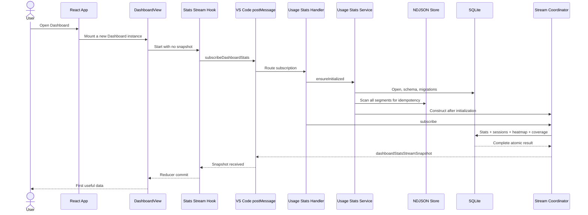
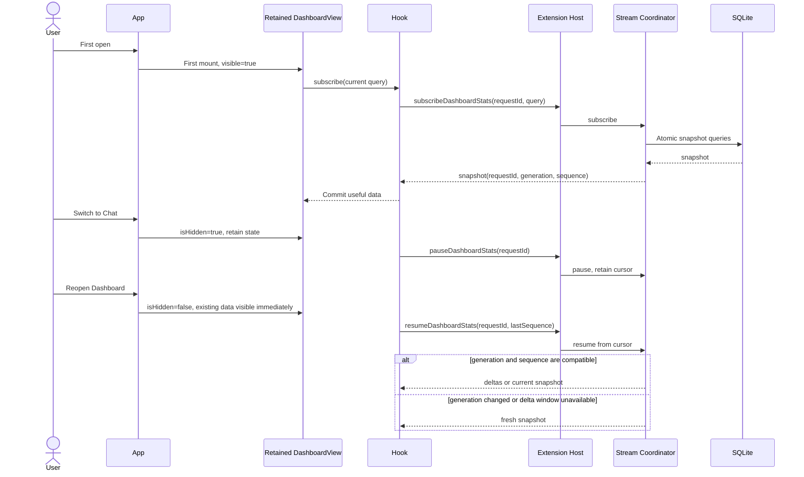
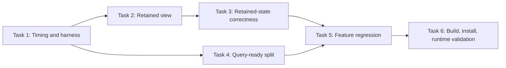

# Architect Task Report: Dashboard Cold-Open Performance

## Task Summary

Design an implementation-ready reduction of Dashboard cold-open latency while preserving every visible function: Today, 7d, 30d, Custom, All, grouping, cache ratio, heatmap ranges, refresh, export, rebuild, clear, summary, breakdown, coverage, session pagination, and session detail.

No product code was changed in this phase.

## Overview

The steady-state SQLite read path is not the observed bottleneck. On the installed data set, individual first-snapshot queries measured approximately 0.02–0.64 ms, while the database contains 9,737 events and uses the expected indexes. The user-visible delay is exposed by lifecycle design:

1. The Dashboard is destroyed whenever the tab changes.
2. Its reducer snapshot, controls, session page, and detail cache are lost.
3. Reopening starts from an empty state and shows a blocking loading state.
4. A new IPC subscription waits for service initialization and a complete atomic snapshot.
5. Service initialization includes a full NDJSON idempotency scan. The installed 7.25 MiB store measured about 115 ms warm, and this work can be duplicated because each provider owns a separate stats service.
6. There is no end-to-end phase trace, so the remaining unmeasured delay cannot safely be attributed to SQLite, React, IPC, or extension-host contention.

The recommended design is **Option A**: retain the Dashboard after its first activation, use the already implemented pause/resume protocol while hidden, render its last-known data immediately on reopen, and instrument the full UI → IPC → service → SQLite → IPC → UI path. Move NDJSON idempotency recovery out of the read-readiness gate in a subsequent bounded backend task. Do not change the snapshot wire contract unless measurements prove that atomic section delivery misses the budget.

## Evidence

### Installed-data measurements

| Measurement                             |       Result |
| --------------------------------------- | -----------: |
| SQLite database size                    |     8.72 MiB |
| Canonical events                        |        9,737 |
| Rollup rows                             |          308 |
| Sessions                                |           80 |
| Today totals first query                |     0.116 ms |
| Today/model first query                 |     0.115 ms |
| First 50 sessions                       |     0.284 ms |
| 30-day heatmap                          |     0.135 ms |
| Today coverage                          |     0.644 ms |
| NDJSON size                             |     7.25 MiB |
| NDJSON idempotency rebuild, warm median | about 115 ms |
| Main webview JavaScript bundle          |     5.71 MiB |

The existing backend performance suite passed 16 tests. Its 10K-event assertions measure only projection assembly, not service initialization, IPC, reducer work, or first useful paint.

### Current critical path



The SQL section is measured as sub-millisecond. The unmount/remount path guarantees an empty visual state and makes every remaining delay visible to the user.

## [1. Technical Specification]

### Goals and core constraints

1. Preserve all visible Dashboard behavior and controls.
2. Do not display data for a different query as if it were current.
3. Keep request-epoch rejection, generation handling, and sequence resync semantics intact.
4. Hidden Dashboard subscriptions must not continue consuming delta/render work.
5. Reopening after one successful snapshot must show useful last-known data without a blocking spinner.
6. A truly fresh Dashboard with no snapshot may show skeleton/loading UI, but controls must remain responsive.
7. Clear and generation changes must invalidate retained data before it can be presented as current.
8. Rebuild and refresh must use stale-while-revalidate. Existing data stays visible with a non-blocking refresh indicator.
9. No new external dependency is required.
10. The existing full snapshot remains the source of truth until timing evidence justifies a protocol split.

### Performance budgets

These are acceptance budgets, measured at p95 after five warm-up iterations and 30 measured iterations unless the test is explicitly a cold-service case.

| User-visible milestone                                                           |                   Budget |
| -------------------------------------------------------------------------------- | -----------------------: |
| Tab action to Dashboard controls committed                                       |                  ≤ 50 ms |
| Reopen after a prior snapshot to last-known summary visible                      |                 ≤ 100 ms |
| Warm service subscribe to fresh Today snapshot received                          |                 ≤ 250 ms |
| Cold service subscribe to first useful Today data on the installed-scale fixture |                 ≤ 500 ms |
| Blocking spinner without progress or stale data                                  |      never beyond 500 ms |
| Default Today snapshot SQL assembly on 10K fixture                               | ≤ 200 ms, existing guard |

The first four budgets must be captured independently. A fast SQL assertion cannot substitute for a slow end-to-end budget.

### Recommended frontend lifecycle

The Dashboard is mounted only after its first activation, then retained:

```text
dashboardActivated = false
user opens Dashboard -> dashboardActivated = true
dashboardActivated -> render DashboardView permanently
isVisible = current tab is Dashboard
hidden -> retain reducer and local controls, send pause
visible again -> synchronously reveal retained DOM/data, send resume(lastSequence)
```

Required view contract:

```ts
interface DashboardViewProps {
	onDone: () => void
	isHidden: boolean
}
```

Required hook use:

```ts
useDashboardStatsStream({
	range,
	heatmapRangeDays,
	sessionPageSize: 50,
	visible: !isHidden,
})
```

The hidden view must use the same established accessibility/display pattern as retained Chat content. It must not be focusable or visible while inactive.

### Frontend ↔ backend communication data flow



### Existing wire types to retain

No protocol version bump is required for the recommended first implementation. Keep the existing message families:

```ts
type DashboardLifecycleMessage =
	| { type: "subscribeDashboardStats"; dashboardStatsSubscription: DashboardStatsSubscription }
	| { type: "pauseDashboardStats"; requestId: string }
	| { type: "resumeDashboardStats"; requestId: string; lastSequence?: number }
	| { type: "replaceDashboardStatsSubscription"; dashboardStatsSubscription: DashboardStatsSubscription }
	| { type: "unsubscribeDashboardStats"; requestId: string }
```

The exact repository type definitions remain authoritative. Code mode must not duplicate these local aliases.

### Freshness and invalidation rules

| Event                                   | Required retained-state behavior                                                                                            |
| --------------------------------------- | --------------------------------------------------------------------------------------------------------------------------- |
| Tab hidden                              | Keep all UI state, pause stream                                                                                             |
| Tab reopened                            | Show retained state immediately, resume using last sequence                                                                 |
| Preset/group/cache ratio/heatmap change | Existing stale-while-revalidate path; request ID changes and stale epoch responses are rejected                             |
| Refresh                                 | Keep current data visible and show non-blocking refresh state                                                               |
| Rebuild success                         | Keep old data until the new generation snapshot arrives; then replace atomically                                            |
| Clear success                           | Immediately reset retained data and expanded session detail cache; do not show pre-clear data while awaiting empty snapshot |
| Generation mismatch                     | Reject incompatible deltas and request a full snapshot                                                                      |
| Extension/webview reload                | No retained in-memory snapshot exists; use cold-load UI and normal subscription                                             |
| Error with retained data                | Keep retained data visible and show inline error/retry; do not replace it with a full blocking error page                   |
| Error with no data                      | Show existing full error state with retry                                                                                   |

### Instrumentation contract

Add development/test phase marks with one correlation identifier per subscription request. Do not include prompts, model text, task titles, file paths, or session content.

Required timestamps:

```ts
interface DashboardColdOpenTimings {
	requestId: string
	tabActionAt?: number
	dashboardCommitAt?: number
	subscribeSentAt?: number
	handlerReceivedAt?: number
	initializationStartedAt?: number
	initializationCompletedAt?: number
	statsQueryMs?: number
	sessionsQueryMs?: number
	heatmapQueryMs?: number
	snapshotPostedAt?: number
	snapshotReceivedAt?: number
	firstUsefulPaintAt?: number
}
```

Use the monotonic clock available in each domain. Report durations rather than comparing frontend and extension-host absolute clock origins. Logging must be development-only or behind the existing diagnostic mechanism. Performance data must not enter user telemetry without separate product approval.

### Backend read-readiness boundary

The service currently treats NDJSON append-readiness and SQLite query-readiness as one initialization gate. Split them conceptually:

```text
Query readiness:
  SQLite open -> schema/migrations -> migration checkpoint check -> coordinator ready

Append recovery readiness:
  manifest -> idempotency recovery -> size cap -> watcher/recovery completion
```

The first implementation must preserve append correctness. Before making the idempotency scan asynchronous, Code mode must establish one of these safe invariants:

1. SQLite already owns a unique idempotency constraint and append can synchronously consult it, or
2. A compact persisted idempotency index is loaded before accepting appends, or
3. Appends are queued until recovery completes while queries are allowed immediately.

The recommended bounded approach is option 3 for this task: expose the coordinator after SQLite is query-ready, queue appends behind the existing initialization promise until idempotency recovery completes, and verify that no append bypass exists. This improves Dashboard reads without weakening deduplication.

## [2. Architecture Decisions]

### Exactly three options

#### Option A, The Standard / The Right Way: retained view, pause/resume, measured query-ready split

**Design**

- Mount Dashboard on first activation and retain it afterward.
- Pass visibility into the existing stream hook.
- Pause while hidden and resume from the last sequence on reopen.
- Preserve the full in-memory reducer snapshot and local UI state.
- Add end-to-end timing marks.
- Split stats query-readiness from slower append-recovery work without allowing writes before idempotency recovery.
- Keep the atomic snapshot protocol unless measurements show a section-specific miss.

**Effort**: Medium. Frontend lifecycle and tests are small; safe service-readiness separation requires careful backend tests.

**Risk**: Medium-low. Memory remains allocated after first Dashboard use, and pause/resume/clear semantics must be integration-tested. No wire-format migration is required.

**Outcome**: Reopen becomes visually immediate, cold service time is bounded by query readiness rather than legacy scans, and measurements identify any remaining cost.

**Principle alignment**:

- Search Before Building: reuse the existing pause/resume and stale-while-revalidate mechanisms.
- Boring Technology: React retention and the current IPC protocol, no new library.
- Boil the Ocean: includes lifecycle, correctness, instrumentation, and tests.
- User Sovereignty: visible functions and user-selected controls remain intact.

**Recommendation**: Select this option.

#### Option B, The Practical / The Pragmatic Way: lifted in-memory snapshot cache with remount

**Design**

- Continue unmounting Dashboard.
- Lift the last snapshot and current query key to App or a Dashboard cache context.
- Seed the reducer on the next mount and background-revalidate with a new subscription.
- Keep backend initialization unchanged initially.

**Effort**: Medium.

**Risk**: Medium-high. The cache duplicates reducer state, needs version/query/generation validation, and can drift from session-detail and control state. It solves perceived reopen latency but not extension-host cold-read latency.

**Outcome**: Fast reopen with less retained DOM, but more cache invalidation code and two sources of UI truth.

**Principle alignment**: Boring Technology is acceptable, but Boil the Ocean is weaker because the initialization boundary remains unresolved.

#### Option C, The Staging / The Incremental Way: summary-first progressive snapshot protocol

**Design**

- Extend shared types with summary, heatmap, and sessions section messages.
- Send Today totals/breakdown first, then heatmap and sessions.
- Render each section independently as messages arrive.
- Keep current mount/unmount behavior for initial validation.

**Effort**: High. Shared types, host routing, coordinator, reducer, component states, stale-epoch rules, and tests all change.

**Risk**: High. Atomic consistency across generation/sequence boundaries becomes more difficult, and current evidence shows all three SQL sections are already sub-millisecond.

**Outcome**: Helps only if later tracing proves serialization, payload transfer, or one section is materially slow. It does not make reopening immediate and adds protocol complexity before evidence supports it.

**Principle alignment**: Conflicts with Search Before Building and Boring Technology at this stage because the existing lifecycle primitives already target the observed problem.

### Decision record, proposed for VP/user approval

## 2026-08-01 ARCH-DASH-COLD-OPEN-001: Retain Dashboard state and separate query readiness

- **Decision**: Retain the Dashboard after first activation, pause/resume its existing stream while hidden, add end-to-end phase timing, and allow read-only snapshot service after SQLite query readiness while append operations remain gated by NDJSON idempotency recovery.
- **Rationale**: Installed-data SQL is sub-millisecond, while the current tab lifecycle destroys all useful state and exposes every new subscription delay. Existing pause/resume and stale-while-revalidate logic can solve the lifecycle issue without a new protocol. Query-readiness separation removes legacy scan work from the read path without weakening append deduplication.
- **Alternatives Considered**: Lifted snapshot cache with remount; progressive summary-first wire protocol.
- **Trade-offs**: Retained UI memory and more explicit lifecycle tests are accepted in exchange for immediate reopen, one frontend source of truth, and lower protocol risk. Progressive section delivery is deferred until measurement proves it is needed.
- **Status**: Proposed. It must not be marked Active until VP/user approval.
- **Principle Reference**: Boil the Ocean, Search Before Building, User Sovereignty, Boring Technology, Security by Default.

### Dependency analysis

- No package addition.
- Shared protocol remains backward compatible in the selected first implementation.
- Frontend lifecycle depends on the existing hook `visible` option and host pause/resume handlers.
- Backend readiness work depends on preserving `UsageRecorder` append ordering and deduplication.
- Multiple provider-owned stats services may duplicate scans and watchers. Do not introduce a global singleton in the same implementation unless tests prove lifecycle ownership across sidebar and editor providers. Treat service sharing as a separate architecture follow-up.

### Risks and edge cases

1. **Hidden view remains interactive**: hide it with the established hidden-view semantics and verify focus does not enter it.
2. **Resume races with prior request epoch**: retain synchronous request-ID checks before reducer dispatch.
3. **Clear shows stale pre-clear state**: reset retained state and detail caches on confirmed clear before resubscription.
4. **Rebuild generation changes**: retain the old view only until a new-generation snapshot arrives; reject cross-generation deltas.
5. **Hidden stream keeps running**: assert exactly one pause message per visibility transition and no duplicate subscription.
6. **React Strict Mode effect duplication**: existing single-subscription tests remain mandatory.
7. **Early append during query-ready state**: queue it until idempotency recovery completes; never accept an ungated append.
8. **NDJSON recovery failure**: reads can continue from SQLite, but writes remain failed/disabled with an explicit stats service error. Do not silently append without deduplication.
9. **Provider duplication**: instrumentation must include provider render context so duplicate initialization is observable without user data.
10. **Whole-webview initial parse**: Dashboard is statically imported into a 5.71 MiB bundle. Do not lazy-load it in this task because that can make first Dashboard activation slower. Address bundle splitting only from separate whole-webview startup measurements.
11. **Schema v4 drift**: the schema version constant, `/002` error-code union, and offset-migration safety issues remain correctness concerns. They should be a separate prerequisite/follow-up task, not mixed into the latency patch without explicit scope approval.

## [3. Implementation Plan (Sub-tasks)]

### Task 1: Add cold-open timing observability and regression harness

**Boundary**: Measurement only. No UI behavior or protocol shape change.

**Exact files to modify**

- `webview-ui/src/App.tsx`
- `webview-ui/src/components/dashboard/useDashboardStatsStream.ts`
- `src/core/webview/usageStatsMessageHandler.ts`
- `src/services/stats/UsageStatsService.ts`
- `src/services/stats/UsageStatsStreamCoordinator.ts`
- `webview-ui/src/__tests__/App.spec.tsx`
- `webview-ui/src/components/dashboard/__tests__/useDashboardStatsStream.spec.tsx`
- `src/core/webview/__tests__/usageStatsMessageRouting.spec.ts`
- `src/services/stats/__tests__/dashboardStatsPerformance.spec.ts`

**Implementation prerequisites**

- Use request ID as the correlation key.
- Log durations only, behind development/diagnostic behavior.
- Do not add user telemetry or content fields.

**Acceptance criteria**

- A trace identifies mount, subscribe, host receipt, initialization, each snapshot section, post, receipt, and first useful paint.
- Existing messages are unchanged.
- A benchmark separates service initialization from projection assembly.

**Verification and test protocol**

- Existing suites: frontend hook/App tests, host routing tests, backend performance tests.
- New targeted assertions belong in the listed existing test files; no e2e test is required yet.
- Commands:

```powershell
Set-Location webview-ui; npx vitest run src/__tests__/App.spec.tsx src/components/dashboard/__tests__/useDashboardStatsStream.spec.tsx
```

```powershell
Set-Location src; npx vitest run core/webview/__tests__/usageStatsMessageRouting.spec.ts services/stats/__tests__/dashboardStatsPerformance.spec.ts
```

### Task 2: Retain Dashboard after first activation and connect visibility

**Boundary**: React lifecycle only. No backend or shared-type modifications.

**Exact files to modify**

- `webview-ui/src/App.tsx`
- `webview-ui/src/components/dashboard/DashboardView.tsx`
- `webview-ui/src/__tests__/App.spec.tsx`
- `webview-ui/src/components/dashboard/__tests__/DashboardView.spec.tsx`
- `webview-ui/src/components/dashboard/__tests__/useDashboardStatsStream.spec.tsx`

**Implementation prerequisites**

- Task 1 trace must exist so before/after timing can be compared.
- Reuse the hook's current `visible` option.
- Mount lazily on first activation, not at whole-webview startup.

**Acceptance criteria**

- First activation creates one subscription.
- Switching away retains summary, breakdown, coverage, heatmap, sessions, pagination, selected preset/group/cache ratio/heatmap range, and loaded detail cache.
- Hidden transition sends pause; reopen sends resume, not a fresh subscribe.
- Reopen reveals last-known data within 100 ms at p95 in the React harness.
- Hidden Dashboard is not visible or focusable.
- Every visible feature remains operable after reopen.

**Verification and test protocol**

- Extend the App test to open Dashboard, inject a snapshot, switch to Chat, reopen, and assert the same data is immediately present.
- Keep the hook pause/resume and single-subscription tests.
- Run:

```powershell
Set-Location webview-ui; npx vitest run src/__tests__/App.spec.tsx src/components/dashboard/__tests__/DashboardView.spec.tsx src/components/dashboard/__tests__/useDashboardStatsStream.spec.tsx src/components/dashboard/__tests__/dashboardStreamReducer.spec.ts
```

### Task 3: Define clear, rebuild, error, and generation behavior for retained state

**Boundary**: Dashboard reducer/view correctness. Do not change SQL or service initialization.

**Exact files to modify**

- `webview-ui/src/components/dashboard/DashboardView.tsx`
- `webview-ui/src/components/dashboard/dashboardStreamReducer.ts`
- `webview-ui/src/components/dashboard/useDashboardStatsStream.ts`
- `webview-ui/src/components/dashboard/__tests__/DashboardView.spec.tsx`
- `webview-ui/src/components/dashboard/__tests__/dashboardStreamReducer.spec.ts`
- `webview-ui/src/components/dashboard/__tests__/useDashboardStatsStream.spec.tsx`

**Implementation prerequisites**

- Retained lifecycle from Task 2.
- Preserve request-ID and generation guards.

**Acceptance criteria**

- Refresh/rebuild retains data with a non-blocking indicator.
- Clear removes data and session-detail caches before an empty fresh snapshot.
- Error with data is inline; error without data remains blocking.
- Old request and old generation messages cannot overwrite current data.
- Timeout does not erase valid retained data.

**Verification and test protocol**

- Extend existing Dashboard and reducer tests for all listed state transitions.
- Run:

```powershell
Set-Location webview-ui; npx vitest run src/components/dashboard/__tests__/DashboardView.spec.tsx src/components/dashboard/__tests__/dashboardStreamReducer.spec.ts src/components/dashboard/__tests__/useDashboardStatsStream.spec.tsx
```

### Task 4: Separate SQLite query readiness from NDJSON append recovery

**Boundary**: Stats service initialization and append gate. No frontend changes.

**Exact files to modify**

- `src/services/stats/UsageStatsService.ts`
- `src/services/stats/UsageEventStore.ts`
- `src/core/webview/usageStatsMessageHandler.ts`
- `src/services/stats/__tests__/UsageStatsService.spec.ts`
- `src/services/stats/__tests__/UsageEventStore.spec.ts`
- `src/core/webview/__tests__/usageStatsMessageRouting.spec.ts`
- `src/services/stats/__tests__/dashboardStatsPerformance.spec.ts`

If the named service/store test files do not exist, create them at exactly those paths.

**Implementation prerequisites**

- Instrumentation from Task 1 must demonstrate that initialization contributes materially to cold service latency.
- Audit every call to append and ensure it remains gated by append readiness.
- No singleton or provider ownership refactor in this task.

**Acceptance criteria**

- Dashboard subscriptions can query once SQLite and coordinator are query-ready.
- Appends arriving before NDJSON recovery completes are ordered and queued, not dropped or accepted without deduplication.
- Idempotency behavior remains unchanged after recovery.
- Recovery failure leaves reads available when SQLite is healthy and causes explicit append failure.
- Cold-service first useful data meets 500 ms on the 10K/7.25 MiB fixture.

**Verification and test protocol**

- Add controlled deferred-promise tests for query-ready versus append-ready phases.
- Add a concurrent early-append test and a recovery-failure test.
- Run:

```powershell
Set-Location src; npx vitest run services/stats/__tests__/UsageStatsService.spec.ts services/stats/__tests__/UsageEventStore.spec.ts core/webview/__tests__/usageStatsMessageRouting.spec.ts services/stats/__tests__/dashboardStatsPerformance.spec.ts
```

### Task 5: Full Dashboard feature regression and IPC contract gate

**Boundary**: Verification and fixes only for regressions caused by Tasks 1–4.

**Exact files to modify if assertions are missing**

- `webview-ui/src/components/dashboard/__tests__/DashboardView.spec.tsx`
- `webview-ui/src/components/dashboard/__tests__/useDashboardStatsStream.spec.tsx`
- `src/core/webview/__tests__/usageStatsMessageRouting.spec.ts`
- `src/services/stats/__tests__/UsageStatsStreamCoordinator.spec.ts`

**Implementation prerequisites**

- Tasks 1–4 complete.

**Acceptance criteria**

- Today, 7d, 30d, Custom, All.
- Model, provider, mode grouping.
- Cache ratio and all heatmap ranges.
- Refresh, export, rebuild, clear.
- Summary, breakdown, coverage.
- Sessions, pagination, detail expand/reopen.
- Pause, resume, resync, stale request rejection, generation reset, timeout, disposal.

**Verification and test protocol**

- Run focused suites:

```powershell
Set-Location webview-ui; npx vitest run src/__tests__/App.spec.tsx src/components/dashboard/__tests__
```

```powershell
Set-Location src; npx vitest run core/webview/__tests__/usageStatsMessageRouting.spec.ts services/stats/__tests__/UsageStatsStreamCoordinator.spec.ts services/stats/__tests__/dashboardStatsPerformance.spec.ts services/stats/__tests__/UsageStatsService.spec.ts services/stats/__tests__/UsageEventStore.spec.ts
```

- Run lint for every changed source/test file from the correct workspace. Suppression counts must not increase.
- Build frontend and extension after focused tests pass.

### Task 6: Installed VSIX cold-open validation

**Boundary**: Build/package/install/runtime evidence. No architecture expansion.

**Exact files to modify**

- No product file is required.
- Append measured evidence to the Code-mode report in this session folder.

**Implementation prerequisites**

- All focused tests and lint pass.
- The webview must be explicitly rebuilt before packaging.

**Acceptance criteria**

- Install the newly built VSIX.
- Verify a genuinely cold Dashboard open after extension reload.
- Verify switch to Chat and Dashboard reopen.
- Record each timing phase and confirm the budgets.
- Manually exercise every visible function listed in Task 5.
- Confirm packaged bundle contains the new lifecycle behavior.

**Verification and test protocol**

```powershell
Set-Location webview-ui; pnpm build
```

```powershell
Set-Location src; pnpm run vsix
```

Install the generated VSIX with the repository's established install workflow and record the exact artifact path and observed timings. A source-only test pass is not sufficient for completion.

## Implementation order and delegation boundaries



- Tasks 2 and 4 can be delegated in parallel after Task 1 because their file boundaries overlap only in tests and the measurement contract.
- Task 3 follows Task 2.
- Task 5 integrates both frontend and backend work.
- Task 6 is a hard release gate.

## Actions Taken

- Mapped Dashboard React lifecycle, stream hook, IPC routing, service initialization, migration, NDJSON store, coordinator, projection, and SQLite query path.
- Ran the existing backend Dashboard performance suite: 16 tests passed.
- Measured installed SQLite query plans and timings read-only.
- Measured the installed NDJSON idempotency scan read-only.
- Confirmed Dashboard static bundle inclusion and current build output.
- Confirmed the pause/resume protocol and tests already exist but are not connected to App-level Dashboard visibility.
- Compared exactly three designs and selected Option A.

## Result

**Success, architecture phase complete.**

The plan targets the evidenced lifecycle bottleneck first, preserves the current protocol, defines explicit freshness/error/generation rules, and makes the remaining cold-service latency measurable before deeper changes. Implementation has not begun.

## Issues Discovered

1. Stats query-readiness and append-recovery readiness are coupled.
2. Every provider owns a separate stats service, which can duplicate scan/watcher/database work.
3. The main webview bundle is 5.71 MiB; this is a separate whole-webview startup concern.
4. Existing performance tests do not measure end-to-end first useful paint.
5. Schema v4 metadata and migration correctness concerns remain: schema constant mismatch, missing `/002` union member, and unsafe sign-flip idempotence assumptions.
6. The session requirement checklist describes the older blank-screen task and should be updated by the VP if this cold-open work is treated as a new requirement set.

## Next Step Recommendations

1. VP/CPO reviews and approves or rejects proposed decision `ARCH-DASH-COLD-OPEN-001`.
2. Delegate Task 1 to Code mode first.
3. Do not introduce progressive section protocol changes unless the new phase trace shows that the atomic snapshot itself misses the budget.
4. Keep the schema-v4 correctness cleanup separate unless the VP explicitly expands scope.

## Affected File List

- `docs/260731_0001_session_dashboard-blank-fix/164200_architect-report.md`
- `docs/feedbacks/fromarchitect/260801_missing_webview_build_path.md` was created earlier during this analysis to record environment/benchmark failures.
