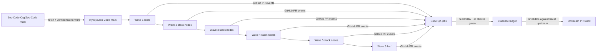
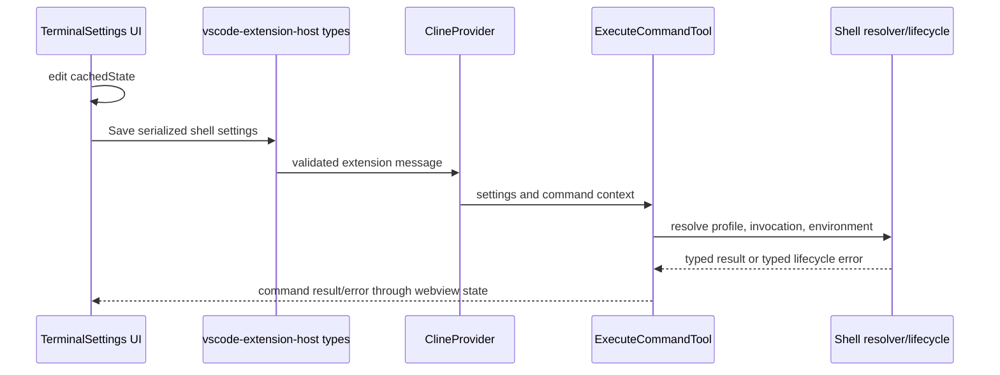
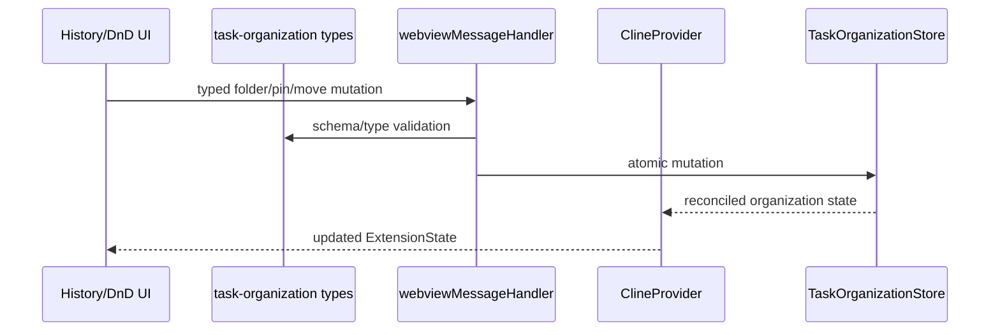
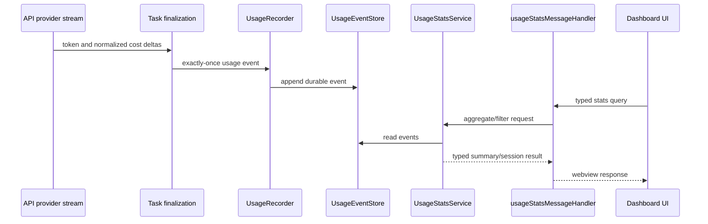

# Architect Task Report: Fork PR Rebase and CI Pass

## Overview

This plan rebuilds the 17 B-series feature branches against the current `upstream/main`, validates each review unit locally and on GitHub Actions, opens a dependency-aware PR graph in `myk1yt/Zoo-Code`, and then recreates the validated PRs against `Zoo-Code-Org/Zoo-Code`.

Repository inspection confirmed:

- `myk1yt/main` is 17 commits behind and 0 commits ahead of `upstream/main`.
- All B branches exist locally and at `myk1yt`.
- The 17 B branches are **not currently stacked by Git ancestry**. Every B tip is independent of every other B tip, even when its content includes copied prerequisite commits.
- Every B branch currently modifies `knip.json`; most also modify `pnpm-lock.yaml`, `src/package.json`, and `webview-ui/tsconfig.json`. These repeated CI-fix commits are the main mechanical conflict source.
- The active CI workflow contains more than the four named checks. In addition to translations, knip, lint, and type checking, it includes dependency review, invisible-character scanning, and unit/coverage lanes in [`.github/workflows/code-qa.yml`](../../.github/workflows/code-qa.yml).
- The root commands are defined in [`package.json`](../../package.json): `pnpm lint`, `pnpm check-types`, `pnpm knip`, and `node scripts/find-missing-translations.js`.

### Governing decision

Use **Option A, a dependency-aware stack rebuilt from feature commits**, not a direct rebase of every current tip. A plain `git rebase upstream/main` would replay copied parent commits and obsolete global CI workarounds into each branch. Single-parent chains use parent branches as PR bases. Multi-parent nodes use one canonical base plus a minimal, deterministic dependency-closure prefix for the other parent chain. This is necessary because one GitHub PR can select only one base branch.

---

# [1. Technical Specification]

## 1.1 Goals and core constraints

1. Fast-forward fork `main` to the fetched `upstream/main` exactly. No merge commit.
2. Keep an immutable recovery ref for every pre-rewrite B tip.
3. Rebuild each single-parent branch so its diff contains only its own review unit relative to its declared PR base.
4. For B15 and B16, include only the missing cross-chain prerequisite commits before the node's own feature commit. Mark those commits as dependency closure in the PR body so reviewers can separate prerequisite code from the node's owned scope.
5. Treat branch movement as a compare-and-swap operation. A force update may occur only with `--force-with-lease` and only after recording the expected old remote SHA.
6. Do not hide new failures through broad [`knip.json`](../../knip.json) warnings, `@ts-nocheck`, increased ESLint suppression counts, or unrelated dependency ignores.
7. Preserve the Settings local-buffer invariant in [`webview-ui/src/components/settings/SettingsView.tsx`](../../webview-ui/src/components/settings/SettingsView.tsx): inputs bind to `cachedState`, not live extension state.
8. Do not create changesets. Maintainers manage those separately.
9. A branch is green only when every GitHub-required job for its current head SHA is successful. A prior run for an older SHA is not evidence.
10. Before upstream submission, refresh `upstream/main` and prove no new upstream commit invalidates the fork result.

## 1.2 Source-control data flow



## 1.3 Frontend to backend communication contracts affected by the stack

The rebase must preserve three cross-domain contracts. Conflict resolution must validate the complete path, not only compile the changed file.

### Shell path, B04 to B07



Key type-binding files are [`packages/types/src/terminal.ts`](../../packages/types/src/terminal.ts), [`packages/types/src/global-settings.ts`](../../packages/types/src/global-settings.ts), and [`packages/types/src/vscode-extension-host.ts`](../../packages/types/src/vscode-extension-host.ts). Runtime errors must stay structured through [`src/core/tools/ExecuteCommandTool.ts`](../../src/core/tools/ExecuteCommandTool.ts) and the terminal subsystem. Do not resolve conflicts by choosing an old whole-file side.

### Task organization path, B08 to B10



The contract spans [`packages/types/src/task-organization.ts`](../../packages/types/src/task-organization.ts), [`src/core/webview/webviewMessageHandler.ts`](../../src/core/webview/webviewMessageHandler.ts), [`src/core/webview/ClineProvider.ts`](../../src/core/webview/ClineProvider.ts), and [`src/core/task-persistence/TaskOrganizationStore.ts`](../../src/core/task-persistence/TaskOrganizationStore.ts). Any conflict in a message union requires synchronized frontend and backend cases plus serialization tests.

### Usage statistics path, B13 to B16



The type contract centers on [`packages/types/src/usage-stats.ts`](../../packages/types/src/usage-stats.ts) and [`packages/types/src/vscode-extension-host.ts`](../../packages/types/src/vscode-extension-host.ts). Persistence and error boundaries span [`src/services/stats/UsageEventStore.ts`](../../src/services/stats/UsageEventStore.ts), [`src/services/stats/UsageRecorder.ts`](../../src/services/stats/UsageRecorder.ts), [`src/services/stats/UsageStatsService.ts`](../../src/services/stats/UsageStatsService.ts), and [`src/core/webview/usageStatsMessageHandler.ts`](../../src/core/webview/usageStatsMessageHandler.ts). Unknown/corrupt stored events must not crash dashboard state assembly.

## 1.4 Branch specification

### Canonical base graph

| B ID | Branch                      | Fork PR base                | Direct dependency expressed by base | Additional semantic prerequisites                                                                         |
| ---- | --------------------------- | --------------------------- | ----------------------------------- | --------------------------------------------------------------------------------------------------------- |
| B01  | `pr/b01-error-contracts`    | `main`                      | none                                | none                                                                                                      |
| B04  | `pr/b04-shell-contracts`    | `main`                      | none                                | none                                                                                                      |
| B08  | `pr/b08-task-persistence`   | `main`                      | none                                | none                                                                                                      |
| B13  | `pr/b13-usage-store`        | `main`                      | none                                | none                                                                                                      |
| B02  | `pr/b02-error-runtime`      | `pr/b01-error-contracts`    | B01                                 | none                                                                                                      |
| B05  | `pr/b05-shell-resolution`   | `pr/b04-shell-contracts`    | B04                                 | none                                                                                                      |
| B09  | `pr/b09-task-org-ipc`       | `pr/b08-task-persistence`   | B08                                 | none                                                                                                      |
| B03  | `pr/b03-error-integration`  | `pr/b02-error-runtime`      | B02                                 | B01 is transitive                                                                                         |
| B05a | `pr/b05a-strict-reasoning`  | `pr/b05-shell-resolution`   | B05                                 | none                                                                                                      |
| B06  | `pr/b06-terminal-lifecycle` | `pr/b05-shell-resolution`   | B05                                 | none                                                                                                      |
| B07  | `pr/b07-shell-integration`  | `pr/b06-terminal-lifecycle` | B06                                 | B05 is transitive                                                                                         |
| B10  | `pr/b10-task-org-ui`        | `pr/b09-task-org-ipc`       | B09                                 | none                                                                                                      |
| B12  | `pr/b12-mimo-enforcement`   | `pr/b05a-strict-reasoning`  | B05a                                | **B11 is treated as integrated into B12; verify manifest before opening**                                 |
| B14  | `pr/b14-usage-aggregation`  | `pr/b13-usage-store`        | B13                                 | none                                                                                                      |
| B17  | `pr/b17-provider-cost`      | `pr/b05a-strict-reasoning`  | B05a                                | none                                                                                                      |
| B15  | `pr/b15-usage-capture`      | `pr/b14-usage-aggregation`  | B14                                 | Prefix the B12 feature patch as dependency closure, then apply B15                                        |
| B16  | `pr/b16-stats-ui`           | `pr/b15-usage-capture`      | B15                                 | Prefix the B08→B09→B10 feature chain as dependency closure, then apply B16; B14 is transitive through B15 |

GitHub supports only one base branch per PR. A multi-parent node cannot both exclude every prerequisite from its diff and compile against every prerequisite. B15 and B16 therefore use a declared dependency-closure prefix. Do **not** create hidden synthetic base branches: they cannot be merged as review units and make upstream retargeting opaque. After the cross-chain prerequisite PR merges, rebase the child and drop the now-upstream dependency-closure prefix before final review.

## 1.5 Step 0, exact fork-main synchronization sequence

Run only from a clean working tree. The sequence is intentionally fast-forward-only and records a recovery ref before moving `main`.

```powershell
git status --short
git fetch --prune upstream
git fetch --prune myk1yt
git rev-parse upstream/main
git rev-parse myk1yt/main
git rev-list --left-right --count upstream/main...myk1yt/main
git branch backup/main-before-sync-260801 myk1yt/main
git switch main
git merge --ff-only upstream/main
git push myk1yt main:main
git fetch myk1yt main
git rev-parse upstream/main
git rev-parse myk1yt/main
git diff --exit-code upstream/main myk1yt/main
```

Expected precondition from inspection: divergence prints `17 0`, meaning `myk1yt/main` has no unique commit. Expected postcondition: both SHA values are identical and `git diff --exit-code` returns 0.

The preflight below may be run before switching to make the fast-forward condition explicit. Do not use a hard reset.

```powershell
git merge-base --is-ancestor main upstream/main
```

## 1.6 Per-branch rewrite protocol

Because current branches include copied prerequisite commits, rebuild each branch from its declared new base using the feature commit(s), not every old tip commit.

For each B ID:

```powershell
git fetch myk1yt
git rev-parse myk1yt/<branch>
git branch backup/260801-<b-id>-pre-rebase myk1yt/<branch>
git switch -C <branch> <new-base>
git cherry-pick <feature-commit-or-reviewed-feature-range>
```

Then resolve conflicts, run targeted tests, and inspect:

```powershell
git status --short
git diff --check
git diff --stat <new-base>...HEAD
git log --oneline <new-base>..HEAD
git range-diff <old-base>...backup/260801-<b-id>-pre-rebase <new-base>...HEAD
```

Only after local gates pass:

```powershell
git push --force-with-lease=myk1yt/<branch>:<recorded-old-sha> myk1yt <branch>:<branch>
```

The feature-commit manifest begins with the inspected commits below. Code mode must verify each patch using `git show --stat` before cherry-picking:

| B ID | Primary feature commit                                                                                       |
| ---- | ------------------------------------------------------------------------------------------------------------ |
| B01  | `3af34fc6c`                                                                                                  |
| B04  | `0d166f124`, plus reviewed B04-only follow-ups `22fc0ac90` and `563a35075`                                   |
| B02  | `723e69883`, plus B02-only cleanup `6b4f26f7c` if still needed                                               |
| B05  | `2cc8c18a7`, plus shell-only ESLint/knip follow-ups only if current upstream still requires them             |
| B08  | `e19f2c3ca`, plus B08-only ratchet/global filename follow-up `2fa820531` if still applicable                 |
| B03  | `5d4b22cde`, plus type correction `2aca3d4bd` if the new API still requires it                               |
| B06  | `7a7703579`, plus contract correction `71c39024d` only after review                                          |
| B07  | `ac7a0b183`                                                                                                  |
| B09  | `01eb456b6` after B08 base supplies its contracts                                                            |
| B10  | `0a8a849e7`, then reviewed B10-only compatibility/lint fixes if required                                     |
| B12  | `72fab07ca`; B11 content must be proven inside this patch or added as a clearly named B12 commit             |
| B14  | `fe064b266`                                                                                                  |
| B17  | `c51473810`                                                                                                  |
| B15  | `9a141808e`; old `task.run()` to `task.start()` follow-ups must be re-evaluated against current upstream API |
| B16  | `0184a9376`                                                                                                  |

The primary B05a and B13 feature commit SHAs were truncated in the command artifact. Code mode must obtain them from `git log --reverse <merge-base>..backup/...` and select only commits whose subject and patch match the PR scope. This is a hard gate, not a reason to replay the whole branch.

## 1.7 Wave execution order

Same-wave ordering is chosen to unblock the widest chains first and to reduce shared-file churn:

1. **Wave 1**: B04, B01, B08, B13.
    - B04 first because shell settings and 18 locale files have the broadest upstream conflict surface.
    - B01 next to unblock B02/B03 and expose current error subsystem conflicts early.
    - B08 next to unblock B09/B10.
    - B13 last because its chain ultimately joins B15/B16 and has broad stats changes.
2. **Wave 2**: B05, B02, B09.
    - B05 first to unblock three branches: B05a, B06, and later B07.
    - B02 second to unblock B03.
    - B09 third to unblock B10.
3. **Wave 3**: B06, B05a, B03.
    - B06 before B05a because B07 depends on B06 and is a wider integration point.
    - B05a next to unblock B12 and B17.
    - B03 closes the shorter error chain.
4. **Wave 4**: B07, B10, B12.
    - B07 first because it overlaps later task/stats integration files such as [`src/core/task/Task.ts`](../../src/core/task/Task.ts), [`src/core/webview/ClineProvider.ts`](../../src/core/webview/ClineProvider.ts), and [`src/eslint-suppressions.json`](../../src/eslint-suppressions.json).
    - B10 next to finish the task-org chain required by B16.
    - B12 last after its B11 assumption is resolved.
5. **Wave 5**: B14, B17, B15.
    - B14 first to establish aggregation contracts.
    - B17 second because provider formula conflicts must be settled before B15 usage deltas.
    - B15 last because it semantically depends on B12, B13, B14 and overlaps B17 provider files.
6. **Wave 6**: B16 only, after B09, B10, B14, and B15 are green.

Do not push an entire wave at once. Complete the local gate and open the PR for one branch, then move to the next. Independent CI jobs may run concurrently after their branch heads are stable.

## 1.8 Conflict resolution policy

For every conflict:

1. Identify the exact replaying commit with `git status` and `git rebase --show-current-patch` or `git show CHERRY_PICK_HEAD`.
2. Inspect all three states with `git ls-files -u`, `git show :1:<path>`, `git show :2:<path>`, and `git show :3:<path>`.
3. Use `git log --follow -- <path>`, `git blame`, and relevant upstream commit messages to determine intent.
4. Resolve by applying the feature intent inside the current upstream structure. Never default to blanket `--ours` or `--theirs` for source files.
5. Run the narrowest affected tests before continuing the cherry-pick/rebase.
6. Record the resolution in the PR body under `Conflict decisions`, including file, upstream intent, feature intent, and resulting invariant.

Special-file rules:

- [`pnpm-lock.yaml`](../../pnpm-lock.yaml): resolve package manifests first, then regenerate once with the repository's pinned Node and pnpm versions. Never hand-merge lockfile conflict blocks.
- [`knip.json`](../../knip.json): begin from upstream and add only an entry proven necessary by `pnpm knip`. The observed repeated global `warn` changes and `@types/shell-quote` toggles must not be replayed blindly.
- [`src/eslint-suppressions.json`](../../src/eslint-suppressions.json): regenerate/prune with the repository command after source resolution. Counts must not increase.
- [`webview-ui/tsconfig.json`](../../webview-ui/tsconfig.json): keep upstream unless the feature introduces a real compile scope requirement. Do not carry broad Playwright exclusions as historical CI cargo.
- Locale JSON: use English as the key schema, preserve current upstream translated values, add only new keys, and run parity checks.
- Barrel/type union files: combine additive exports/message variants, then prove exhaustive handling in backend and frontend.

## 1.9 Expected shared-file conflict hotspots

### Critical

| Pair/cluster        | Shared area                                                                                                                                                                                                   | Resolution invariant                                                                                                                                  |
| ------------------- | ------------------------------------------------------------------------------------------------------------------------------------------------------------------------------------------------------------- | ----------------------------------------------------------------------------------------------------------------------------------------------------- |
| B04, B05, B05a, B07 | shell types, settings UI, 18 locale files, shell resolver tests                                                                                                                                               | B04 owns contracts/settings. B05 adds resolution primitives. B07 adds consumers. B05a must not carry copied shell files after being rebased onto B05. |
| B01, B02, B12       | complete error interception directory                                                                                                                                                                         | B01 owns classifier contracts, B02 adds runtime, B12 adds only MiMo policy integration. Preserve bounded/non-recursive error handling.                |
| B08, B09, B10       | task organization types/store, [`src/core/webview/ClineProvider.ts`](../../src/core/webview/ClineProvider.ts), [`src/core/webview/webviewMessageHandler.ts`](../../src/core/webview/webviewMessageHandler.ts) | B08 owns storage, B09 owns IPC, B10 owns UI. Message unions and handlers stay exhaustive.                                                             |
| B13, B14, B15, B16  | usage types and every stats service                                                                                                                                                                           | Layer in order: event contract/store, aggregation, capture, UI/IPC. No copied parent implementation should remain in child diff.                      |
| B05a, B17, B15      | [`src/api/providers/openai.ts`](../../src/api/providers/openai.ts), Moonshot/provider usage files                                                                                                             | Keep strict/reasoning behavior, then cost formulas, then usage-event emission. Tests must assert all three where they overlap.                        |
| B07, B12, B15       | [`src/core/task/Task.ts`](../../src/core/task/Task.ts), command tool, ESLint ratchet                                                                                                                          | Preserve terminal integration, MiMo retention, and exactly-once usage finalization without double disposal or duplicate recording.                    |

### High but mostly additive

- [`packages/types/src/vscode-extension-host.ts`](../../packages/types/src/vscode-extension-host.ts) is touched by B04, B05/B05a/B07, B09/B10, B13/B15/B16. Resolve by additive discriminated unions and verify every consumer.
- [`packages/types/src/index.ts`](../../packages/types/src/index.ts) is touched by task organization and stats branches. Exports must match actual consumers so knip remains green.
- [`src/core/webview/ClineProvider.ts`](../../src/core/webview/ClineProvider.ts) is shared across shell, task-org, capture, and stats UI chains. Resolve method-level intent, not whole-file snapshots.
- [`src/shared/globalFileNames.ts`](../../src/shared/globalFileNames.ts) is shared by task organization and usage storage. Preserve distinct filenames and migration behavior.

## 1.10 CI verification loop and fast-fail order

### Local branch loop

Run these gates in order. Stop on the first failure, fix the root cause, rerun the failed command, then rerun all earlier gates affected by the fix.

1. **Repository invariants, seconds**
    ```powershell
    git diff --check
    git grep -n -E '^(<<<<<<<|=======|>>>>>>>)' -- ':!pnpm-lock.yaml'
    node scripts/find-missing-translations.js
    ```
    Translation parity runs early because it is deterministic and cheap, especially for B04, B10, and B16.
2. **Changed-file lint, seconds to low minutes**
    ```powershell
    pnpm --dir src exec eslint --prune-suppressions --max-warnings=0 <changed-src-files>
    pnpm --dir webview-ui exec eslint --prune-suppressions --max-warnings=0 <changed-webview-files>
    ```
3. **Focused tests, low minutes** using the branch-specific commands in the implementation plan below.
4. **Type checking**
    ```powershell
    pnpm check-types
    ```
5. **Knip**
    ```powershell
    pnpm knip
    ```
6. **Full lint**
    ```powershell
    pnpm lint
    ```
7. **Affected package tests**, then repository unit/coverage lanes when practical. Although the user named four jobs, [`.github/workflows/code-qa.yml`](../../.github/workflows/code-qa.yml) also runs unit coverage on Ubuntu and Windows.

### Remote CI loop

1. Push only after all local gates pass.
2. Open or update the draft PR.
3. Wait for the run tied to the current head SHA.
4. If several jobs fail, triage in this order:
    - checkout/setup/dependency failures, because all downstream results may be noise;
    - translations and invisible-character checks;
    - compile job, where lint runs before type checking;
    - knip;
    - unit/coverage lanes, split by failing workspace and OS;
    - dependency review.
5. Reproduce the exact failed command locally. Do not add suppressions before reproducing.
6. Push one focused CI fix commit. Do not mix feature expansion into CI remediation.
7. Confirm old runs are superseded/cancelled and the new SHA has all required checks green.

### Branch acceptance record

For each B branch, record:

- base branch and base SHA,
- old remote head SHA,
- new head SHA,
- targeted test command and result,
- four named CI results,
- all additional required job results,
- GitHub Actions run URL,
- unresolved cross-chain prerequisites.

## 1.11 PR creation strategy and body contract

Create new PRs rather than reopening #5-#21. New PRs produce a clean event/check history and avoid ambiguity with obsolete base SHAs.

All PRs begin as draft. Use the exact base in the canonical graph. The body template is:

```markdown
## Why

[User-visible problem and boundary]

## Scope

- [Exact owned modules]

## Stack position

- B ID: Bxx
- Wave: N
- Base branch: `pr/...` at `<sha>`
- Direct dependency: Bxx, fork PR #NN
- Additional prerequisites: Bxx #NN, or none
- Dependents: Bxx, Bxx
- Merge rule: do not merge until every prerequisite is merged or the branch is rebased onto the merged base

## Cross-domain contract

- UI request/state type: `...`
- IPC/backend handler: `...`
- Persistence/runtime boundary: `...`
- Error behavior: `...`

## Conflict decisions

- `<file>`: upstream intent + branch intent -> preserved invariant

## Verification

- [targeted tests]
- `node scripts/find-missing-translations.js`
- `pnpm check-types`
- `pnpm knip`
- `pnpm lint`
- GitHub Actions run: [URL]

## Non-goals

- [Explicit neighboring B scopes]

## Upstream issue

- Fixes/Refs #NNN
```

Every upstream PR must reference an assigned upstream issue, per [`CONTRIBUTING.md`](../../CONTRIBUTING.md). If an assigned issue does not exist, the upstream transition stops before PR creation.

---

# [2. Architecture Decisions]

## 2.1 Exactly three design options

### Option A, The Standard / The Right Way, recommended

Rebuild a true stacked graph from reviewed feature commits, base each PR on its direct prerequisite branch, and encode cross-chain prerequisites in metadata.

- **Effort**: High. Each branch requires patch review, range-diff, focused tests, and likely selective conflict resolution.
- **Risk**: Lowest long-term risk. Historical CI hacks and copied parent commits are intentionally removed.
- **Outcome**: Small review diffs, meaningful per-PR CI, clean fork-to-upstream transfer, and predictable retargeting after parent merges.

### Option B, The Practical / The Pragmatic Way

Rebase each current B tip onto `upstream/main`, then use interactive rebase to drop obvious duplicate prerequisite and CI-fix commits. Keep every fork PR based on `main`.

- **Effort**: Medium.
- **Risk**: Medium-high. Duplicated feature hunks may survive, multi-dependency diffs remain hard to review, and CI may pass because broad suppressions remain.
- **Outcome**: Faster fork PR creation, but weaker evidence that each B boundary is independent. Upstream reviewers receive larger, noisier diffs.

### Option C, The Staging / The Incremental Way

Build one temporary integration branch from all 17 feature patches, make the four named CI checks green, then back-port verified patch groups into B branches.

- **Effort**: Low initially, high later.
- **Risk**: Highest. Integration CI cannot attribute failures to a B boundary, and splitting after stabilization can reintroduce errors.
- **Outcome**: Quick feasibility signal only. Not acceptable as final evidence for 17 upstream PRs.

## 2.2 Decision rationale

Option A follows the injected Builder Ethos principles: completeness first, search before building, boring Git primitives, user sovereignty through reviewable boundaries, and security by default. It also respects the existing one-focused-PR policy in [`CONTRIBUTING.md`](../../CONTRIBUTING.md).

## 2.3 B11 decision gate

The assumption that B11 is integrated into B12 must be proven before B12 is pushed. Evidence must show that B12 contains all capability metadata/types and provider detection consumed by its retention policy, with no unresolved symbol or implicit fallback.

Accepted outcomes:

1. B11 content is fully inside B12. Rename the PR dependency section to `B11 capability metadata integrated in this PR` and list exact files/tests.
2. B11 content is already in current upstream. Cite the upstream commit and remove B11 as a dependency.
3. B11 content is absent. Stop B12/B15/B16 and create a separate architecture decision. Do not silently stub or weaken enforcement.

## 2.4 Risks and mitigation

| Risk                                                    | Signal                                                          | Mitigation                                                                                                |
| ------------------------------------------------------- | --------------------------------------------------------------- | --------------------------------------------------------------------------------------------------------- |
| Historical CI hacks mask real defects                   | broad knip warnings, `@ts-nocheck`, repeated dependency toggles | Start config files from upstream; add only evidence-backed narrow changes.                                |
| Force push overwrites unseen work                       | remote head differs from recorded SHA                           | Use explicit `--force-with-lease=<ref>:<old-sha>`; stop on lease failure.                                 |
| Fork main sync creates accidental merge                 | `main` has unique commits or merge commit appears               | Require divergence `17 0`; fast-forward only; compare final SHAs.                                         |
| PR base graph does not encode cross-chain prerequisites | B15/B16 can be merged before B12/B10                            | Draft PRs, dependency table, blocked labels/checklist, and VP merge-order gate.                           |
| Parent branch changes invalidate child green status     | child CI ran on an older merge result                           | After any parent rewrite, rebase every descendant and require new SHA CI.                                 |
| Upstream advances after fork CI                         | new upstream SHA differs from evidence base                     | Freeze an evidence SHA; fetch upstream before transfer; rebase affected roots and descendants if changed. |
| B10/B16 locale conflicts                                | missing keys or overwritten translations                        | English key schema plus parity script and locale-specific diff review.                                    |
| UI/backend union mismatch                               | type compiles in one workspace but runtime case missing         | Cross-domain integration tests for message handler and UI state.                                          |
| Stats duplication/data corruption                       | duplicate finalization or stale event schema                    | Exactly-once recorder tests, corrupt-event tests, and migration/schema validation.                        |
| Windows/Linux behavior diverges                         | terminal or path tests pass on one OS only                      | Treat both platform-unit-test matrix lanes as required for shell branches.                                |
| Dependency review blocks new packages                   | B10 DnD dependencies or lockfile changes                        | Regenerate lockfile from manifests and inspect dependency-review findings before override discussions.    |
| Upstream policy rejects PR without issue assignment     | PR unlinked or contributor not assigned                         | Obtain/confirm issue assignment before upstream PR creation.                                              |

## 2.5 Upstream transition strategy

Fork CI success is reusable evidence, not a transferable PR object. GitHub cannot move a PR between repositories. The upstream process creates new PRs from the same `myk1yt` branches.

1. Freeze the fork evidence ledger with branch head SHAs, selected bases, dependency-closure commit manifests, and run URLs.
2. Fetch `upstream` and compare current `upstream/main` with the fork evidence base.
3. If unchanged, proceed. If advanced:
    - rebase root branches onto latest `upstream/main`;
    - rebuild/rebase descendants in graph order;
    - push with leases;
    - rerun fork CI for every changed head.
4. Confirm each upstream issue is assigned and referenced.
5. Open upstream PRs in the same graph and wave order. Root PRs target upstream `main`. Child PRs target the contributor branch for their direct parent until that parent merges.
6. Copy, do not merely link, the scope, dependency graph, conflict decisions, targeted tests, and fork CI run URL into each upstream body.
7. Mark all upstream PRs draft until direct and cross-chain prerequisites are accepted.
8. When a parent merges upstream, update the child branch against new upstream `main`, change the child PR base to `main`, drop equivalent dependency-closure commits, verify the resulting diff contains only child scope, and rerun CI. For B15/B16, repeat this step after each cross-chain prerequisite lands.
9. Never assume the fork green check satisfies upstream required checks. Upstream Actions must pass on the upstream PR's current merge ref.
10. Preserve the fork PRs and evidence until all upstream PRs are closed or merged. Do not delete recovery refs during the transfer window.

---

# [3. Implementation Plan (Sub-tasks)]

## Sub-task 1, synchronize fork main and establish recovery ledger

- **Exact paths to create/modify**: create a session evidence ledger at [`docs/260801_0001_session_fork-pr-rebase-ci/rebase-evidence.md`](rebase-evidence.md). No source files.
- **Prerequisites**: clean working tree; both remotes fetched; divergence remains 17 behind/0 ahead.
- **Actions**: run Step 0, create backup refs for `main` and all 17 current remote tips, record all SHAs.
- **Verification**: `git diff --exit-code upstream/main myk1yt/main`; `git rev-list --left-right --count upstream/main...myk1yt/main` must return `0 0`.
- **Test suite**: Git topology verification, no Vitest file required.
- **Exact command**: `git diff --exit-code upstream/main myk1yt/main`.

## Sub-task 2, rebuild Wave 1 roots B04, B01, B08, B13

- **Exact paths to modify**:
    - B04: [`packages/types/src/terminal.ts`](../../packages/types/src/terminal.ts), [`packages/types/src/global-settings.ts`](../../packages/types/src/global-settings.ts), [`packages/types/src/vscode-extension-host.ts`](../../packages/types/src/vscode-extension-host.ts), [`webview-ui/src/components/settings/SettingsView.tsx`](../../webview-ui/src/components/settings/SettingsView.tsx), [`webview-ui/src/components/settings/TerminalSettings.tsx`](../../webview-ui/src/components/settings/TerminalSettings.tsx), terminal settings tests, and all settings locale JSON files.
    - B01: [`src/core/tools/error-interception/ErrorClassifier.ts`](../../src/core/tools/error-interception/ErrorClassifier.ts), [`src/core/tools/error-interception/errorPatterns.ts`](../../src/core/tools/error-interception/errorPatterns.ts), [`src/core/tools/error-interception/types.ts`](../../src/core/tools/error-interception/types.ts), and classifier tests.
    - B08: [`packages/types/src/task-organization.ts`](../../packages/types/src/task-organization.ts), [`src/core/task-persistence/TaskOrganizationStore.ts`](../../src/core/task-persistence/TaskOrganizationStore.ts), [`src/utils/safeWriteJson.ts`](../../src/utils/safeWriteJson.ts), and tests.
    - B13: [`packages/types/src/usage-stats.ts`](../../packages/types/src/usage-stats.ts), [`src/services/stats/UsageEventStore.ts`](../../src/services/stats/UsageEventStore.ts), base usage service files, and tests.
- **Prerequisites**: Sub-task 1 complete; branch-specific primary commits reviewed.
- **Verification and test protocol**:
    - B04: `pnpm --dir packages/types exec vitest run src/__tests__/terminal-shell-settings.spec.ts`; `pnpm --dir webview-ui exec vitest run src/components/settings/__tests__/TerminalSettings.shell.spec.tsx`.
    - B01: `pnpm --dir src exec vitest run core/tools/error-interception/__tests__/ErrorClassifier.spec.ts`.
    - B08: `pnpm --dir src exec vitest run core/task-persistence/__tests__/TaskOrganizationStore.spec.ts`.
    - B13: `pnpm --dir src exec vitest run services/stats/__tests__/UsageEventStore.spec.ts`.
    - Every branch then runs the four CI-equivalent commands.

## Sub-task 3, rebuild Wave 2 B05, B02, B09

- **Exact paths to modify**:
    - B05: shell resolver/profile/invocation files under [`src/integrations/terminal`](../../src/integrations/terminal) and [`src/utils/shell.ts`](../../src/utils/shell.ts).
    - B02: runtime files under [`src/core/tools/error-interception`](../../src/core/tools/error-interception).
    - B09: [`packages/types/src/vscode-extension-host.ts`](../../packages/types/src/vscode-extension-host.ts), [`src/core/webview/ClineProvider.ts`](../../src/core/webview/ClineProvider.ts), [`src/core/webview/webviewMessageHandler.ts`](../../src/core/webview/webviewMessageHandler.ts), and task-organization IPC tests.
- **Prerequisites**: B04, B01, and B08 green respectively.
- **Verification and test protocol**:
    - B05: `pnpm --dir src exec vitest run integrations/terminal/__tests__/ShellResolver.spec.ts integrations/terminal/__tests__/ShellInvocationAdapter.spec.ts integrations/terminal/__tests__/TerminalProfile.spec.ts utils/__tests__/shell.spec.ts`.
    - B02: `pnpm --dir src exec vitest run core/tools/error-interception`.
    - B09: use existing task-org handler/provider tests if present; otherwise create [`src/core/webview/__tests__/taskOrganizationMessageHandler.spec.ts`](../../src/core/webview/__tests__/taskOrganizationMessageHandler.spec.ts). Run `pnpm --dir src exec vitest run core/webview/__tests__/taskOrganizationMessageHandler.spec.ts`.

## Sub-task 4, rebuild Wave 3 B06, B05a, B03

- **Exact paths to modify**:
    - B06: [`src/integrations/terminal/CommandScheduler.ts`](../../src/integrations/terminal/CommandScheduler.ts), [`src/integrations/terminal/TerminalLifecycle.ts`](../../src/integrations/terminal/TerminalLifecycle.ts), [`src/integrations/terminal/TerminalRegistry.ts`](../../src/integrations/terminal/TerminalRegistry.ts), [`src/integrations/terminal/CommandTrace.ts`](../../src/integrations/terminal/CommandTrace.ts), and terminal contracts/tests.
    - B05a: [`packages/types/src/provider-settings.ts`](../../packages/types/src/provider-settings.ts), OpenAI-compatible base/provider files, provider settings UI, and tests.
    - B03: [`src/core/assistant-message/presentAssistantMessage.ts`](../../src/core/assistant-message/presentAssistantMessage.ts) and its integration tests.
- **Prerequisites**: B05 green for B06/B05a; B02 green for B03.
- **Verification and test protocol**:
    - B06: use existing scheduler/lifecycle/registry tests; if absent create [`src/integrations/terminal/__tests__/TerminalLifecycle.spec.ts`](../../src/integrations/terminal/__tests__/TerminalLifecycle.spec.ts). Run `pnpm --dir src exec vitest run integrations/terminal/__tests__/TerminalLifecycle.spec.ts`.
    - B05a: `pnpm --dir packages/types exec vitest run src/__tests__/provider-settings.test.ts`; `pnpm --dir src exec vitest run api/providers/__tests__/base-provider.spec.ts api/providers/__tests__/openai.spec.ts`.
    - B03: use existing assistant-message tests; if no focused regression exists create [`src/core/assistant-message/__tests__/presentAssistantMessage.error.spec.ts`](../../src/core/assistant-message/__tests__/presentAssistantMessage.error.spec.ts). Run `pnpm --dir src exec vitest run core/assistant-message/__tests__/presentAssistantMessage.error.spec.ts`.

## Sub-task 5, rebuild Wave 4 B07, B10, B12 and close the B11 gate

- **Exact paths to modify**:
    - B07: [`src/core/tools/ExecuteCommandTool.ts`](../../src/core/tools/ExecuteCommandTool.ts), terminal integration, prompts, IPC/provider files, and shell E2E fixtures/tests.
    - B10: history/task-organization UI, hooks, DnD models, webview locale files, and package manifests.
    - B12: MiMo retention policy/telemetry files, parser/task/tool integration, error interception extensions, and tests.
- **Prerequisites**: B06 green for B07; B09 green for B10; B05a green plus B11 proof for B12.
- **Verification and test protocol**:
    - B07: `pnpm --dir src exec vitest run core/tools/__tests__/executeCommandTool.spec.ts`; run the shell-related VS Code E2E lane when the fixture behavior is touched.
    - B10: use existing history/task DnD tests; if insufficient create [`webview-ui/src/components/history/__tests__/TaskOrganizationDnd.spec.tsx`](../../webview-ui/src/components/history/__tests__/TaskOrganizationDnd.spec.tsx). Run `pnpm --dir webview-ui exec vitest run src/components/history/__tests__/TaskOrganizationDnd.spec.tsx`.
    - B12: run all MiMo retention and telemetry tests discovered in the branch. If no focused policy test exists create [`src/core/tools/error-interception/__tests__/MimoRetentionPolicy.spec.ts`](../../src/core/tools/error-interception/__tests__/MimoRetentionPolicy.spec.ts). Run `pnpm --dir src exec vitest run core/tools/error-interception/__tests__/MimoRetentionPolicy.spec.ts`.

## Sub-task 6, rebuild Wave 5 B14, B17, B15

- **Exact paths to modify**:
    - B14: [`src/services/stats/UsageAggregator.ts`](../../src/services/stats/UsageAggregator.ts), [`src/services/stats/UsageStatsService.ts`](../../src/services/stats/UsageStatsService.ts), [`src/services/stats/costRecalculation.ts`](../../src/services/stats/costRecalculation.ts), contracts and tests.
    - B17: provider implementations and provider cost tests, especially [`src/api/providers/openai.ts`](../../src/api/providers/openai.ts) and [`src/api/providers/moonshot.ts`](../../src/api/providers/moonshot.ts).
    - B15: [`src/services/stats/UsageRecorder.ts`](../../src/services/stats/UsageRecorder.ts), [`src/core/task/Task.ts`](../../src/core/task/Task.ts), provider delta files, [`src/core/webview/ClineProvider.ts`](../../src/core/webview/ClineProvider.ts), and tests.
- **Prerequisites**: B13 green for B14; B05a green for B17; B12, B13, B14, and B17 green before B15 finalization.
- **Verification and test protocol**:
    - B14: `pnpm --dir src exec vitest run services/stats/__tests__/UsageAggregator.spec.ts services/stats/__tests__/UsageStatsService.spec.ts services/stats/__tests__/costRecalculation.spec.ts`.
    - B17: `pnpm --dir src exec vitest run api/providers/__tests__/openai.spec.ts api/providers/__tests__/moonshot.spec.ts` plus other changed-provider tests.
    - B15: `pnpm --dir src exec vitest run core/task/__tests__/Task.usage-stats.spec.ts core/task/__tests__/Task.dispose.test.ts services/stats/__tests__/UsageEventStore.spec.ts` and any UsageRecorder-focused test. If none exists, create [`src/services/stats/__tests__/UsageRecorder.spec.ts`](../../src/services/stats/__tests__/UsageRecorder.spec.ts).

## Sub-task 7, rebuild Wave 6 B16 and verify complete stats UI flow

- **Exact paths to modify**: [`src/core/webview/usageStatsMessageHandler.ts`](../../src/core/webview/usageStatsMessageHandler.ts), [`src/core/webview/webviewMessageHandler.ts`](../../src/core/webview/webviewMessageHandler.ts), [`src/activate/registerCommands.ts`](../../src/activate/registerCommands.ts), dashboard/stats components under [`webview-ui/src/components/dashboard`](../../webview-ui/src/components/dashboard) and [`webview-ui/src/components/stats`](../../webview-ui/src/components/stats), all dashboard/stats locales, and usage-stats types.
- **Prerequisites**: B09, B10, B14, and B15 green; branch rebuilt after the latest change to any prerequisite.
- **Verification and test protocol**:
    - Backend: `pnpm --dir src exec vitest run core/webview/__tests__/usageStatsMessageHandler.spec.ts services/stats/__tests__/UsageStatsService.spec.ts`.
    - Frontend: `pnpm --dir webview-ui exec vitest run src/components/dashboard/__tests__/DashboardSummary.spec.tsx src/components/dashboard/__tests__/DashboardView.spec.tsx src/components/dashboard/__tests__/SessionDetail.spec.tsx src/components/dashboard/__tests__/SessionList.spec.tsx src/components/stats/__tests__/UsageHeatmap.spec.tsx src/utils/__tests__/formatNumber.spec.ts`.
    - Translation parity and all CI-equivalent commands are mandatory.

## Sub-task 8, open and stabilize 17 fork PRs

- **Exact paths to create/modify**: no source files; update [`docs/260801_0001_session_fork-pr-rebase-ci/rebase-evidence.md`](rebase-evidence.md) with PR numbers and Actions URLs.
- **Prerequisites**: each branch's local gate passed and remote lease push succeeded.
- **Actions**: open draft PRs in graph order using the body contract; wait for SHA-specific checks; remediate failures one branch at a time.
- **Verification**: `gh pr checks <number> --repo myk1yt/Zoo-Code --watch --fail-fast` for each PR, followed by a non-watch final status capture.
- **Test suite**: GitHub Actions [`.github/workflows/code-qa.yml`](../../.github/workflows/code-qa.yml).
- **Exact command**: `gh pr checks <number> --repo myk1yt/Zoo-Code --watch --fail-fast`.

## Sub-task 9, upstream freshness gate and PR recreation

- **Exact paths to create/modify**: update the evidence ledger and upstream PR bodies only. No source modification unless upstream advanced.
- **Prerequisites**: all fork PRs green; assigned upstream issues exist; evidence ledger complete.
- **Actions**: fetch upstream, compare evidence base, rebuild and retest if necessary, then open upstream drafts using the same branch/base graph.
- **Verification**: each upstream PR's changed-file manifest equals the intended B scope relative to its selected base; every upstream-required check passes on the current SHA.
- **Test suite**: upstream GitHub Actions plus branch-specific tests from Sub-tasks 2-7.
- **Exact command**: `gh pr checks <number> --repo Zoo-Code-Org/Zoo-Code --watch --fail-fast`.

---

## Task Summary

Produced a dependency-aware execution plan for synchronizing the fork, rebuilding 17 branch review units, resolving high-risk shared-file conflicts, running local and remote CI loops, creating fork PRs, and recreating them upstream.

## Actions Taken

- Inspected both Git remotes and confirmed the fork-main divergence.
- Inspected all 17 branch tips, commit histories, changed-file manifests, and pairwise overlaps.
- Confirmed no B branch tip is currently an ancestor of another B tip.
- Read the current Code QA workflow and root package scripts.
- Read closed fork PR metadata to restore scope and dependency intent.
- Defined exact branch bases, wave order, conflict rules, test commands, PR metadata, and upstream transition gates.

## Result

**Success, planning complete.** No branch, remote, PR, or source file was mutated. The recommended plan is Option A, a selectively rebuilt stacked graph with SHA-specific CI evidence.

## Issues Discovered

1. Current branches are not true stacks despite their logical dependencies.
2. Historical branches contain repeated global CI-config edits that must not be replayed blindly.
3. B11 remains an evidence gate for B12 rather than a safely proven assumption.
4. The live Code QA workflow includes additional jobs beyond the four listed in the task; those jobs should also be treated as required.
5. Upstream contribution policy requires an assigned issue before upstream PR submission.

## Next Step Recommendations

VP should delegate Sub-task 1 first, then use one code task per branch or tightly coupled wave node. Do not delegate all 17 rewrites to one code task because every force update and CI result needs an independent recovery/evidence checkpoint.

## Affected File List

- [`docs/260801_0001_session_fork-pr-rebase-ci/222900_architect-report.md`](222900_architect-report.md)
- Read-only evidence from [`.github/workflows/code-qa.yml`](../../.github/workflows/code-qa.yml), [`package.json`](../../package.json), branch histories, and fork PR metadata.
