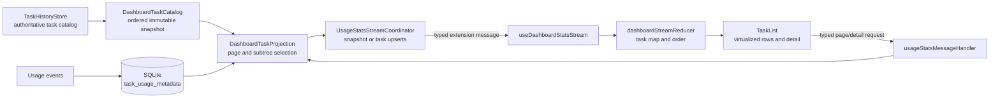
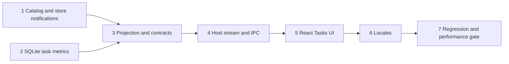

# Architect Task Report: Dashboard Tasks Data Integration

## Overview

The Dashboard must stop treating usage-event sessions as the task catalog. The complete catalog already exists in the in-memory [`TaskHistoryStore`](../../src/core/task-persistence/TaskHistoryStore.ts:67), and the History view exposes that catalog without a workspace filter when “Workspace: all” is selected through [`useTaskSearch()`](../../webview-ui/src/components/history/useTaskSearch.ts:9).

The selected design is a host-side, History-first task projection:

1. [`TaskHistoryStore`](../../src/core/task-persistence/TaskHistoryStore.ts:67) remains the only authority for task identity, title, timestamp, hierarchy, and visibility.
2. SQLite remains the authority for recorded API usage.
3. A new read-only projection pages History tasks first, obtains usage aggregates for the page in one batched query, and left-joins the two datasets.
4. Every History task is returned. Missing usage becomes explicit zero values.
5. The webview receives one canonical task stream. It does not merge two independently paged datasets.

This corrects an important implementation detail in the supplied problem statement. The current [`UsageStatsDatabase.querySessions()`](../../src/services/stats/UsageStatsDatabase.ts:1883) reads [`session_metadata`](../../src/services/stats/UsageStatsDatabase.ts:379), not [`session_activity`](../../src/services/stats/UsageStatsDatabase.ts:395). The defect remains the same because both tables are produced only from usage events.

### Scope decision

“All tasks” means every valid [`HistoryItem`](../../packages/types/src/history.ts:1), including nested subtasks, not only root task groups. A Dashboard task row represents one History task.

To preserve the existing root-session totals and expandable details:

- A task row’s usage scope is that task plus all descendants reachable through `parentTaskId`.
- A root task therefore retains its current root-and-descendants totals.
- A nested task shows its own subtree totals and detail.
- The list remains flat and newest-first in this change. Hierarchical indentation is optional follow-up UI work, not a data-contract requirement.

This interpretation satisfies the literal complete-task requirement without hiding nested History entries.

---

# [1. Technical Specification]

## 1.1 Goals and core constraints

### Functional goals

- The Dashboard section title is “Tasks” in all 18 webview locales under [`webview-ui/src/i18n/locales`](../../webview-ui/src/i18n/locales).
- The task ID set equals the valid ID set returned by [`TaskHistoryStore.getAll()`](../../src/core/task-persistence/TaskHistoryStore.ts:167) after the same `ts` and `task` validity check used by History.
- No workspace filter is applied. This matches History’s “Workspace: all” state in [`useTaskSearch()`](../../webview-ui/src/components/history/useTaskSearch.ts:26).
- Tasks with no usage events show zero tokens, zero cost, zero calls, and an empty expandable detail.
- Expand, detail caching, virtualization, stale-response rejection, and cursor pagination continue working.
- Clearing usage data keeps every History task visible and changes only its usage fields to zero.
- Rebuilding usage projections changes metrics only. It never creates, removes, or renames tasks.

### Data authority constraints

| Data | Authority | Rule |
|---|---|---|
| Task existence and visibility | [`TaskHistoryStore`](../../src/core/task-persistence/TaskHistoryStore.ts:67) | A usage-only ID is not a Dashboard task. It may still contribute to aggregate charts. |
| Title, task timestamp, parent, root, workspace, mode/profile hints | [`HistoryItem`](../../packages/types/src/history.ts:1) | SQLite never overrides catalog metadata. |
| Tokens, cost, call count, latest provider/model, usage timestamp | [`UsageStatsDatabase`](../../src/services/stats/UsageStatsDatabase.ts:236) | Missing aggregate is represented as zero, never as omission. |
| List order and page membership | New [`DashboardTaskCatalog`](../../src/services/stats/DashboardTaskCatalog.ts) | Deterministic order is task timestamp descending, then task ID descending. |
| Webview state | [`dashboardStreamReducer()`](../../webview-ui/src/components/dashboard/dashboardStreamReducer.ts:194) | One normalized task map plus task order. No client-side source join. |

### Non-goals

- Do not synthesize zero-cost [`UsageEventV1`](../../packages/types/src/usage-stats.ts:1) records. Fake events would corrupt call counts, rollups, export, coverage, and rebuild semantics.
- Do not move task authority into SQLite.
- Do not make Dashboard task membership depend on the selected chart time range. This change preserves current lifetime task-row metrics and makes the empty copy stop claiming that the list is time-range filtered.
- Do not scan task files or the full usage event log for every page.

## 1.2 Canonical task model

The shared wire contract should use task terminology instead of exposing new code through legacy session names.

| Contract | Required fields | Semantics |
|---|---|---|
| [`DashboardTaskSummary`](../../packages/types/src/usage-stats.ts) | `taskId`, `rootTaskId`, optional `parentTaskId`, `title`, `taskTimestamp`, optional `lastUsageAt`, `totalCost`, `totalTokens`, `model`, `provider`, `eventCount` | One History task and aggregate usage for its subtree. |
| [`DashboardTaskPage`](../../packages/types/src/usage-stats.ts) | `requestId`, `catalogRevision`, `tasks`, optional opaque `cursor`, `totalEstimate` | One deterministic page from the History catalog. |
| [`DashboardTaskUpsert`](../../packages/types/src/usage-stats.ts) | Same identity and metric fields as the summary | Usage-event delta for the directly affected task and each visible ancestor. |
| [`DashboardTaskDetail`](../../packages/types/src/usage-stats.ts) | `taskId`, title, task timestamp, models, modes, tokens, cost, call count, API calls | Detail for the selected task plus descendants. Empty usage is a successful zero-value detail. |

`lastUsageAt` is optional rather than overloaded. A zero-usage task displays its History timestamp, while the type still distinguishes task creation/update time from actual API activity.

## 1.3 Hierarchy rules

The new [`DashboardTaskCatalog`](../../src/services/stats/DashboardTaskCatalog.ts) builds immutable read indexes from [`TaskHistoryStore.getAll()`](../../src/core/task-persistence/TaskHistoryStore.ts:167):

- `byId`: task ID to History item.
- `childrenByParentId`: parent ID to children, using `parentTaskId` as canonical.
- `ancestorsByTaskId`: task to visible ancestor chain.
- `descendantsByTaskId`: task to subtree IDs, computed lazily and memoized per catalog revision.
- `orderedTaskIds`: all valid History task IDs sorted by `(ts DESC, id DESC)`.

Edge handling:

- Missing parent: treat the item as an orphan root while retaining its own row.
- Parent cycle: stop at the first repeated ID, keep every involved task visible, and log one coded warning. Never recurse indefinitely.
- Duplicate ID: impossible after the store map is built; the latest store value wins by current persistence semantics.
- `childIds` disagreement: `parentTaskId` wins because History grouping already derives parenthood from that field in [`useGroupedTasks()`](../../webview-ui/src/components/history/useGroupedTasks.ts:36).

## 1.4 Pagination and consistency

The cursor is opaque outside the host and encodes:

- schema version,
- catalog revision,
- last task timestamp,
- last task ID.

Rules:

1. The first page is read from the latest immutable catalog snapshot.
2. The next page uses strict keyset comparison on both timestamp and ID. Equal timestamps cannot cause skipped tasks.
3. If the cursor revision differs from the current catalog revision, the host returns a coded stale-cursor result and requests a stream resnapshot. It must not silently continue against a changed list.
4. The reducer still de-duplicates by task ID as a defense, but correctness does not depend on de-duplication.
5. Page size remains bounded to 1–100 by the shared schema.

This replaces the current timestamp-only session cursor in [`UsageStatsDatabase.querySessions()`](../../src/services/stats/UsageStatsDatabase.ts:1883), which can skip records sharing the same activity timestamp.

## 1.5 Usage projection storage

Add an additive SQLite projection named `task_usage_metadata`. It is usage data, not a task catalog.

Required columns:

- `task_id` primary key,
- `total_cost`,
- `total_tokens`,
- `event_count`,
- `last_activity_ms`,
- `model`,
- `provider`.

Also add an index on `usage_events(task_id)` for focused detail and rebuild queries.

Write behavior:

- Every appended usage event updates the direct event task’s `task_usage_metadata` row.
- Existing root-oriented [`session_metadata`](../../src/services/stats/UsageStatsDatabase.ts:379) updates remain during one compatibility window so downgrade behavior does not lose recent session data.
- Rebuild repopulates both projections from real events.
- Clear removes both projections and events, but never touches History.

Read behavior:

- [`UsageStatsDatabase.queryTaskUsageByTaskIds()`](../../src/services/stats/UsageStatsDatabase.ts) accepts a bounded set of direct task IDs and returns one map in one prepared query per SQLite parameter chunk.
- The host page projection takes the union of descendant IDs needed by that page, performs the batched lookup, then sums direct rows for each task subtree.
- Tokens, cost, and event counts are summed.
- Model, provider, and `lastUsageAt` come from the direct row with the greatest activity timestamp in the subtree.
- A missing row becomes a zero-value metric object.

This prevents N+1 database calls and keeps the hot path independent of total event-log size.

## 1.6 Frontend ↔ backend data flow

### Initial snapshot

1. [`ClineProvider`](../../src/core/webview/ClineProvider.ts:165) constructs the task store and the stats service with an injected read-only task catalog dependency.
2. [`UsageStatsService.initialize()`](../../src/services/stats/UsageStatsService.ts:136) waits for both SQLite and [`TaskHistoryStore.initialized`](../../src/core/task-persistence/TaskHistoryStore.ts:67).
3. [`UsageStatsStreamCoordinator.sendSnapshot()`](../../src/services/stats/UsageStatsStreamCoordinator.ts:458) asks the new projection for page 1.
4. The projection pages History first, batch-loads usage, left-joins, and emits [`DashboardTaskPage`](../../packages/types/src/usage-stats.ts).
5. The webview reducer atomically replaces its normalized task state.

### Usage event delta

1. An actual usage event updates SQLite.
2. The catalog resolves the direct task and visible ancestors.
3. The projection recomputes only those task summaries.
4. The stream sends `taskUpsert` entries.
5. Existing rows update in place. A newly visible task is inserted according to catalog order, not event activity order.

### History mutation

1. [`TaskHistoryStore`](../../src/core/task-persistence/TaskHistoryStore.ts:67) emits an `onDidChange` notification after cache mutation or reconciliation.
2. [`DashboardTaskCatalog`](../../src/services/stats/DashboardTaskCatalog.ts) builds the next immutable snapshot and increments `catalogRevision` once.
3. [`UsageStatsStreamCoordinator`](../../src/services/stats/UsageStatsStreamCoordinator.ts:115) debounces and emits a full replacement snapshot to each active subscriber.
4. Pending pages from the old revision are rejected.

History changes are much less frequent than usage events, so a full task-page resnapshot is simpler and safer than introducing task insert/delete deltas in this change.

### Detail request

1. The UI sends the selected `taskId`.
2. The catalog resolves that task and its descendants.
3. [`UsageStatsDatabase.queryEventsByTaskIds()`](../../src/services/stats/UsageStatsDatabase.ts) reads only those event IDs, in bounded chunks, using the task index.
4. The handler returns a task detail even when the event list is empty, using title and timestamp directly from History.

This replaces the current full-event-log filtering in [`handleGetDashboardSessionDetail()`](../../src/core/webview/usageStatsMessageHandler.ts:871).

## 1.7 Error contract

| Condition | Host behavior | Webview behavior |
|---|---|---|
| Task catalog not initialized | Do not subscribe until service initialization completes; return the existing service-unavailable stream error if initialization fails. | Keep retained data and show the current non-blocking error state. |
| Stale catalog cursor | Return `STATS_HANDLER/task-page/002` with current catalog revision; schedule resnapshot. | Do not append the page. Wait for or request resync. |
| Unknown task detail ID | Return `STATS_HANDLER/task-detail/001`; do not synthesize a phantom task. | Cache an inline row error for that ID. |
| Known task with no usage | Return success with zero totals and an empty API-call list. | Expand normally and show the existing empty-detail state. |
| SQLite read failure | Wrap as the existing coded stats database error family. | Preserve current tasks, expose retry/refresh, and reject only the failed page/detail. |
| Hierarchy cycle | Cut traversal at the repeated ID and log `STATS_TASK_CATALOG/hierarchy/001`. | Render the affected tasks as ordinary rows; no crash. |
| History changes during paging | Reject old revision instead of returning a mixed page. | Replace task state from the fresh snapshot. |

Raw stack traces, task prompts beyond titles, workspace paths, and storage paths must not be included in IPC errors.

## 1.8 Performance and correctness acceptance budgets

These are implementation targets to verify with synthetic tests, not measured current results:

- First 50-task page at 10,000 History tasks and 100,000 usage events: p95 under 100 ms after initialization on the test machine.
- Next 50-task page: p95 under 50 ms after the catalog snapshot is built.
- No more than one task-usage query per SQLite parameter chunk for a page.
- No full task-file scan, full event-log read, or per-row SQL query on snapshot/page paths.
- IPC payload remains bounded by the 100-row page limit.
- Repeated timestamps produce no missing or duplicate task IDs across an unchanged catalog revision.
- Set equality test proves Dashboard page traversal returns every valid History task exactly once.

---

# [2. Architecture Decisions]

## 2.1 Exactly three design options

### Option A, The Standard / The Right Way: Host-side History-first task projection

**Design**

- Add a read-only task catalog adapter over [`TaskHistoryStore`](../../src/core/task-persistence/TaskHistoryStore.ts:67).
- Add task-level usage metadata in SQLite.
- Page History tasks, batch-load metrics, and left-join in the extension host.
- Rename the wire and UI contracts from sessions to tasks.
- Stream targeted usage upserts and full snapshots for catalog mutations.

**Effort**: High. Shared contracts, migration, projection, stream, handler, reducer, UI, localization, and tests change together.

**Risk**: Medium. The blast radius is controlled by typed boundaries and focused tests, but migration and stream sequencing must be implemented carefully.

**Outcome**: Exact all-task coverage, correct nested-task semantics, deterministic pagination, bounded queries, one frontend source, and terminology aligned with the feature.

**Principle alignment**: Best alignment with Boil the Ocean, Search Before Building, Boring Technology, and User Sovereignty in [`ethos.md`](../../.roo/rules/ethos.md). It uses the existing store and SQLite rather than adding a new service.

### Option B, The Practical / The Pragmatic Way: Host-side root-group left join using legacy session contracts

**Design**

- Page only History roots/orphans.
- Batch-read existing root [`session_metadata`](../../src/services/stats/UsageStatsDatabase.ts:379).
- Return zero-valued legacy [`DashboardSessionSummary`](../../packages/types/src/usage-stats.ts:254) rows.
- Change visible labels to Tasks but retain most internal session naming.

**Effort**: Medium. Database migration and task-level delta fan-out are avoided.

**Risk**: Medium-high against the requirement. Nested History tasks remain absent as independent rows, so the literal “all tasks” set is not met. Legacy naming also increases long-term confusion.

**Outcome**: Fast delivery and correct zero-usage root rows, with smaller regression surface. It is acceptable only if the VP explicitly redefines a Dashboard task as a History root group.

**Principle alignment**: Strong Boring Technology alignment, weaker Completeness alignment.

### Option C, The Staging / The Incremental Way: Webview merge of History state and session stream

**Design**

- Send the existing `taskHistory` state and existing session pages independently.
- Merge zero-valued task rows in React.
- Keep the current backend session stream unchanged.

**Effort**: Low for a visual prototype.

**Risk**: High. The browser must reconcile two source clocks, two pagination domains, stale extension-state broadcasts, child/root semantics, clear/rebuild behavior, and ordering. A complete list also requires loading all task history into the Dashboard, defeating bounded pagination.

**Outcome**: Useful only as a disposable proof that zero rows are visually acceptable. It is not suitable as the production architecture.

**Principle alignment**: Supports quick User Sovereignty validation, but conflicts with Completeness and maintainability.

## 2.2 Decision

Select **Option A**.

It is the only option that satisfies all five requirements without redefining “all tasks.” It keeps authority clear, uses one host-composed stream, removes N+1/full-log hot paths, and preserves root totals through explicit subtree semantics.

## 2.3 Proposed ADR, pending VP approval

The following entry is proposed but must not be marked Active or copied into the project ADR index until VP/user approval, as required by the ADR workflow.

## 2026-08-03 ARCH-PROPOSED: Adopt a History-first Dashboard task projection

- **Decision**: Build Dashboard task membership and pagination from [`TaskHistoryStore`](../../src/core/task-persistence/TaskHistoryStore.ts:67), then left-join batched SQLite task-usage projections in the extension host.
- **Rationale**: Event-derived session tables cannot represent zero-usage tasks or nested tasks. Frontend joining would duplicate authority and break bounded paging. Existing persistence and SQLite components already provide the correct stable foundations.
- **Alternatives Considered**: Legacy root-group host join and frontend History/session merge.
- **Trade-offs**: Accept a larger typed migration and task-level projection in exchange for exact membership, deterministic pagination, faster focused reads, and lower long-term coupling.
- **Status**: Proposed, pending VP/user approval.
- **Principle Reference**: Boil the Ocean, Search Before Building, Boring Technology, User Sovereignty, and Security by Default in [`ethos.md`](../../.roo/rules/ethos.md).

## 2.4 Dependency analysis

No new external package is required.

- Persistence remains [`TaskHistoryStore`](../../src/core/task-persistence/TaskHistoryStore.ts:67).
- Database remains the existing Node SQLite integration in [`UsageStatsDatabase`](../../src/services/stats/UsageStatsDatabase.ts:236).
- Validation remains Zod in [`packages/types`](../../packages/types/src).
- Virtualization remains `react-virtuoso` in [`TaskList.tsx`](../../webview-ui/src/components/dashboard/TaskList.tsx).
- Streaming remains the current extension-host/webview message channel.

Dependency direction must remain:

`ClineProvider` → stats service → task catalog/projection → task-store reader and database.

The task persistence layer must not import stats classes, and the database must not import [`HistoryItem`](../../packages/types/src/history.ts:1).

## 2.5 Main risks and mitigations

| Risk | Mitigation and testable constraint |
|---|---|
| Double counting when parent and child rows are both shown | Each row intentionally represents its own subtree. Document this in type comments and test root, child, and grandchild totals separately. Aggregate Dashboard cards continue using global rollups, not sums of visible rows. |
| Catalog and database initialize in different orders | Stats readiness awaits the task-store readiness promise before subscriptions can snapshot. |
| Same-timestamp pagination gap | Compound timestamp/ID cursor and unchanged-revision traversal test. |
| History update races with a page response | Revisioned cursor, stale-page rejection, and atomic snapshot replacement. |
| Too many SQL bind variables for a large subtree | Deduplicate IDs and query in fixed chunks below SQLite’s parameter ceiling. |
| Usage-only historic sessions disappear from the Tasks list | Intentional: membership follows History. Their usage remains in global totals. Add an explicit regression test. |
| Clearing stats empties the list | Task list is recomposed from History after clear; assert unchanged IDs and zero metrics. |
| Empty provider/model causes dangling separators | [`TaskList.tsx`](../../webview-ui/src/components/dashboard/TaskList.tsx) builds metadata segments conditionally. |
| Repeated `endReached` requests | Hook gates on non-empty cursor and an in-flight page flag; list does not issue a request after exhaustion. |
| Large history mutation churn | Debounce store notifications into one catalog rebuild and one stream snapshot per burst. |

---

# [3. Implementation Plan (Sub-tasks)]

## Sub-task 1: Add observable, deterministic task catalog snapshots

**Boundary**: Task-history read model and hierarchy only. No SQL, IPC, or React changes.

**Exact files to create**

- [`src/services/stats/DashboardTaskCatalog.ts`](../../src/services/stats/DashboardTaskCatalog.ts)
- [`src/services/stats/__tests__/DashboardTaskCatalog.spec.ts`](../../src/services/stats/__tests__/DashboardTaskCatalog.spec.ts)

**Exact files to modify**

- [`src/core/task-persistence/TaskHistoryStore.ts`](../../src/core/task-persistence/TaskHistoryStore.ts)
- [`src/core/task-persistence/__tests__/TaskHistoryStore.spec.ts`](../../src/core/task-persistence/__tests__/TaskHistoryStore.spec.ts)

**Implementation prerequisites**

- Preserve per-task files as authority.
- Add a typed `onDidChange` listener without coupling the store to stats.
- Emit once after successful cache mutations and reconciliation, never before persistence/cache state is consistent.
- Catalog filtering must match History validity checks and must not filter by workspace.

**Acceptance criteria**

- All valid tasks are ordered by `(ts DESC, id DESC)`.
- Cursor traversal is exact with equal timestamps.
- Ancestor and descendant maps handle roots, nested children, orphans, and cycles.
- One mutation burst advances one catalog revision after debounce.

**Verification and test protocol**

- Existing suite: [`TaskHistoryStore.spec.ts`](../../src/core/task-persistence/__tests__/TaskHistoryStore.spec.ts).
- New suite: [`DashboardTaskCatalog.spec.ts`](../../src/services/stats/__tests__/DashboardTaskCatalog.spec.ts).
- Run: `corepack pnpm --dir src exec vitest run core/task-persistence/__tests__/TaskHistoryStore.spec.ts services/stats/__tests__/DashboardTaskCatalog.spec.ts`
- Lint: `corepack pnpm --dir src exec eslint --prune-suppressions --max-warnings=0 core/task-persistence/TaskHistoryStore.ts services/stats/DashboardTaskCatalog.ts core/task-persistence/__tests__/TaskHistoryStore.spec.ts services/stats/__tests__/DashboardTaskCatalog.spec.ts`

## Sub-task 2: Add task-level SQLite usage projection and focused event reads

**Boundary**: SQLite schema, append/rebuild/clear, and database query APIs. No History imports and no webview contract changes.

**Exact files to modify**

- [`src/services/stats/UsageStatsDatabase.ts`](../../src/services/stats/UsageStatsDatabase.ts)
- [`src/services/stats/__tests__/UsageStatsDatabase.spec.ts`](../../src/services/stats/__tests__/UsageStatsDatabase.spec.ts)

**Implementation prerequisites**

- Sub-task 1’s semantics are agreed, but this sub-task can be implemented in parallel because it depends only on task IDs.
- Use an additive schema migration.
- Continue root session projection writes for downgrade compatibility.
- Bound all `IN` queries below the SQLite parameter limit.

**Acceptance criteria**

- Append updates direct task totals exactly once.
- Rebuild produces byte-for-byte-equivalent logical task totals.
- Clear removes metrics but leaves task persistence untouched.
- Batched summary and detail queries avoid full event-log reads.
- Latest provider/model selection is deterministic when timestamps tie, using event sequence as the tie-breaker during rebuild/detail.

**Verification and test protocol**

- Existing suite: [`UsageStatsDatabase.spec.ts`](../../src/services/stats/__tests__/UsageStatsDatabase.spec.ts).
- Add migration, append, rebuild, clear, chunking, latest-metadata, and query-plan assertions to that suite.
- Run: `corepack pnpm --dir src exec vitest run services/stats/__tests__/UsageStatsDatabase.spec.ts`
- Lint: `corepack pnpm --dir src exec eslint --prune-suppressions --max-warnings=0 services/stats/UsageStatsDatabase.ts services/stats/__tests__/UsageStatsDatabase.spec.ts`

## Sub-task 3: Define the task projection and shared IPC contracts

**Boundary**: Pure composition and shared schemas. No React rendering.

**Exact files to create**

- [`src/services/stats/DashboardTaskProjection.ts`](../../src/services/stats/DashboardTaskProjection.ts)
- [`src/services/stats/__tests__/DashboardTaskProjection.spec.ts`](../../src/services/stats/__tests__/DashboardTaskProjection.spec.ts)

**Exact files to modify**

- [`packages/types/src/usage-stats.ts`](../../packages/types/src/usage-stats.ts)
- [`packages/types/src/vscode-extension-host.ts`](../../packages/types/src/vscode-extension-host.ts)
- [`packages/types/src/__tests__/dashboard-stats-stream.spec.ts`](../../packages/types/src/__tests__/dashboard-stats-stream.spec.ts)
- [`src/services/stats/UsageStatsProjection.ts`](../../src/services/stats/UsageStatsProjection.ts)
- [`src/services/stats/__tests__/UsageStatsProjection.spec.ts`](../../src/services/stats/__tests__/UsageStatsProjection.spec.ts)

**Implementation prerequisites**

- Sub-tasks 1 and 2 complete.
- Task contracts must be Zod-validated at the existing shared boundary.
- Remove session projection responsibility from [`UsageStatsProjection.ts`](../../src/services/stats/UsageStatsProjection.ts) after callers migrate; leave aggregate/heatmap responsibilities there.
- Do not add a second frontend merge path.

**Acceptance criteria**

- Page membership comes only from the task catalog.
- A missing usage row creates a zero summary.
- Parent, child, and grandchild subtree totals are correct.
- A known zero-usage task detail succeeds with title and History timestamp.
- Shared task snapshot, delta, page, and detail payloads round-trip through JSON validation.

**Verification and test protocol**

- Existing suites: [`dashboard-stats-stream.spec.ts`](../../packages/types/src/__tests__/dashboard-stats-stream.spec.ts) and [`UsageStatsProjection.spec.ts`](../../src/services/stats/__tests__/UsageStatsProjection.spec.ts).
- New suite: [`DashboardTaskProjection.spec.ts`](../../src/services/stats/__tests__/DashboardTaskProjection.spec.ts).
- Run types: `corepack pnpm --dir packages/types exec vitest run src/__tests__/dashboard-stats-stream.spec.ts`
- Run host: `corepack pnpm --dir src exec vitest run services/stats/__tests__/DashboardTaskProjection.spec.ts services/stats/__tests__/UsageStatsProjection.spec.ts`
- Type checks: `corepack pnpm --dir packages/types run check-types; corepack pnpm --dir src run check-types`

## Sub-task 4: Wire provider, service, stream coordinator, and message handlers

**Boundary**: Extension-host lifecycle and IPC. No JSX or localization.

**Exact files to modify**

- [`src/core/webview/ClineProvider.ts`](../../src/core/webview/ClineProvider.ts)
- [`src/services/stats/UsageStatsService.ts`](../../src/services/stats/UsageStatsService.ts)
- [`src/services/stats/UsageStatsStreamCoordinator.ts`](../../src/services/stats/UsageStatsStreamCoordinator.ts)
- [`src/core/webview/usageStatsMessageHandler.ts`](../../src/core/webview/usageStatsMessageHandler.ts)
- [`src/core/webview/webviewMessageHandler.ts`](../../src/core/webview/webviewMessageHandler.ts)
- [`src/services/stats/__tests__/UsageStatsService.spec.ts`](../../src/services/stats/__tests__/UsageStatsService.spec.ts)
- [`src/services/stats/__tests__/UsageStatsStreamCoordinator.spec.ts`](../../src/services/stats/__tests__/UsageStatsStreamCoordinator.spec.ts)
- [`src/core/webview/__tests__/usageStatsMessageHandler.spec.ts`](../../src/core/webview/__tests__/usageStatsMessageHandler.spec.ts)
- [`src/core/webview/__tests__/usageStatsMessageRouting.spec.ts`](../../src/core/webview/__tests__/usageStatsMessageRouting.spec.ts)

**Implementation prerequisites**

- Sub-task 3 complete.
- Service initialization must wait for task catalog and database readiness.
- Both first-page snapshots and explicit next-page requests must call the same task projection.
- Preserve request ID, stream generation, and sequence guards.

**Acceptance criteria**

- A cold subscription includes all first-page History tasks, including zero-usage entries.
- A usage event emits task upserts for the direct task and visible ancestors.
- A History mutation emits one debounced replacement snapshot.
- A stale catalog cursor cannot append mixed-revision rows.
- Clear keeps task IDs and zeros their metrics.
- Detail reads the selected subtree only and returns correct empty detail.
- Service disposal removes task-store listeners and timers.

**Verification and test protocol**

- Existing suites: [`UsageStatsService.spec.ts`](../../src/services/stats/__tests__/UsageStatsService.spec.ts), [`UsageStatsStreamCoordinator.spec.ts`](../../src/services/stats/__tests__/UsageStatsStreamCoordinator.spec.ts), [`usageStatsMessageHandler.spec.ts`](../../src/core/webview/__tests__/usageStatsMessageHandler.spec.ts), and [`usageStatsMessageRouting.spec.ts`](../../src/core/webview/__tests__/usageStatsMessageRouting.spec.ts).
- Run: `corepack pnpm --dir src exec vitest run services/stats/__tests__/UsageStatsService.spec.ts services/stats/__tests__/UsageStatsStreamCoordinator.spec.ts core/webview/__tests__/usageStatsMessageHandler.spec.ts core/webview/__tests__/usageStatsMessageRouting.spec.ts`
- Lint: `corepack pnpm --dir src exec eslint --prune-suppressions --max-warnings=0 core/webview/ClineProvider.ts services/stats/UsageStatsService.ts services/stats/UsageStatsStreamCoordinator.ts core/webview/usageStatsMessageHandler.ts core/webview/webviewMessageHandler.ts`

## Sub-task 5: Rename the webview feature to Tasks and preserve interactions

**Boundary**: React state, rendering, and task terminology. No SQL.

**Exact file move**

- Move [`webview-ui/src/components/dashboard/SessionList.tsx`](../../webview-ui/src/components/dashboard/SessionList.tsx) to [`webview-ui/src/components/dashboard/TaskList.tsx`](../../webview-ui/src/components/dashboard/TaskList.tsx).
- Move [`webview-ui/src/components/dashboard/__tests__/SessionList.spec.tsx`](../../webview-ui/src/components/dashboard/__tests__/SessionList.spec.tsx) to [`webview-ui/src/components/dashboard/__tests__/TaskList.spec.tsx`](../../webview-ui/src/components/dashboard/__tests__/TaskList.spec.tsx).

**Exact files to modify**

- [`webview-ui/src/components/dashboard/DashboardView.tsx`](../../webview-ui/src/components/dashboard/DashboardView.tsx)
- [`webview-ui/src/components/dashboard/dashboardStreamReducer.ts`](../../webview-ui/src/components/dashboard/dashboardStreamReducer.ts)
- [`webview-ui/src/components/dashboard/useDashboardStatsStream.ts`](../../webview-ui/src/components/dashboard/useDashboardStatsStream.ts)
- [`webview-ui/src/components/dashboard/TaskList.tsx`](../../webview-ui/src/components/dashboard/TaskList.tsx)
- [`webview-ui/src/components/dashboard/__tests__/DashboardView.spec.tsx`](../../webview-ui/src/components/dashboard/__tests__/DashboardView.spec.tsx)
- [`webview-ui/src/components/dashboard/__tests__/dashboardStreamReducer.spec.ts`](../../webview-ui/src/components/dashboard/__tests__/dashboardStreamReducer.spec.ts)
- [`webview-ui/src/components/dashboard/__tests__/useDashboardStatsStream.spec.tsx`](../../webview-ui/src/components/dashboard/__tests__/useDashboardStatsStream.spec.tsx)
- [`webview-ui/src/components/dashboard/__tests__/TaskList.spec.tsx`](../../webview-ui/src/components/dashboard/__tests__/TaskList.spec.tsx)

**Implementation prerequisites**

- Sub-task 4 task IPC contract complete.
- Keep normalized state and virtualization.
- Do not read or merge `taskHistory` from [`ExtensionStateContext`](../../webview-ui/src/context/ExtensionStateContext.tsx) inside Dashboard.
- Rename session-oriented test IDs and internal state names in the same change so new code has one vocabulary.

**Acceptance criteria**

- Zero metrics render as `0` tokens, formatted zero cost, and zero calls.
- Empty provider/model values do not leave dangling separators.
- Expand/reopen uses detail cache by task ID.
- `endReached` requests only when a cursor exists and no page is in flight.
- Old request ID, stream generation, and catalog revision responses are ignored.
- Full snapshot replaces task order; metric upserts update without activity-based reordering.

**Verification and test protocol**

- Existing Dashboard tests migrate with task terminology.
- Run: `corepack pnpm --dir webview-ui exec vitest run src/components/dashboard/__tests__/DashboardView.spec.tsx src/components/dashboard/__tests__/dashboardStreamReducer.spec.ts src/components/dashboard/__tests__/useDashboardStatsStream.spec.tsx src/components/dashboard/__tests__/TaskList.spec.tsx`
- Type check: `corepack pnpm --dir webview-ui run check-types`
- Lint: `corepack pnpm --dir webview-ui exec eslint --prune-suppressions --max-warnings=0 src/components/dashboard/DashboardView.tsx src/components/dashboard/dashboardStreamReducer.ts src/components/dashboard/useDashboardStatsStream.ts src/components/dashboard/TaskList.tsx`

## Sub-task 6: Update all locale copy and empty-state semantics

**Boundary**: Localization JSON and localization assertions only. No behavior changes.

**Exact files to modify**

- Every [`dashboard.json`](../../webview-ui/src/i18n/locales/en/dashboard.json) under [`webview-ui/src/i18n/locales`](../../webview-ui/src/i18n/locales), for `ca`, `de`, `en`, `es`, `fr`, `hi`, `id`, `it`, `ja`, `ko`, `nl`, `pl`, `pt-BR`, `ru`, `tr`, `vi`, `zh-CN`, and `zh-TW`.
- [`webview-ui/src/components/dashboard/__tests__/DashboardView.spec.tsx`](../../webview-ui/src/components/dashboard/__tests__/DashboardView.spec.tsx)
- [`webview-ui/src/components/dashboard/__tests__/TaskList.spec.tsx`](../../webview-ui/src/components/dashboard/__tests__/TaskList.spec.tsx)

**Implementation prerequisites**

- Sub-task 5 establishes final key names.
- Use the repository translation workflow for non-English copy.
- Replace “no sessions in this time range” with task-catalog-accurate empty copy because list membership is not chart-range filtered.

**Acceptance criteria**

- Every locale contains the same Tasks keys.
- English title is “Tasks” and Korean title is “작업”.
- No visible Dashboard list copy calls these rows sessions.
- Missing-key fallback tests remain green.

**Verification and test protocol**

- Existing webview localization setup and Dashboard component tests cover loading.
- Run: `corepack pnpm --dir webview-ui exec vitest run src/i18n/__tests__/TranslationContext.spec.tsx src/components/dashboard/__tests__/DashboardView.spec.tsx src/components/dashboard/__tests__/TaskList.spec.tsx`
- Validate JSON and type/build integration: `corepack pnpm --dir webview-ui run check-types`

## Sub-task 7: Cross-boundary regression and performance gate

**Boundary**: Tests, measured evidence, and fixes only for regressions introduced by Sub-tasks 1–6.

**Exact files to create if no current performance harness covers task paging**

- [`src/services/stats/__tests__/dashboardTaskPerformance.spec.ts`](../../src/services/stats/__tests__/dashboardTaskPerformance.spec.ts)

**Exact files to modify if assertions are missing**

- [`src/services/stats/__tests__/DashboardTaskCatalog.spec.ts`](../../src/services/stats/__tests__/DashboardTaskCatalog.spec.ts)
- [`src/services/stats/__tests__/DashboardTaskProjection.spec.ts`](../../src/services/stats/__tests__/DashboardTaskProjection.spec.ts)
- [`src/services/stats/__tests__/UsageStatsStreamCoordinator.spec.ts`](../../src/services/stats/__tests__/UsageStatsStreamCoordinator.spec.ts)
- [`src/core/webview/__tests__/usageStatsMessageHandler.spec.ts`](../../src/core/webview/__tests__/usageStatsMessageHandler.spec.ts)
- [`webview-ui/src/components/dashboard/__tests__/DashboardView.spec.tsx`](../../webview-ui/src/components/dashboard/__tests__/DashboardView.spec.tsx)
- [`webview-ui/src/components/dashboard/__tests__/useDashboardStatsStream.spec.tsx`](../../webview-ui/src/components/dashboard/__tests__/useDashboardStatsStream.spec.tsx)

**Implementation prerequisites**

- Sub-tasks 1–6 complete.
- Pinned dependencies installed in each workspace. Earlier reports in this repository show missing local Vitest executables in some worktrees, so absence of a test runner is a blocked gate, not a passing result.

**Acceptance criteria**

- Set equality: all valid History task IDs appear exactly once across unchanged-revision pages.
- Zero usage, nested subtree, orphan, cycle, same timestamp, task deletion, clear, rebuild, stale cursor, and concurrent append scenarios pass.
- 10,000-task/100,000-event synthetic performance targets in Section 1.8 are measured and recorded.
- All focused tests, per-file lint, type checks, webview build, and extension bundle pass.
- Manual installed view confirms title, zero rows, expansion, pagination, clear, and rebuild.

**Verification and test protocol**

- Backend: `corepack pnpm --dir src exec vitest run core/task-persistence/__tests__/TaskHistoryStore.spec.ts services/stats/__tests__/DashboardTaskCatalog.spec.ts services/stats/__tests__/UsageStatsDatabase.spec.ts services/stats/__tests__/DashboardTaskProjection.spec.ts services/stats/__tests__/UsageStatsService.spec.ts services/stats/__tests__/UsageStatsStreamCoordinator.spec.ts core/webview/__tests__/usageStatsMessageHandler.spec.ts core/webview/__tests__/usageStatsMessageRouting.spec.ts services/stats/__tests__/dashboardTaskPerformance.spec.ts`
- Shared contracts: `corepack pnpm --dir packages/types exec vitest run src/__tests__/dashboard-stats-stream.spec.ts`
- Webview: `corepack pnpm --dir webview-ui exec vitest run src/components/dashboard/__tests__`
- Types: `corepack pnpm --dir packages/types run check-types; corepack pnpm --dir src run check-types; corepack pnpm --dir webview-ui run check-types`
- Builds: `corepack pnpm --dir webview-ui run build; corepack pnpm --dir src run bundle`
- Run required per-file ESLint with `--prune-suppressions --max-warnings=0` for every changed TypeScript/TSX file. Suppression counts must not increase.

## 3.1 Delegation order and parallel boundaries

- Sub-tasks 1 and 2 can run in parallel.
- Sub-task 3 owns shared contract names. No other sub-task should independently invent aliases.
- Sub-task 4 owns host lifecycle and IPC.
- Sub-task 5 owns frontend state and rendering.
- Sub-task 6 can begin after final keys from Sub-task 5 are fixed.
- Sub-task 7 is the integration gate and may only repair regressions within this design.

## 3.2 Rollout and migration behavior

1. Database initialization runs the additive task-usage migration.
2. The migration rebuilds task usage from existing real events before the Dashboard service reports ready.
3. The first post-upgrade snapshot uses History task membership immediately.
4. No task-history migration is required.
5. Old `session_metadata` remains populated for one downgrade compatibility window. Removal requires a separate approved ADR after the minimum supported downgrade window.
6. No feature flag is needed because the typed host and bundled webview ship together. If rollout risk requires a flag, that is a VP scope change, not an implicit implementation choice.

---

## Task Summary

Designed the cross-domain architecture to rename Dashboard Sessions to Tasks and make the list exactly reflect History’s complete all-workspace task catalog, including zero-usage and nested tasks.

## Actions Taken

- Traced History authority, task hierarchy, SQLite session projections, stream snapshots/deltas, IPC handlers, reducer behavior, detail flow, pagination, localization, and focused tests.
- Corrected the current table-source description from `session_activity` to `session_metadata`.
- Compared exactly three designs and selected the host-side History-first projection.
- Defined task-level metric storage, deterministic revisioned pagination, subtree totals, initialization, deltas, errors, and clear/rebuild semantics.
- Split implementation into seven delegation-ready sub-tasks with exact paths and module-local verification commands.

## Result

**Success, architecture complete.** The recommended design satisfies [`REQ-001` through `REQ-005`](requirement-checklist.md) without adding external dependencies or making SQLite a second task authority.

## Issues Discovered

- Current session paging uses a timestamp-only cursor and can skip equal-timestamp records.
- Current task detail reads and filters the full event set rather than querying the selected task subtree.
- Current frontend metadata rendering can show dangling separators for zero-usage rows.
- Current `endReached` path needs explicit cursor and in-flight guards.
- Current internal naming remains session-oriented across shared contracts, reducers, components, test IDs, and locale keys.
- The project-specific [`architecture-constraints.md`](../../.roo/rules/architecture-constraints.md) is still a template. This report therefore defines concrete stats error codes and boundary rules for this feature; VP should not infer unspecified database/auth constraints from that template.

## Next Step Recommendations

1. VP approves or rejects proposed `ARCH-PROPOSED` and the explicit every-History-item/subtree semantics.
2. Delegate Sub-tasks 1 and 2 in parallel.
3. Gate all later work on shared contract completion in Sub-task 3.
4. Require Sub-task 7 evidence before declaring the rename/data integration complete.

## Affected File List

The planned affected files are enumerated under each sub-task. This Architect phase created only [`202630_architect-report.md`](202630_architect-report.md).
