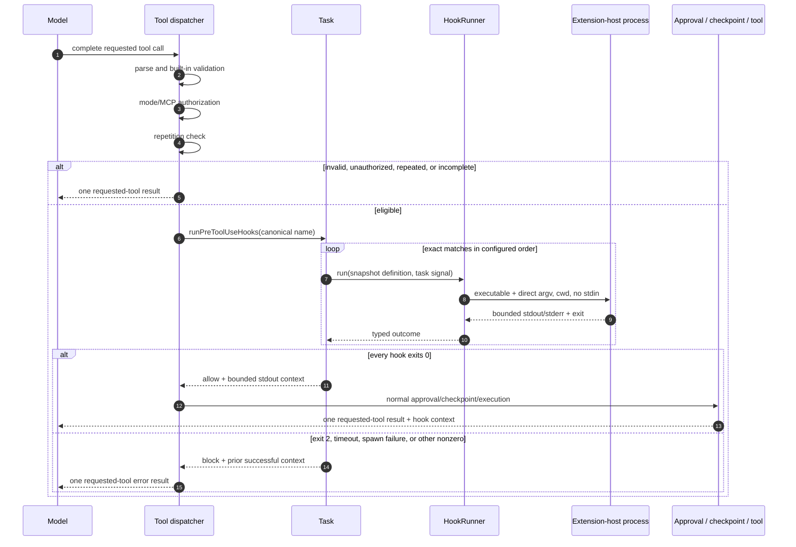
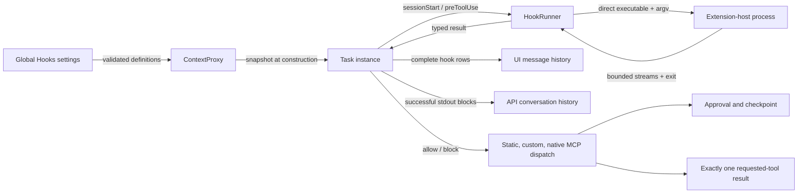

# Hooks

Hooks run trusted local programs at defined task lifecycle boundaries. Configure them in the global **Hooks** settings panel.

## Security model

- Hooks are global user configuration. Zoo Code does not discover or execute hook definitions from a repository.
- Enabled hooks execute on the VS Code extension host. In a remote window, container, Codespace, SSH session, or WSL session, that normally means the remote extension host, not the computer displaying the UI.
- Every run uses the task's captured file-system workspace as its current working directory. A missing directory, a relative path, or an unsupported non-file workspace fails safely.
- Zoo Code starts the configured executable directly with the configured argument array. It does not concatenate a shell command, invoke a shell, or interpolate tool input into arguments.
- Standard input is closed. Interactive commands are unsupported.
- The timeout is fixed at 10 seconds. It is not configurable per hook. Timeout or task cancellation kills the process tree and waits for settlement.
- Hook definitions are snapshotted when a task instance is created, even if no `sessionStart` hook is configured. Settings edits affect the next task instance, not a running task.
- Only the phase metadata, task identity, workspace path, and canonical tool name are available through the temporary invocation file named by `ZOO_CODE_HOOK_INVOCATION_FILE`. Raw tool arguments are not exposed.
- Treat enabled executables and scripts as trusted code. They inherit the extension-host process environment and can access anything that host account can access.

Project-controlled hooks are intentionally deferred. Automatically executing repository configuration requires a separate workspace-trust, symlink, ownership, and change-approval design.

## Phases and ordering

Zoo Code supports two phases:

- `sessionStart` runs once for each new or resumed task instance before its first model request. Failures are visible but do not stop the task.
- `preToolUse` runs before an eligible tool call. Matching hooks run sequentially in their configured order and stop at the first block or failure.

For static tools, custom tools, and native MCP tools, the pre-tool boundary is:

1. Finalize and parse the complete model tool call.
2. Apply built-in tool, mode, argument, MCP existence, MCP server authorization, and repetition checks as applicable.
3. Run matching `preToolUse` hooks in configured order.
4. If allowed, continue through the existing approval, checkpoint, and execution path.
5. If blocked, publish exactly one result for the model's requested tool and skip approval, checkpoint creation, and execution.

Incomplete, invalid, unauthorized, and repetition-blocked calls do not run hooks. Existing authorization always wins; a hook cannot grant access that built-in policy denied.



## Matching

Matching is exact and case-sensitive. There are no regular expressions, globs, prefixes, or an implicit all-tools matcher.

- Static tools use their canonical names, such as `read_file`, `execute_command`, or `use_mcp_tool`. The settings UI lists every supported static dispatch name.
- Custom tools use the exact registered custom tool name, such as `company_lookup`.
- Native MCP tools use the exact canonical name sent in the native tool call, such as `mcp_local_server_search-docs`. This is distinct from the static `use_mcp_tool` wrapper.

Dynamic custom and native MCP names can be entered as comma-separated exact names. A broad matcher such as `mcp_*` is a literal name and does not match other MCP tools.

## Exit and output contract

| Result              | `sessionStart`                        | `preToolUse`                      |
| ------------------- | ------------------------------------- | --------------------------------- |
| Exit `0`            | Continue and expose non-empty stdout  | Allow and expose non-empty stdout |
| Exit `2`            | Record failure and continue           | Intentionally block               |
| Other nonzero       | Record failure and continue           | Fail closed                       |
| Spawn/start failure | Record failure and continue           | Fail closed                       |
| Timeout             | Record timeout and continue           | Fail closed                       |
| Cancellation        | Stop and discard late model/UI writes | Stop tool dispatch                |

Stdout is arbitrary text; it is not parsed as JSON. "Invalid output" means output or process-start behavior that cannot be safely represented by the runner contract, not JSON parse failure. Terminal escapes and unsafe control characters are removed.

Combined stdout and stderr capture is capped at 64 KiB. Persisted/model summaries are capped at 16 KiB and include a clear truncation marker. Only successful, non-empty stdout becomes model-visible context, delimited as ordinary text:

```text
<hook_result id="load-context" phase="preToolUse" status="succeeded">
bounded, sanitized stdout
</hook_result>
```

This text is added to the pending user turn beside the legitimate requested-tool result. It is not a system instruction, environment-details block, or fabricated `tool_result`. Stderr and failed/blocked stdout are not sent to the model.

## Components and persistence



The chat history persists a structured hook row with the hook name, phase, status, bounded summaries, timestamps, and matched canonical tool name. A running row left by extension-host termination is shown as `interrupted` when history reloads and is not restarted. Model context is persisted independently in API conversation history and is never reconstructed from the chat row.

Hook definitions and rows may contain sensitive local information. Commands are not shown in the normal chat row. Zoo Code does not add executable paths, arguments, output, cwd, workspace, hook names, tool input, or error bodies to hook telemetry. Hook definitions are excluded from settings import and export; configure trusted hooks separately on each extension host.

## Examples

### Load context

Create an enabled `sessionStart` hook with:

```text
Executable: /usr/bin/env
Arguments:  node, /absolute/path/to/session-context.js
```

Write concise context to stdout and exit `0`. Write diagnostics to stderr only when needed; stderr is visible in hook details but is not model context.

### Deterministically block a tool

Create a `preToolUse` hook matching `execute_command` with:

```text
Executable: /usr/bin/env
Arguments:  node, /absolute/path/to/block-commands.js
```

The script can read the invocation file path from `ZOO_CODE_HOOK_INVOCATION_FILE`. Exit `2` to block. The invocation intentionally contains the canonical tool name but not the requested command or other raw tool input.

## Troubleshooting

- **`interrupted` row:** The extension host stopped while the hook was running. Start a new task or resume the task to create a new instance; interrupted hooks are never restarted automatically.
- **Workspace unavailable:** Open a file-system workspace and start a new task. Hooks reject missing, relative, and unsupported workspace locations.
- **Timeout:** Make the program deterministic and complete within 10 seconds. Interactive input and long-running daemons are unsupported.
- **Executable not found remotely:** Install it on the machine/container running the VS Code extension host and use a path valid there.
- **Hook does not match:** Compare the configured name with the exact canonical static, custom, or native MCP tool name. Patterns are not supported.
- **Settings edit has no effect:** Start a new task instance. Active tasks intentionally retain their original immutable definition snapshot.
- **Output is truncated:** Reduce output. Hooks are context providers and policy gates, not artifact or log streaming channels.

## Compatibility and future changes

Unknown phases and action shapes are rejected instead of guessed or silently executed. Future phases and action types, if introduced, will be additive. Post-tool rewriting, project hooks, recursive MCP/prompt actions, output artifacts/streaming, configurable timeouts, and additional lifecycle phases are not implemented by this feature.

The deterministic VS Code end-to-end smoke configures global hooks on the real extension host, verifies session output reaches the mocked model, reopens persisted history without rerunning completed work, blocks a model-requested static tool, and confirms cancellation terminates a hook process tree. Detailed static, custom, and native MCP ordering and edge cases remain at the narrower integration layers.
